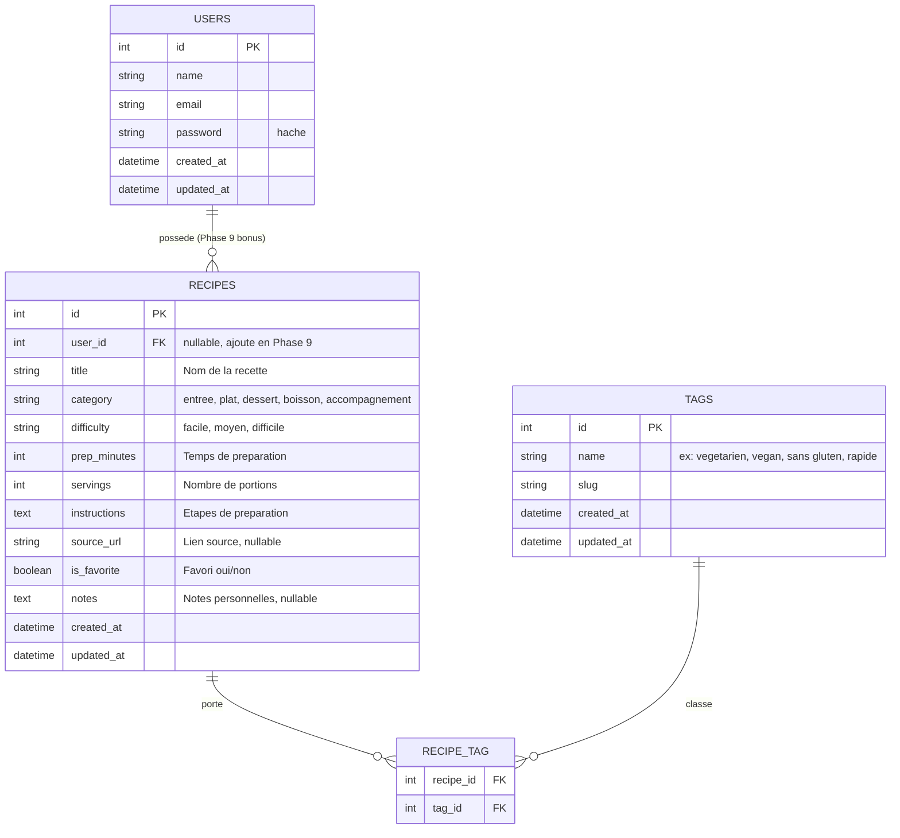
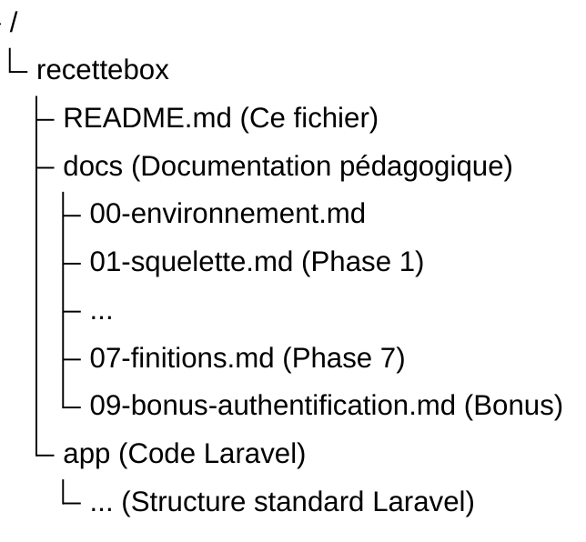

# RecetteBox

> Carnet de recettes personnel : enregistrer, filtrer, retrouver et organiser ses recettes de cuisine.
> Projet pédagogique pour maîtriser la stack TALL en partant de zéro. Le cœur du projet fonctionne sans authentification ; une phase bonus l'ajoute via Laravel Breeze.

 

---

 

## Sommaire

- [RecetteBox](#recettebox)
  - [Sommaire](#sommaire)
  - [Objectif pédagogique](#objectif-pédagogique)
  - [Stack technique](#stack-technique)
  - [Modèle de données cible](#modèle-de-données-cible)
  - [Roadmap des phases](#roadmap-des-phases)
  - [Structure du repository](#structure-du-repository)
  - [Convention de travail](#convention-de-travail)
  - [Démarrage](#démarrage)

 

---

 

## Objectif pédagogique

Construire, phase après phase, une application Laravel 13 utilisant la stack TALL (Tailwind 4, Alpine, Livewire 4, Laravel) en **comprenant pourquoi chaque outil arrive au moment où il arrive**.

> [!NOTE]  
> Le projet n'est ni un blog ni une todo. **RecetteBox** est un outil réel pour gérer ses recettes :
> 
> - enregistrer une recette (_type_, _difficulté_, _temps_, _portions_, _étapes_) ;
> - la classer par étiquettes (_végétarien_, _rapide_, _économique…_) ;
> - filtrer, trier et retrouver une recette en temps réel ;
> - marquer ses favoris ;
> - consulter un tableau de bord de statistiques.

_Une **phase bonus optionnelle** ajoute ensuite l'authentification (Laravel Breeze) pour transformer le carnet partagé en carnets individuels par utilisateur. Cette phase est volontairement séparée du cœur afin de bien dissocier "savoir construire une application" et "savoir y greffer de l'authentification"._

 

---

 

## Stack technique

| Couche | Outil | Version cible | Rôle |
|---|---|---|---|
| Langage | PHP | 8.4 (8.3 minimum requis par Laravel 13) | Runtime serveur |
| Framework | Laravel | 13.x | Backend, routing, ORM, validation |
| Front réactif serveur | Livewire | 4.x (Single-File Components) | Composants full-stack |
| Front réactif client | Alpine.js | 3.x (bundlé avec Livewire) | Interactions purement UI |
| Styles | Tailwind CSS | 4.x | Système d'utilities CSS |
| Build | Vite + `@tailwindcss/vite` | dernière | Bundling assets |
| Base de données | SQLite | 3.x | Stockage local, zéro install |
| Authentification (bonus) | Laravel Breeze | dernière compatible Laravel 13 | Auth publiée dans le projet |
| Gestion paquets PHP | Composer | 2.x | Dépendances backend |
| Gestion paquets JS | npm | fourni avec Node 22 LTS | Dépendances frontend |
| OS de développement | Windows 11 | - | Cible documentée |

> [!TIP]
> ### 🍎 MacOS & 🐧 Linux
> Bien que ce projet soit documenté pour **Windows 11**, il est 100% compatible avec MacOS et Linux.
> - Utilisez **[Laravel Herd](https://herd.laravel.com/)** (Mac) pour un environnement ultra-rapide.
> - PHP 8.4+ et Node 22+ sont requis.
> - SQLite est généralement pré-installé nativement.

 

---

 

## Modèle de données cible

Vue d'ensemble du domaine. Les détails techniques (types, indexes, contraintes) sont produits en Phase 2. La table `USERS` et la relation `USERS ||--o{ RECIPES` n'apparaissent qu'en Phase 9 bonus ; tant que l'auth n'est pas installée, les recettes ne sont rattachées à aucun utilisateur.

 

---

 

## Roadmap des phases

Chaque phase introduit volontairement **un seul concept majeur** afin de maintenir une charge cognitive raisonnable. Les outils s'imbriquent dans l'ordre où ils deviennent nécessaires, jamais avant.

Le **cœur du projet** correspond aux phases 00 à 07. La phase 08 est un emplacement réservé pour un module futur (tests automatisés ou déploiement) et n'est pas traitée ici. La **phase 09 est un bonus optionnel** : l'application est pleinement fonctionnelle sans elle.

| Phase | Intitulé | Concept majeur introduit | Outils ajoutés | Statut |
|---|---|---|---|---|
| 00 | Environnement Windows 11 | Boîte à outils locale | PHP 8.4, Composer, Node 22, Git, VS Code, php.new | Cœur |
| 01 | Squelette Laravel | MVC sans magie | Routes, controllers, Blade | Cœur |
| 02 | Modèle de données | Eloquent et migrations | Migrations, models, enums, factory, seeder | Cœur |
| 03 | Premier composant Livewire | Composant full-stack | Tailwind 4, Livewire 4 SFC | Cœur |
| 04 | Réactivité Livewire | Recherche, filtres, tri, pagination | `wire:model.live`, `#[Computed]`, `WithPagination` | Cœur |
| 05 | Alpine.js et CRUD | Frontière client/serveur | Alpine `x-data`, modal, validation Livewire | Cœur |
| 06 | Tableau de bord | Statistiques calculées | Computed properties persistées, composition de composants | Cœur |
| 07 | Finitions | Polissage UX | Dark mode, `wire:loading`, toasts, transitions | Cœur |
| 08 | _(réservé)_ | Tests ou déploiement | — | Non traité |
| 09 | **Bonus — Authentification** | Auth, middleware, scoping par utilisateur | Laravel Breeze, relation `User hasMany Recipe`, policies | **Bonus** |

 

### Accès aux guides détaillés

| Phase | Guide | État |
|---|---|---|
| Phase 00 | [docs/00-environnement.md](docs/00-environnement.md) | ✅ Prêt |
| Phase 01 | [docs/01-squelette.md](docs/01-squelette.md) | ✅ Prêt |
| Phase 02 | [docs/02-modele.md](docs/02-modele.md) | ✅ Prêt |
| Phase 03 | [docs/03-livewire.md](docs/03-livewire.md) | ✅ Prêt |
| Phases 04 à 07 | _Générées durant le cursus_ | 🏗️ En cours |
| Phase 09 (bonus) | [docs/09-bonus-authentification.md](docs/09-bonus-authentification.md) | 🎁 Bonus |

 

---

 

## Structure du repository

Le code Laravel n'existe pas encore. Il sera créé lors de la Phase 1 via `laravel new recettebox`.
Le contenu du dossier `docs/` est l'ossature pédagogique : il survit aux régénérations du code et constitue le manuel du projet.

 

---

 

## Convention de travail

| Règle | Détail |
|---|---|
| Une phase = une branche Git | `phase/00-environnement`, `phase/01-squelette`, …, `phase/09-bonus-auth` |
| Commits atomiques | Un commit par étape comprise, message en français impératif |
| Pas de saut de phase | Chaque phase suppose acquise la précédente |
| Le bonus est isolé | La phase 09 se fait sur une branche dédiée, jamais fusionnée tant que le cœur n'est pas stable |
| Vérifications obligatoires | À la fin de chaque phase, une checklist `## Vérifications` doit être verte avant de passer à la suivante |
| Pièges documentés | Chaque phase liste les erreurs courantes constatées on Windows 11 |

 

---

 

## Démarrage

Commence par lire et exécuter [`docs/00-environnement.md`](docs/00-environnement.md). Tu n'écris aucune ligne de code Laravel avant que la Phase 0 ne soit entièrement validée. La phase bonus d'authentification ([`docs/09-bonus-authentification.md`](docs/09-bonus-authentification.md)) ne doit être abordée qu'une fois les phases 01 à 07 terminées.

 

---

 

**Tags :** `Laravel 13` `TALL Stack` `Livewire 4` `Tailwind CSS 4` `PHP 8.4` `Education` `MacOS` `Linux` `Windows 11`
