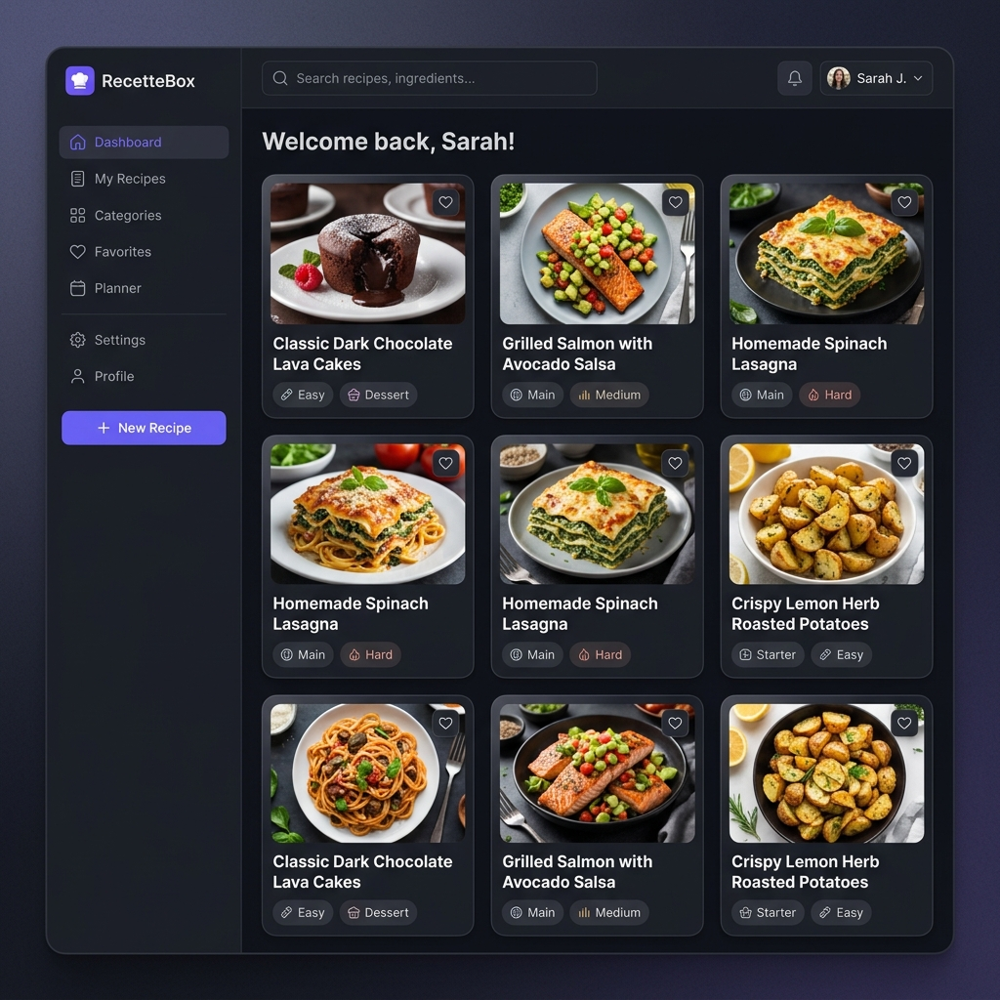
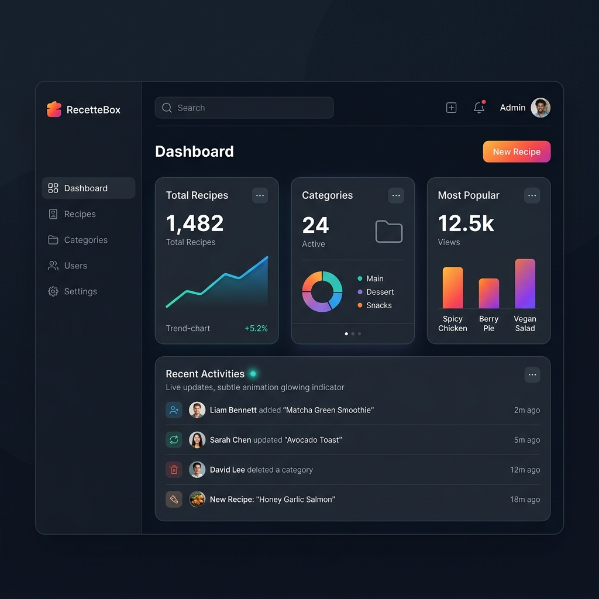
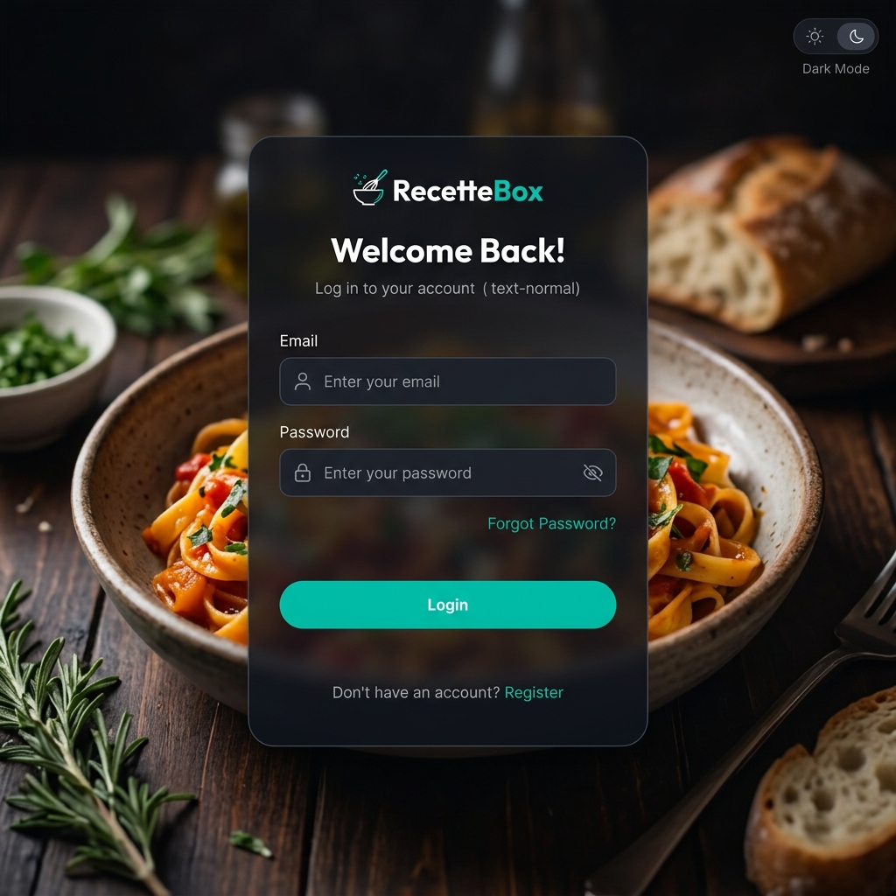
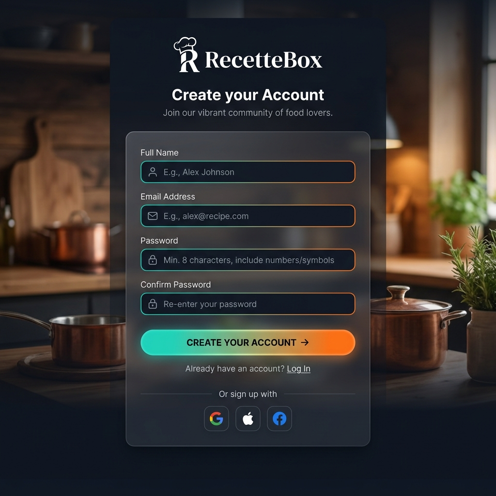
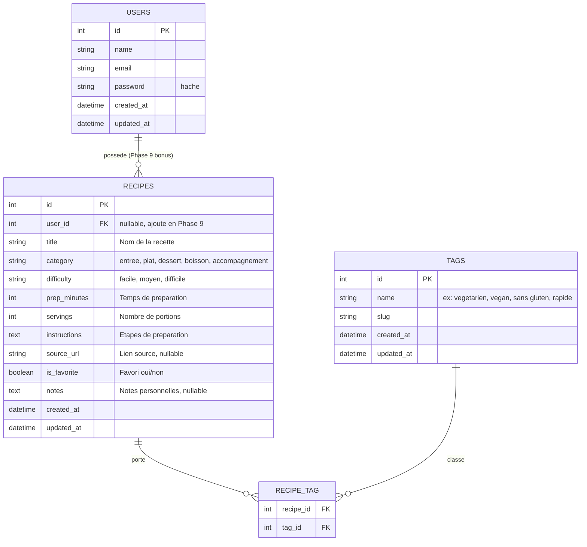

# RecetteBox — Cursus d'Apprentissage Actif de Laravel 13 & Stack TALL


> 💡 **IMPORTANT : Ce dépôt n'est pas une application finie à cloner et à exécuter directement.**  
> Il s'agit d'une **solution d'auto-formation autosuffisante et ultra-méthodique**. Ce dépôt sert de conteneur et de manuel pédagogique pour vous guider pas à pas dans le développement complet et de vos propres mains de **RecetteBox** : un carnet de recettes réactif haut de gamme, conçu pour vous faire maîtriser les fondamentaux de Laravel 13 par la pratique.

<br>

---

<br>

## Sommaire

- [RecetteBox — Cursus d'Apprentissage Actif de Laravel 13 \& Stack TALL](#recettebox--cursus-dapprentissage-actif-de-laravel-13--stack-tall)
  - [Sommaire](#sommaire)
  - [🎯 Objectif Pédagogique et Approche par la Pratique](#-objectif-pédagogique-et-approche-par-la-pratique)
  - [⏱️ Engagement Pédagogique](#️-engagement-pédagogique)
  - [🎨 Le Rendu Cible (Ce que vous allez construire)](#-le-rendu-cible-ce-que-vous-allez-construire)
  - [🛠️ Stack Technique Apprise](#️-stack-technique-apprise)
  - [📐 Modèle de Données Cible](#-modèle-de-données-cible)
  - [🗺️ Le Curriculum : Feuille de route des phases](#️-le-curriculum-feuille-de-route-des-phases)
  - [📂 Structure et Rôle de ce Dépôt](#-structure-et-rôle-de-ce-dépôt)
  - [🤝 Méthodologie et Conventions de Travail](#-méthodologie-et-conventions-de-travail)
  - [🚀 Prêt à commencer ?](#-prêt-à-commencer)
  - [🏗️ Qualité et Professionnalisme de la Solution](#️-qualité-et-professionnalisme-de-la-solution)

<br>

---

<br>

## 🎯 Objectif Pédagogique et Approche par la Pratique

L'approche de ce projet est guidée par un principe simple : **comprendre pourquoi chaque outil arrive au moment où il arrive**, sans magie noire et sans raccourcis. 

Plutôt que d'être un énième tutoriel "Todo List" ou "Blog", **RecetteBox** est une application réelle et complète pour gérer ses recettes de cuisine :
- **Enregistrer** une recette complexe (_type_, _difficulté_, _temps_, _portions_, _étapes_).
- **Classer** par étiquettes dynamiques (_végétarien_, _rapide_, _économique_...).
- **Filtrer, trier et rechercher** des recettes en temps réel de manière fluide.
- **Marquer** ses favoris et gérer un dashboard analytique.

Vous développerez d'abord le cœur de l'application sans authentification afin de vous concentrer sur la logique métier et l'interface réactive, puis vous grefferez l'authentification (Laravel Breeze) de façon isolée et propre en phase bonus.

<br>

---

<br>

## ⏱️ Engagement Pédagogique

Ce cursus demande un investissement actif de votre part :

*   **Mode "Pratique Guidée" (6 à 8 heures)** : Pour assembler rapidement le projet en suivant scrupuleusement les guides (idéal pour avoir une vue d'ensemble rapide).
*   **Mode "Étude & Maîtrise" (15 à 25 heures)** : Pour comprendre chaque concept en profondeur, taper chaque ligne de code manuellement, analyser les flux asynchrones, et s'approprier les modèles de conception (vivement recommandé pour valoriser vos compétences en entretien technique).

<br>

---

<br>

## 🎨 Le Rendu Cible (Ce que vous allez construire)

Ces maquettes illustrent le design premium, fluide et moderne que vous allez implémenter de vos propres mains. L'application intègre le mode sombre, des transitions réactives et une ergonomie optimale.

| Liste des Recettes | Tableau de Bord (Dashboard) |
|---|---|
|  |  |

| Page de Connexion | Page d'Inscription |
|---|---|
|  |  |

<br>

---

<br>

## 🛠️ Stack Technique Apprise

Pour construire cette solution, vous utiliserez et maîtriserez les outils suivants dans leurs versions les plus modernes et stables :

| Couche | Outil | Version cible | Rôle et Apport |
|---|---|---|---|
| Langage | PHP | 8.4 (8.3 min requis) | Runtime moderne, typage strict, enums typés |
| Framework | Laravel | 13.x | Backend, routage, ORM Eloquent, validation |
| Réactivité Serveur | Livewire | 4.x (SFC) | Composants dynamiques full-stack sans écrire d'API REST |
| Réactivité Client | Alpine.js | 3.x (intégré) | Interactions d'interface ultra-rapides et légères |
| Design & Styles | Tailwind CSS | 4.x | Design system moderne par utilitaires CSS |
| Build System | Vite + `@tailwindcss/vite` | Dernière | Compilation instantanée des assets |
| Base de Données | SQLite | 3.x | Stockage local léger, configuration zéro effort |
| Authentification | Laravel Breeze | Dernière | Starter kit d'auth publié et customisé en Phase 9 |
| Outils de package | Composer / npm | Dernières | Gestion rigoureuse des dépendances PHP et JS |
| OS Cible | Windows, macOS, Linux | - | Environnements 100% documentés et testés |

> [!TIP]
> ### Compatibilité Multi-OS
> Ce cursus a été conçu et validé sous Windows 11 en minimisant l'empreinte mémoire (sans Docker ni WSL pour préserver la RAM). Des guides d'installation d'environnement spécifiques sont fournis pour chaque OS :
> - [Guide d'environnement Windows 11 (php.new)](./docs/00-configuration/windows11.md)
> - [Guide d'environnement macOS (Laravel Herd)](./docs/00-configuration/macos.md)
> - [Guide d'environnement Linux (php.new)](./docs/00-configuration/linux.md)

<br>

---

<br>

## 📐 Modèle de Données Cible

Voici la structure de la base de données que vous concevrez, migrerez et lierez via les relations d'Eloquent de la Phase 2 à la Phase 9 :



<br>

---

<br>

## 🗺️ Le Curriculum : Feuille de route des phases

Chaque phase du cursus introduit volontairement **un seul concept technique majeur** afin d'assurer une courbe d'apprentissage fluide et solide.

| Phase | Objectif Pédagogique | Concepts majeurs abordés | Outils introduits | Guides |
|---|---|---|---|---|
| **00** | **Préparation de l'environnement** | Configuration machine reproductible | PHP 8.4, Composer, Git, VS Code | [Guide Phase 00](./docs/00-configuration/windows11.md) |
| **01** | **Squelette Laravel & MVC** | Cycle Requête-Réponse nu sans magie | Routes, contrôleurs, Vues Blade, Layouts | [Guide Phase 01](./docs/01-cursus/01-squelette.md) |
| **02** | **Modèle de données & Eloquent** | Modélisation et persistance des données | Migrations, Modèles, Enums, Factories, Seeders | [Guide Phase 02](./docs/01-cursus/02-modele.md) |
| **03** | **Premier Composant Livewire** | Composant réactif full-stack SFC | Livewire 4, Tailwind 4, Intégration Vite | [Guide Phase 03](./docs/01-cursus/03-livewire.md) |
| **04** | **Réactivité temps réel** | Filtres de recherche asynchrones | `wire:model.live`, Pagination, Computed Properties | [Guide Phase 04](./docs/01-cursus/04-reactivite.md) |
| **05** | **CRUD & Alpine.js** | Interaction client/serveur et modales | Alpine `x-data`, Actions, Validation de formulaires | [Guide Phase 05](./docs/01-cursus/05-crud-alpine.md) |
| **06** | **Tableau de Bord dynamique** | Composition et statistiques complexes | Computed properties persistées, relations de calculs | [Guide Phase 06](./docs/01-cursus/06-dashboard.md) |
| **07** | **Finitions UX Premium** | Retours visuels, transitions et mode sombre | `wire:loading`, toasts de notification, Dark mode | [Guide Phase 07](./docs/01-cursus/07-finitions.md) |
| **08** | **Stabilité & Tests unitaires** | Sécurisation du code par les tests | Pest (Tests de fonctionnalités et unitaires) | [Guide Phase 08](./docs/01-cursus/08-tests.md) |
| **09** | **Bonus — Authentification** | Sécurisation multi-utilisateurs et scope | Laravel Breeze, Policies de sécurité, Scoping | [Guide Phase 09](./docs/09-bonus/09-authentification.md) |

<br>

---

<br>

## 📂 Structure et Rôle de ce Dépôt

Ce repository agit comme un **manuel de cursus**. Le code Laravel n'existe pas initialement ; c'est vous qui allez l'initialiser en Phase 1 avec `laravel new` dans ce dossier, puis faire évoluer l'application étape par étape.

L'organisation des fichiers de ce dépôt s'organise ainsi :
```text
recettebox/
├── README.md                         # Ce guide d'accueil et d'orientation
├── docs/
│   ├── README.md                     # Index général de la documentation
│   ├── 00-configuration/             # Guides de démarrage de l'environnement (Win/Mac/Linux)
│   │   ├── windows11.md
│   │   ├── macos.md
│   │   └── linux.md
│   ├── 01-cursus/                    # Les guides de développement étape par étape (Phases 1 à 8)
│   │   ├── 01-squelette.md
│   │   ├── 02-modele.md
│   │   ├── 03-livewire.md
│   │   ├── 04-reactivite.md
│   │   ├── 05-crud-alpine.md
│   │   ├── 06-dashboard.md
│   │   ├── 07-finitions.md
│   │   └── 08-tests.md
│   ├── 09-bonus/                     # Guides de fonctionnalités avancées (Phase 9)
│   │   └── 09-authentification.md
│   └── images/                       # Captures d'écran et ressources visuelles
└── (le code Laravel généré)          # Votre code d'application créé et développé à partir de la Phase 1
```

Le contenu du dossier `docs/` est le tuteur pédagogique stable. Il coexiste harmonieusement avec le code Laravel que vous allez créer.

<br>

---

<br>

## 🤝 Méthodologie et Conventions de Travail

Pour tirer le maximum de valeur professionnelle de ce cursus et simuler des conditions de travail réelles en entreprise, vous vous astreindrez à suivre ces règles :

| Règle | Rôle | Impact Pédagogique |
|---|---|---|
| **Une phase = Une branche Git** | `phase/00-environnement`, `phase/01-squelette`... | Maîtrise avancée de Git et du flux de branches |
| **Commits atomiques et clairs** | Un commit par étape logique, messages en français ou anglais normé | Rendre son historique de développement lisible et professionnel |
| **Pas de saut de phase** | Chaque phase s'appuie sur le code de la précédente | Assimilation progressive, pas de trous dans la compréhension |
| **Checklist de validation** | Chaque fin de guide contient une checklist stricte | Auto-évaluation rigoureuse pour valider ses acquis |
| **Pièges courants documentés** | Les sections de dépannage fournissent les solutions aux erreurs | Apprendre à lire, interpréter et corriger les logs d'erreurs |

<br>

---

<br>

## 🚀 Prêt à commencer ?

Votre voyage d'apprentissage commence maintenant :

1. **Préparez votre environnement** en choisissant le guide adapté à votre système :
   - [Windows 11 (recommandé)](./docs/00-configuration/windows11.md)
   - [macOS](./docs/00-configuration/macos.md)
   - [Linux](./docs/00-configuration/linux.md)
2. **Initialisez votre projet** en suivant scrupuleusement la Phase 1 dès que l'étape 0 est entièrement validée.
3. **Avancez pas à pas** en codant manuellement sans copier-coller pour forger votre mémoire musculaire de développeur.

<br>

---

<br>

## 🏗️ Qualité et Professionnalisme de la Solution

Pour analyser la maturité de la stack apprise et la valeur CV de ce projet pour votre portfolio :
- [**Audit d'Architecture TALL**](./docs/audit-complet.md) : Rapport d'analyse sur l'intégration moderne de Laravel, Livewire et Tailwind.
- [**Analyse de Fiabilité Professionnelle**](./docs/fiabilite-professionnelle.md) : Pourquoi ce projet surpasse largement une simple application de démonstration classique (Todo, Blog) aux yeux des recruteurs.

<br>

---

<br>

**Tags Pédagogiques :** `Laravel 13` `TALL Stack` `Livewire 4` `Tailwind CSS 4` `PHP 8.4` `SQLite` `Pest Testing` `Active Learning`
