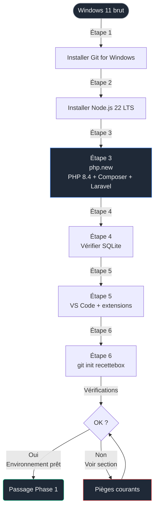
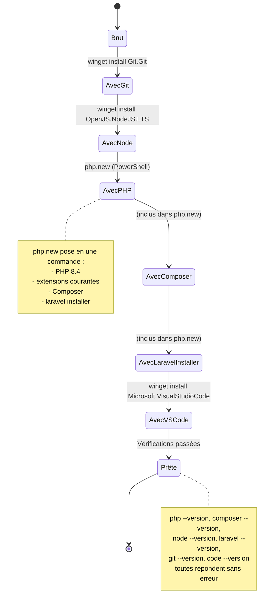

# Phase 0 — Préparation de l'environnement Windows 11

> [!IMPORTANT]
> ### 🎯 Objectif
> Disposer d'un poste de travail capable de compiler, exécuter et servir une application Laravel 13 + Livewire 4 + Tailwind 4, sans Docker ni WSL, avec une empreinte mémoire minimale.

> [!TIP]
> ### 🍎 Vous êtes sur MacOS ou 🐧 Linux ?
> Bien que ce guide détaille l'installation sous Windows 11, les concepts sont identiques.
> - **MacOS** : Nous recommandons vivement **[Laravel Herd](https://herd.laravel.com/)** pour une installation en un clic de PHP, Composer et Node.js.
> - **Linux** : Utilisez votre gestionnaire de paquets (`apt`, `pacman`, `dnf`) pour installer PHP 8.4, Node.js 22 et SQLite 3.
> - **Toutes plateformes** : Une fois l'environnement prêt, vous pouvez passer directement à la **Phase 1**.

<br>

---

<br>

## Sommaire

- [Phase 0 — Préparation de l'environnement Windows 11](#phase-0--préparation-de-lenvironnement-windows-11)
  - [Sommaire](#sommaire)
  - [Pourquoi une phase dédiée à l'environnement](#pourquoi-une-phase-dédiée-à-lenvironnement)
  - [Pré-requis matériels et logiciels](#pré-requis-matériels-et-logiciels)
  - [Flux d'installation global](#flux-dinstallation-global)
  - [Diagramme d'état de la machine](#diagramme-détat-de-la-machine)
  - [Étape 1 — Installer Git](#étape-1--installer-git)
  - [Étape 2 — Installer Node.js 22 LTS](#étape-2--installer-nodejs-22-lts)
  - [Étape 3 — Installer PHP, Composer et l'installeur Laravel via php.new](#étape-3--installer-php-composer-et-linstalleur-laravel-via-phpnew)
  - [Étape 4 — Vérifier que SQLite est disponible](#étape-4--vérifier-que-sqlite-est-disponible)
  - [Étape 5 — Installer VS Code et ses extensions](#étape-5--installer-vs-code-et-ses-extensions)
  - [Étape 6 — Initialiser le repository Git](#étape-6--initialiser-le-repository-git)
  - [Vérifications finales](#vérifications-finales)
  - [Pièges courants sur Windows 11](#pièges-courants-sur-windows-11)
  - [Ce que tu as à la fin de cette phase](#ce-que-tu-as-à-la-fin-de-cette-phase)

<br>

---

<br>

## Pourquoi une phase dédiée à l'environnement

Trois raisons concrètes :

1. **Reproductibilité.** Tout le projet repose sur des versions précises. Sans verrouiller PHP 8.4 et Node 22, des erreurs inexplicables surviendront en Phases 3 et 4.
2. **Économie de RAM.** Ton poste a 8 Go. On évite Docker et WSL, qui consomment 2 à 4 Go de RAM en veille. SQLite + serveur Laravel interne suffisent largement pour RecetteBox.
3. **Transparence pédagogique.** `php.new` installe sans masquer ce qu'il fait (à la différence de Laragon, XAMPP ou Herd qui posent un système clé en main difficile à diagnostiquer).

<br>

---

<br>

## Pré-requis matériels et logiciels

| Élément | Exigence | Vérification |
|---|---|---|
| OS | Windows 11 (toute édition) | `winver` dans PowerShell |
| RAM | 4 Go minimum, 8 Go recommandés | Gestionnaire des tâches |
| Espace disque libre | 5 Go | Explorateur, propriétés du disque C: |
| Connexion Internet | Stable pendant ~20 minutes | - |
| Droits administrateur | Nécessaires pour les installeurs | Compte admin local |
| Terminal | PowerShell 5.1 ou PowerShell 7 (Windows Terminal recommandé) | `$PSVersionTable` |

<br>

---

<br>

## Flux d'installation global



<br>

---

<br>

## Diagramme d'état de la machine



<br>

---

<br>

## Étape 1 — Installer Git

Git est l'outil de versionning. On l'installe avant tout pour pouvoir commiter dès la première ligne.

Ouvre **PowerShell** (pas besoin d'administrateur pour `winget`) et exécute :

### Installation de Git

```powershell
# Installation de Git via le gestionnaire de paquets natif Windows 11
# winget est livré avec Windows 11, aucune installation préalable nécessaire
winget install --id Git.Git --source winget --accept-source-agreements --accept-package-agreements
```

**Pourquoi `winget` plutôt qu'un .exe téléchargé ?** Reproductible, scriptable, mises à jour avec `winget upgrade --all`.

Ferme et rouvre PowerShell pour rafraîchir la variable `PATH`, puis vérifie :

### Vérification de Git

```powershell
# La commande doit renvoyer "git version 2.x.x..."
git --version
```

Configure ton identité (utilisée dans chaque commit) :

### Configuration de l'identité Git

```powershell
# Remplace par tes vraies valeurs
git config --global user.name "Ton Nom"
git config --global user.email "ton.email@exemple.fr"

# Branche par défaut = main, et pas master (convention 2026)
git config --global init.defaultBranch main

# Fin de ligne : on conserve LF côté repo, conversion auto à l'écriture
git config --global core.autocrlf input
```

<br>

---

<br>

## Étape 2 — Installer Node.js 22 LTS

Node sert à exécuter Vite, qui compile Tailwind 4 et bundle les assets. La version 22 est la LTS active jusqu'en avril 2027.

### Installation de Node.js 22 LTS

```powershell
# Installe Node.js 22 LTS et npm
winget install --id OpenJS.NodeJS.LTS --source winget --accept-source-agreements --accept-package-agreements
```

Ferme et rouvre PowerShell, puis vérifie :

### Vérification de Node.js et npm

```powershell
# Doit afficher v22.x.x
node --version

# Doit afficher 10.x.x ou supérieur
npm --version
```

> **Note.** On ne configure pas nvm-windows à ce stade. Tu peux y revenir si tu commences à jongler entre plusieurs projets Node avec des versions divergentes.

<br>

---

<br>

## Étape 3 — Installer PHP, Composer et l'installeur Laravel via php.new

`php.new` est l'installeur officiel poussé par Laravel. Il pose PHP avec toutes les extensions courantes activées (`mbstring`, `openssl`, `pdo_sqlite`, `curl`, `fileinfo`, etc.), Composer, et la commande `laravel`, en **une seule exécution**.

Ouvre **PowerShell en administrateur** (clic droit sur l'icône PowerShell, « Exécuter en tant qu'administrateur ») et exécute :

### Installation de PHP, Composer et Laravel (php.new)

```powershell
# Décomposition de cette ligne :
#  1. Set-ExecutionPolicy Bypass -Scope Process -Force
#     Autorise temporairement l'exécution de scripts dans CETTE session uniquement.
#     Aucune incidence sur la politique globale du système.
#
#  2. [System.Net.ServicePointManager]::SecurityProtocol = ... -bor 3072
#     Force l'utilisation de TLS 1.2 pour le téléchargement.
#     Nécessaire sur certains Windows 11 dont le défaut n'est pas TLS 1.2.
#
#  3. iex ((New-Object System.Net.WebClient).DownloadString('...'))
#     Télécharge le script d'installation et l'exécute immédiatement (Invoke-Expression).
#
# Cette commande est issue de https://php.new (vérifié le 15 mai 2026)
Set-ExecutionPolicy Bypass -Scope Process -Force; [System.Net.ServicePointManager]::SecurityProtocol = [System.Net.ServicePointManager]::SecurityProtocol -bor 3072; iex ((New-Object System.Net.WebClient).DownloadString('https://php.new/install/windows'))
```

Le script va :
- télécharger PHP 8.4 dans `C:\php\` (ou `%USERPROFILE%\.config\php\` selon la version du script),
- télécharger Composer dans le même répertoire,
- ajouter ces chemins à ton `PATH` utilisateur,
- installer le binaire `laravel` (installateur de nouveaux projets).

**Important.** Ferme entièrement PowerShell après le script, puis rouvre une nouvelle fenêtre. La nouvelle valeur de `PATH` n'est lue qu'à l'ouverture d'un terminal.

Vérifie ensuite :

### Vérification des versions PHP, Composer et Laravel

```powershell
# Doit afficher PHP 8.4.x
php --version

# Doit afficher Composer version 2.x.x
composer --version

# Doit afficher Laravel Installer version x.x.x
laravel --version
```

Confirme aussi les extensions PHP critiques pour Laravel et SQLite :

### Vérification des extensions PHP actives

```powershell
# Doit lister : ctype, curl, fileinfo, mbstring, openssl, pdo_sqlite, tokenizer, xml, zip
php -m | Select-String -Pattern "ctype|curl|fileinfo|mbstring|openssl|pdo_sqlite|tokenizer|xml|zip"
```

Si une extension manque, on la corrige ; je couvre ce cas dans la section Pièges courants.

<br>

---

<br>

## Étape 4 — Vérifier que SQLite est disponible

SQLite n'a pas besoin d'être installé séparément : il fonctionne via l'extension `pdo_sqlite` de PHP, qui vient avec `php.new`. Aucun service à lancer.

Test rapide :

### Test de fonctionnement SQLite via PHP

```powershell
# Crée un fichier SQLite temporaire et y exécute une requête via PHP
# Le simple fait que ces lignes ne lèvent pas d'erreur prouve que pdo_sqlite fonctionne
php -r "$db = new PDO('sqlite::memory:'); $db->exec('CREATE TABLE t(x INT)'); echo 'SQLite OK';"
```

Sortie attendue : `SQLite OK`.

<br>

---

<br>

## Étape 5 — Installer VS Code et ses extensions

### Installation de Visual Studio Code

```powershell
# Installation de VS Code
winget install --id Microsoft.VisualStudioCode --source winget --accept-source-agreements --accept-package-agreements
```

Ferme et rouvre PowerShell, puis installe les extensions essentielles en ligne de commande :

### Installation des extensions recommandées

```powershell
# Tailwind CSS IntelliSense : autocomplétion des classes utilitaires Tailwind 4
code --install-extension bradlc.vscode-tailwindcss

# Laravel Blade Snippets : coloration et snippets pour les fichiers .blade.php
code --install-extension onecentlin.laravel-blade

# Alpine.js IntelliSense : autocomplétion des directives Alpine (x-data, x-show, etc.)
code --install-extension adrianwilczynski.alpine-js-intellisense

# Livewire Blade : coloration et autocomplétion des directives wire:* et composants <livewire:*>
code --install-extension cierra.livewire-vscode

# PHP Intelephense : analyse statique PHP, autocomplétion, navigation
code --install-extension bmewburn.vscode-intelephense-client

# DotENV : coloration des fichiers .env
code --install-extension mikestead.dotenv

# GitLens : enrichissement de l'intégration Git de VS Code
code --install-extension eamodio.gitlens
```

<br>

---

<br>

## Étape 6 — Initialiser le repository Git

À ce stade, on prépare **uniquement** le dossier du repository. Le code Laravel sera généré en Phase 1.

### Création de l'arborescence et initialisation Git

```powershell
# Crée le dossier projet à l'emplacement de ton choix
# Ici on prend Documents\Projets, adapte si tu as une autre convention
cd $env:USERPROFILE\Documents
mkdir Projets -ErrorAction SilentlyContinue
cd Projets

# Crée le dossier du projet
mkdir recettebox
cd recettebox

# Initialise le repository Git avec main comme branche par défaut
git init

# Crée la structure de documentation
mkdir docs
```

Crée maintenant le `README.md` et `docs/00-environnement.md` (copie ceux du repo modèle).

```powershell

git add .
git commit -m "docs: ajouter README et documentation Phase 0"

# Crée la branche dédiée à la Phase 0 (convention du projet)
git checkout -b phase/00-environnement
```

> [!NOTE]
> On ne pousse rien sur GitHub à ce stade : ce sera fait à la fin de la Phase 1, quand le code Laravel existe.

<br>

---

<br>

## Vérifications finales

Exécute ces six commandes l'une après l'autre. Toutes doivent répondre sans erreur.

### Rapport de version global

```powershell
# Toutes les commandes ci-dessous doivent renvoyer une version
git --version           # git version 2.x.x.windows.x
node --version          # v22.x.x
npm --version           # 10.x.x ou supérieur
php --version           # PHP 8.4.x
composer --version      # Composer version 2.x.x
laravel --version       # Laravel Installer x.x.x
```

Checklist finale, à cocher mentalement avant de passer à la Phase 1 :

- [ ] `git --version` répond
- [ ] `node --version` répond avec une version 22.x
- [ ] `php --version` répond avec une version 8.4.x
- [ ] `composer --version` répond avec une version 2.x
- [ ] `laravel --version` répond
- [ ] Extensions PHP `pdo_sqlite`, `mbstring`, `openssl`, `curl`, `fileinfo`, `tokenizer`, `xml`, `zip` toutes présentes
- [ ] VS Code se lance via `code` en ligne de commande
- [ ] Extensions VS Code listées installées (vérifiable via `code --list-extensions`)
- [ ] Dossier `recettebox/` créé, `git init` fait, branche `phase/00-environnement` active
- [ ] Premier commit présent (`git log --oneline`)

<br>

---

<br>

## Pièges courants sur Windows 11

| Symptôme | Cause probable | Résolution |
|---|---|---|
| `php : Le terme «php» n'est pas reconnu` après `php.new` | Le `PATH` n'a pas été rechargé | Ferme **toutes** les fenêtres PowerShell et rouvre-en une neuve. Si insuffisant : déconnexion/reconnexion Windows |
| Le script `php.new` échoue sur le téléchargement | TLS non forcé en 1.2 | Vérifie que la ligne `[System.Net.ServicePointManager]::SecurityProtocol ... -bor 3072` a bien été exécutée |
| `winget : commande introuvable` | Windows 11 très ancien, ou App Installer désactivé | Installer App Installer via le Microsoft Store |
| Composer demande `cacert.pem` au lancement | Certificats CA non détectés | Exécuter `composer config -g cafile (php -r "echo openssl_get_cert_locations()['default_cert_file'];")` |
| Extension `pdo_sqlite` absente de `php -m` | Variante minimale de PHP installée | Éditer `C:\php\php.ini` (ou équivalent) : décommenter `extension=pdo_sqlite` et `extension=sqlite3`, puis relancer le terminal |
| `Set-ExecutionPolicy : accès refusé` | PowerShell non lancé en administrateur pour l'étape `php.new` | Relancer PowerShell avec « Exécuter en tant qu'administrateur » |
| Antivirus tiers (Bitdefender, Kaspersky) bloque l'installation | Heuristique paranoïaque sur les scripts PowerShell distants | Désactiver temporairement la protection en temps réel pendant l'installation, puis la réactiver |
| Erreurs « OneDrive » lors du `git init` | Le dossier est sous OneDrive synchronisé | Placer le projet hors d'un dossier OneDrive (par exemple `C:\Dev\recettebox`) |

<br>

---

<br>

## Ce que tu as à la fin de cette phase

État final attendu :

| Élément | État |
|---|---|
| Git | Installé et configuré (identité, branche par défaut, fins de ligne) |
| Node.js 22 LTS | Installé, `npm` disponible |
| PHP 8.4 | Installé via `php.new` avec toutes les extensions requises |
| Composer 2.x | Installé |
| Laravel Installer | Installé, prêt pour `laravel new` |
| SQLite | Fonctionnel via `pdo_sqlite` |
| VS Code | Installé avec extensions Tailwind, Blade, Alpine, Livewire, Intelephense, DotENV, GitLens |
| Repository `recettebox/` | Initialisé, branche `phase/00-environnement` active, premier commit présent |

Tu n'as **rien écrit en PHP** à ce stade. C'est volontaire. La Phase 1 commencera par `laravel new recettebox` exécuté **à l'intérieur du dossier déjà initialisé**, ce qui pose la question d'écraser le `README.md` existant. Je traiterai ce point précis en ouverture de la Phase 1.

<br>

---

<br>

> Phase suivante : [01-squelette.md](01-squelette.md) — création du projet Laravel 13, premier itinéraire MVC sans Livewire, prise en main de la structure de fichiers.