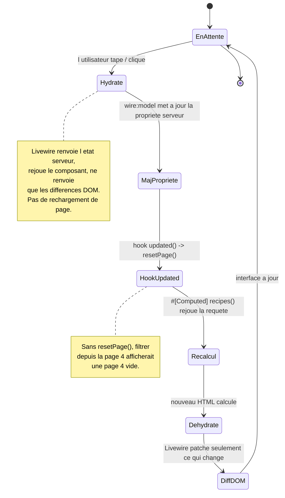
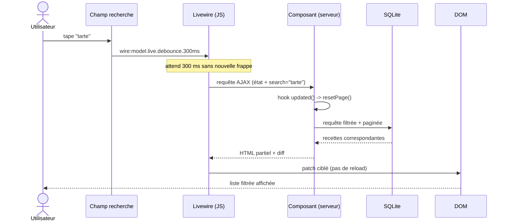
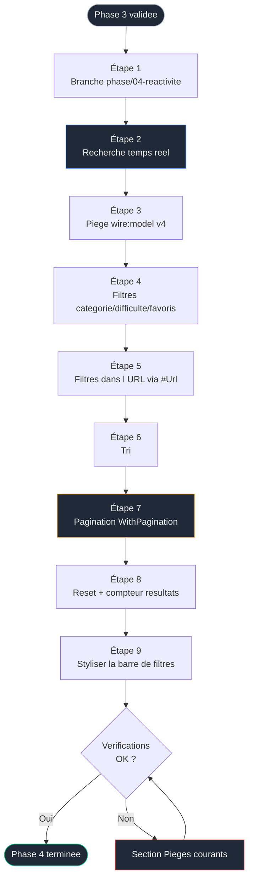

# Phase 4 — Réactivité Livewire : recherche, filtres, tri, pagination


> [!IMPORTANT]
> ### Objectif
> Rendre la liste de recettes interactive en enrichissant le composant `recipe-index` de la Phase 3, sans le réécrire. Recherche en temps réel, filtres par catégorie / difficulté / favoris, tri, pagination, et filtres partageables via l'URL. C'est ici qu'on exploite la moitié droite du cycle de vie Livewire vue en Phase 3.

> Pré-requis strict : la [Phase 3 — Premier composant Livewire](./03-livewire.md) est terminée. `/recettes` affiche une grille de cartes stylée, produite par le Single-File Component `recipe-index`, sans aucune interaction.
<br>

---

<br>
> Phase précédente : [03-livewire.md](./03-livewire.md)
> Phase suivante : [05-crud-alpine.md](./05-crud-alpine.md)
<br>

---

<br>

## Sommaire

- [Le lien avec la Phase 3](#le-lien-avec-la-phase-3)
- [Concepts introduits dans cette phase](#concepts-introduits-dans-cette-phase)
- [La boucle réactive de Livewire](#la-boucle-réactive-de-livewire)
- [Diagramme de séquence : une frappe dans le champ de recherche](#diagramme-de-séquence--une-frappe-dans-le-champ-de-recherche)
- [Flux de la phase](#flux-de-la-phase)
- [Étape 1 — Brancher](#étape-1--brancher)
- [Étape 2 — Recherche en temps réel](#étape-2--recherche-en-temps-réel)
- [Étape 3 — Le piège wire:model de Livewire 4](#étape-3--le-piège-wiremodel-de-livewire-4)
- [Étape 4 — Filtres catégorie, difficulté, favoris](#étape-4--filtres-catégorie-difficulté-favoris)
- [Étape 5 — Rendre les filtres partageables via l'URL](#étape-5--rendre-les-filtres-partageables-via-lurl)
- [Étape 6 — Tri](#étape-6--tri)
- [Étape 7 — Pagination](#étape-7--pagination)
- [Étape 8 — Réinitialisation et compteur de résultats](#étape-8--réinitialisation-et-compteur-de-résultats)
- [Étape 9 — Styliser la barre de filtres](#étape-9--styliser-la-barre-de-filtres)
- [Le composant complet de cette phase](#le-composant-complet-de-cette-phase)
- [Vérifications finales](#vérifications-finales)
- [Pièges courants](#pièges-courants)
- [Ce que tu as à la fin de cette phase](#ce-que-tu-as-à-la-fin-de-cette-phase)

<br>

---

<br>

## Le lien avec la Phase 3

En Phase 3, le composant exposait les recettes via une propriété calculée figée :

```php
#[Computed]
public function recipes()
{
    return Recipe::with('tags')->latest()->get();
}
```

En Phase 4, **cette même méthode** devient le point d'application de tous tes filtres. La requête se construit dynamiquement selon des propriétés publiques pilotées par l'interface. Tu n'ajoutes pas un nouveau composant : tu fais vivre celui qui existe.

<br>

---

<br>

## Concepts introduits dans cette phase

| Concept | Rôle | Nouveauté |
|---|---|---|
| Propriété publique liée | État du composant, synchronisé avec un champ | Nouveau |
| `wire:model.live` | Lier un champ et déclencher une requête à chaque frappe | Nouveau |
| `.debounce` | Temporiser pour ne pas envoyer une requête à chaque touche | Nouveau |
| `when()` Eloquent | Ajouter une clause seulement si une condition est vraie | Nouveau |
| `#[Url]` | Synchroniser une propriété avec la query string | Nouveau |
| `WithPagination` | Paginer les résultats | Nouveau |
| `resetPage()` + hook `updated()` | Revenir page 1 quand un filtre change | Nouveau |
| `wire:click` | Déclencher une méthode du composant | Nouveau |

<br>

---

<br>

## La boucle réactive de Livewire

En Phase 3, on s'était arrêté à l'état « EnAttente ». La Phase 4 active la boucle complète.



<br>

---

<br>

## Diagramme de séquence : une frappe dans le champ de recherche



<br>

---

<br>

## Flux de la phase



<br>

---

<br>

## Étape 1 — Brancher

### Initialisation de la Phase 4

#### Windows (PowerShell)
```powershell
cd $env:USERPROFILE\Documents\Projets\recettebox
git status
git checkout -b phase/04-reactivite
```

#### macOS / Linux (Terminal)
```bash
cd ~/Documents/Projets/recettebox
git status
git checkout -b phase/04-reactivite
```

<br>

---

<br>

## Étape 2 — Recherche en temps réel

Ajoute une propriété publique `$search` au composant et injecte-la dans la requête.

### Logique PHP : Le filtre search

#### resources/views/livewire/pages/recipe-index.blade.php

```php
<?php

use App\Models\Recipe;
use Livewire\Attributes\Computed;
use Livewire\Attributes\Title;
use Livewire\Component;

new
#[Title('Mes recettes')]
class extends Component {

    /**
     * Propriete publique : son contenu est synchronise avec le champ
     * de recherche cote client via wire:model. Valeur par defaut vide.
     */
    public string $search = '';

    #[Computed]
    public function recipes()
    {
        return Recipe::query()
            ->with('tags')
            // when() : la clause where n'est ajoutee QUE si $this->search
            // n'est pas vide. Evite de filtrer sur une chaine vide.
            ->when($this->search, fn ($q) =>
                $q->where('title', 'like', '%'.$this->search.'%')
            )
            ->latest()
            ->get();
    }
};
?>
```

### Interface Blade : Le champ de recherche

#### resources/views/livewire/pages/recipe-index.blade.php

```blade
<div class="mx-auto max-w-5xl px-4 py-8">
    <h1 class="text-3xl font-bold tracking-tight mb-6">Mes recettes</h1>

    {{-- wire:model.live : lie le champ a la propriete $search ET
         declenche une requete serveur a chaque changement.
         .debounce.300ms : attend 300 ms sans frappe avant d'envoyer,
         pour ne pas inonder le serveur a chaque touche. --}}
    <input
        type="text"
        wire:model.live.debounce.300ms="search"
        placeholder="Rechercher une recette..."
        class="mb-6 w-full rounded-lg border border-gray-300 px-4 py-2 focus:border-gray-900 focus:outline-none"
    >

    {{-- ... la grille @if/@foreach de la Phase 3 reste ici, inchangee ... --}}
</div>
```

Recharge, tape dans le champ : ta liste se filtre sans rechargement de page. La réactivité serveur-client est en place.

> Différence `wire:model` seul vs `wire:model.live` : sans `.live`, la propriété ne se synchronise qu'à un événement déclencheur (soumission, perte de focus selon le cas). Avec `.live`, chaque changement déclenche une requête. Pour une recherche, on veut `.live` ; pour un formulaire de création (Phase 5), on voudra l'inverse.

<br>

---

<br>

## Étape 3 — Le piège wire:model de Livewire 4

### Différence de comportement v3 vs v4

| Version | Comportement de `wire:model` |
|---|---|
| Livewire 3 | Écoute aussi les événements remontés par les éléments enfants (bubbling) |
| Livewire 4 | Écoute **uniquement** l'événement de l'élément qui porte la directive |

Conséquence : si tu places `wire:model` sur un conteneur englobant un `<input>` (au lieu de l'input lui-même), ça ne fonctionnera plus comme en v3. Le modificateur `.deep` restaure l'ancien comportement :

```blade
{{-- Cas standard, sans souci : la directive est SUR l'input --}}
<input wire:model.live="search">

{{-- Cas ou .deep redevient necessaire : directive sur un conteneur --}}
<div wire:model.live.deep="search">
    <input ...>
</div>
```

Dans RecetteBox, toutes nos directives sont posées directement sur les champs : `.deep` n'est pas nécessaire. Mais connaître ce piège évite des heures de débogage si tu réutilises du code Livewire 3 ailleurs.

<br>

---

<br>

## Étape 4 — Filtres catégorie, difficulté, favoris

Ajoute trois propriétés de filtre. Décision pédagogique à comprendre : bien que le modèle `Recipe` caste `category` et `difficulty` en enum, **tes propriétés de filtre restent des chaînes**. Un `<select>` HTML renvoie toujours une chaîne ; on compare cette chaîne à la colonne (qui stocke la valeur de l'enum). Inutile de caster côté filtre : cela ajouterait de la complexité sans gain réel.

### Mise à jour de la logique PHP

#### resources/views/livewire/pages/recipe-index.blade.php

```php
use App\Enums\RecipeCategory;
use App\Enums\RecipeDifficulty;

// ... dans la classe :

public string $search = '';

// Vide = "toutes les categories". Sinon contient la VALEUR de l'enum
// (ex: 'plat'), telle que stockee en base.
public string $category = '';

public string $difficulty = '';

// Booleen : n'afficher que les favoris si vrai.
public bool $onlyFavorites = false;

#[Computed]
public function recipes()
{
    return Recipe::query()
        ->with('tags')
        ->when($this->search, fn ($q) =>
            $q->where('title', 'like', '%'.$this->search.'%')
        )
        ->when($this->category, fn ($q) =>
            $q->where('category', $this->category)
        )
        ->when($this->difficulty, fn ($q) =>
            $q->where('difficulty', $this->difficulty)
        )
        ->when($this->onlyFavorites, fn ($q) =>
            $q->where('is_favorite', true)
        )
        ->latest()
        ->get();
}
```

Pour peupler les listes déroulantes avec les libellés français, on expose les cas d'enums via une seconde propriété calculée :

```php
#[Computed]
public function categories()
{
    // RecipeCategory::cases() : tous les cas de l'enum.
    // On renvoie un tableau [valeur => libelle francais].
    return collect(RecipeCategory::cases())
        ->mapWithKeys(fn ($c) => [$c->value => $c->label()]);
}

#[Computed]
public function difficulties()
{
    return collect(RecipeDifficulty::cases())
        ->mapWithKeys(fn ($d) => [$d->value => $d->label()]);
}
```

### Ajout des menus déroulants et checkboxes

#### resources/views/livewire/pages/recipe-index.blade.php

```blade
<div class="mb-6 flex flex-wrap gap-3">
    {{-- Filtre categorie --}}
    <select wire:model.live="category"
            class="rounded-lg border border-gray-300 px-3 py-2">
        <option value="">Toutes les catégories</option>
        @foreach ($this->categories as $value => $label)
            <option value="{{ $value }}">{{ $label }}</option>
        @endforeach
    </select>

    {{-- Filtre difficulte --}}
    <select wire:model.live="difficulty"
            class="rounded-lg border border-gray-300 px-3 py-2">
        <option value="">Toutes les difficultés</option>
        @foreach ($this->difficulties as $value => $label)
            <option value="{{ $value }}">{{ $label }}</option>
        @endforeach
    </select>

    {{-- Filtre favoris : case a cocher liee a un booleen --}}
    <label class="flex items-center gap-2 text-sm">
        <input type="checkbox" wire:model.live="onlyFavorites"
               class="rounded border-gray-300">
        Favoris uniquement
    </label>
</div>
```

<br>

---

<br>

## Étape 5 — Rendre les filtres partageables via l'URL

Sans rien de plus, recharger la page perd les filtres. L'attribut `#[Url]` synchronise une propriété avec la query string : l'état devient partageable et survit au rechargement.

### Utilisation de l'attribut #[Url]

#### resources/views/livewire/pages/recipe-index.blade.php

```php
use Livewire\Attributes\Url;

// #[Url] : la propriete apparait dans l'URL (?search=...&category=...).
// L'utilisateur peut copier l'URL filtree, la partager, la mettre en favori.
#[Url]
public string $search = '';

#[Url]
public string $category = '';

#[Url]
public string $difficulty = '';

// except: false -> ne met onlyFavorites dans l'URL que s'il differe
// de la valeur par defaut, pour garder une URL propre.
#[Url(except: false)]
public bool $onlyFavorites = false;
```

Teste : applique des filtres, observe l'URL changer, recharge la page. Les filtres persistent. Copie l'URL dans un autre onglet : même résultat filtré.

<br>

---

<br>

## Étape 6 — Tri

Ajoute deux propriétés de tri et une méthode pour basculer l'ordre. Le tri n'a pas besoin d'être dans l'URL ici (choix assumé pour limiter le bruit ; tu peux ajouter `#[Url]` si tu veux le partager aussi).

### Logique PHP du tri

#### resources/views/livewire/pages/recipe-index.blade.php

```php
public string $sortField = 'created_at';
public string $sortDirection = 'desc';

/**
 * Change le champ de tri. Si on reclique le meme champ,
 * on inverse seulement la direction.
 */
public function sortBy(string $field): void
{
    if ($this->sortField === $field) {
        $this->sortDirection = $this->sortDirection === 'asc' ? 'desc' : 'asc';
    } else {
        $this->sortField = $field;
        $this->sortDirection = 'asc';
    }
}
```

Intègre le tri dans la requête de `recipes()`, en remplaçant `->latest()` :

```php
// Remplace ->latest() par un tri dynamique pilote par l'interface.
->orderBy($this->sortField, $this->sortDirection)
```

### Interface de tri

#### resources/views/livewire/pages/recipe-index.blade.php

```blade
<div class="mb-4 flex gap-2 text-sm">
    <span class="text-gray-500">Trier par :</span>
    <button wire:click="sortBy('title')"
            class="underline decoration-dotted hover:text-gray-900">
        Titre
    </button>
    <button wire:click="sortBy('prep_minutes')"
            class="underline decoration-dotted hover:text-gray-900">
        Temps
    </button>
    <button wire:click="sortBy('created_at')"
            class="underline decoration-dotted hover:text-gray-900">
        Date d'ajout
    </button>
    <span class="text-gray-400">
        ({{ $sortField }} / {{ $sortDirection }})
    </span>
</div>
```

> `wire:click="sortBy('title')"` appelle directement la méthode PHP du composant, avec un argument. Aucune ligne de JavaScript écrite.

<br>

---

<br>

## Étape 7 — Pagination

Afficher plus de 30 recettes d'un bloc ne tient pas à l'échelle. Tu vas paginer tes résultats via le trait `WithPagination`. Dans un Single-File Component, le trait s'utilise dans la classe anonyme comme dans une classe normale.

### Logique PHP de pagination

#### resources/views/livewire/pages/recipe-index.blade.php

```php
use Livewire\WithPagination;

new
#[Title('Mes recettes')]
class extends Component {
    use WithPagination; // active la pagination

    // ... proprietes ...

    #[Computed]
    public function recipes()
    {
        return Recipe::query()
            ->with('tags')
            ->when($this->search, fn ($q) =>
                $q->where('title', 'like', '%'.$this->search.'%'))
            ->when($this->category, fn ($q) =>
                $q->where('category', $this->category))
            ->when($this->difficulty, fn ($q) =>
                $q->where('difficulty', $this->difficulty))
            ->when($this->onlyFavorites, fn ($q) =>
                $q->where('is_favorite', true))
            ->orderBy($this->sortField, $this->sortDirection)
            // paginate() remplace get() : 12 recettes par page.
            ->paginate(12);
    }

    /**
     * Hook de cycle de vie : appele a CHAQUE mise a jour d'une propriete.
     * On revient page 1 des qu'un filtre change, sauf si la propriete
     * modifiee est 'page' (sinon on bouclerait).
     */
    public function updated(string $property): void
    {
        if ($property !== 'page') {
            $this->resetPage();
        }
    }
};
```

### Liens de pagination Blade

#### resources/views/livewire/pages/recipe-index.blade.php

```blade
{{-- $this->recipes est maintenant un paginateur.
     ->links() genere les liens de pages, stylise en Tailwind par defaut
     (c'est pourquoi on a garde le @source vendor pagination en Phase 3). --}}
<div class="mt-8">
    {{ $this->recipes->links() }}
</div>
```

> Pourquoi `resetPage()` est indispensable : sans lui, un utilisateur en page 4 qui tape une recherche verrait la page 4 d'un résultat qui n'a peut-être qu'une page. Le hook `updated()` corrige ça globalement, sans dupliquer la logique pour chaque filtre.

<br>

---

<br>

## Étape 8 — Réinitialisation et compteur de résultats

Ajoute une méthode de remise à zéro et un compteur. Le compteur utilise `total()` du paginateur.

### Méthode resetFilters

#### resources/views/livewire/pages/recipe-index.blade.php

```php
/**
 * Remet tous les filtres a leur valeur par defaut.
 */
public function resetFilters(): void
{
    $this->reset(['search', 'category', 'difficulty', 'onlyFavorites']);
    $this->resetPage();
}
```

### Compteur et bouton de remise à zéro

#### resources/views/livewire/pages/recipe-index.blade.php

```blade
<div class="mb-4 flex items-center justify-between text-sm text-gray-600">
    {{-- total() : nombre total de resultats filtres, toutes pages confondues --}}
    <span>{{ $this->recipes->total() }} recette(s)</span>

    <button wire:click="resetFilters"
            class="underline decoration-dotted hover:text-gray-900">
        Réinitialiser les filtres
    </button>
</div>
```

<br>

---

<br>

## Étape 9 — Styliser la barre de filtres

Regroupe recherche, filtres et tri dans un encart cohérent. Remplace l'empilement actuel par un conteneur unique :

### Refonte visuelle de la barre d'outils

#### resources/views/livewire/pages/recipe-index.blade.php

```blade
<div class="mb-6 rounded-xl border border-gray-200 bg-white p-4 shadow-sm">
    <input
        type="text"
        wire:model.live.debounce.300ms="search"
        placeholder="Rechercher une recette..."
        class="mb-3 w-full rounded-lg border border-gray-300 px-4 py-2 focus:border-gray-900 focus:outline-none"
    >

    <div class="flex flex-wrap items-center gap-3">
        <select wire:model.live="category"
                class="rounded-lg border border-gray-300 px-3 py-2 text-sm">
            <option value="">Toutes les catégories</option>
            @foreach ($this->categories as $value => $label)
                <option value="{{ $value }}">{{ $label }}</option>
            @endforeach
        </select>

        <select wire:model.live="difficulty"
                class="rounded-lg border border-gray-300 px-3 py-2 text-sm">
            <option value="">Toutes les difficultés</option>
            @foreach ($this->difficulties as $value => $label)
                <option value="{{ $value }}">{{ $label }}</option>
            @endforeach
        </select>

        <label class="flex items-center gap-2 text-sm">
            <input type="checkbox" wire:model.live="onlyFavorites"
                   class="rounded border-gray-300">
            Favoris uniquement
        </label>
    </div>
</div>
```

Commit :

```powershell
git add .
git commit -m "feat: recherche temps reel, filtres, tri, pagination, filtres dans l URL"
```

<br>

---

<br>

## Le composant complet de cette phase

### Code source final du SFC

#### resources/views/livewire/pages/recipe-index.blade.php

```php
<?php

use App\Enums\RecipeCategory;
use App\Enums\RecipeDifficulty;
use App\Models\Recipe;
use Livewire\Attributes\Computed;
use Livewire\Attributes\Title;
use Livewire\Attributes\Url;
use Livewire\Component;
use Livewire\WithPagination;

new
#[Title('Mes recettes')]
class extends Component {
    use WithPagination;

    #[Url] public string $search = '';
    #[Url] public string $category = '';
    #[Url] public string $difficulty = '';
    #[Url(except: false)] public bool $onlyFavorites = false;

    public string $sortField = 'created_at';
    public string $sortDirection = 'desc';

    public function sortBy(string $field): void
    {
        if ($this->sortField === $field) {
            $this->sortDirection = $this->sortDirection === 'asc' ? 'desc' : 'asc';
        } else {
            $this->sortField = $field;
            $this->sortDirection = 'asc';
        }
    }

    public function resetFilters(): void
    {
        $this->reset(['search', 'category', 'difficulty', 'onlyFavorites']);
        $this->resetPage();
    }

    public function updated(string $property): void
    {
        if ($property !== 'page') {
            $this->resetPage();
        }
    }

    #[Computed]
    public function recipes()
    {
        return Recipe::query()
            ->with('tags')
            ->when($this->search, fn ($q) =>
                $q->where('title', 'like', '%'.$this->search.'%'))
            ->when($this->category, fn ($q) =>
                $q->where('category', $this->category))
            ->when($this->difficulty, fn ($q) =>
                $q->where('difficulty', $this->difficulty))
            ->when($this->onlyFavorites, fn ($q) =>
                $q->where('is_favorite', true))
            ->orderBy($this->sortField, $this->sortDirection)
            ->paginate(12);
    }

    #[Computed]
    public function categories()
    {
        return collect(RecipeCategory::cases())
            ->mapWithKeys(fn ($c) => [$c->value => $c->label()]);
    }

    #[Computed]
    public function difficulties()
    {
        return collect(RecipeDifficulty::cases())
            ->mapWithKeys(fn ($d) => [$d->value => $d->label()]);
    }
};
?>
```

<br>

---

<br>

## Vérifications finales

- [ ] Taper dans la recherche filtre la liste sans rechargement
- [ ] Le débounce évite une requête à chaque touche (observable dans l'onglet réseau)
- [ ] Les trois filtres se combinent correctement (recherche + catégorie + difficulté + favoris)
- [ ] Les filtres apparaissent dans l'URL et survivent à un rechargement
- [ ] Copier l'URL filtrée dans un autre onglet reproduit le même résultat
- [ ] Le tri fonctionne et bascule asc/desc en recliquant le même critère
- [ ] La pagination affiche 12 recettes par page, liens stylés Tailwind
- [ ] Filtrer depuis la page 2+ ramène en page 1 (`resetPage`)
- [ ] Le compteur de résultats reflète le total filtré
- [ ] Le bouton de réinitialisation vide tous les filtres
- [ ] Aucune requête N+1 : `with('tags')` toujours présent
- [ ] Commits de la Phase 4 sur la branche `phase/04-reactivite`

<br>

---

<br>

## Pièges courants

| Symptôme | Cause | Résolution |
|---|---|---|
| La recherche ne réagit pas | `wire:model` sans `.live` | Utiliser `wire:model.live` pour un filtrage immédiat |
| Une requête à chaque touche, interface lente | Pas de `.debounce` | Ajouter `.debounce.300ms` |
| `wire:model` sur un conteneur ne marche plus | Changement Livewire 4 (plus de bubbling) | Poser la directive sur l'input lui-même, ou ajouter `.deep` |
| Filtrer en page 3 affiche une page vide | `resetPage()` non appelé | Implémenter le hook `updated()` qui appelle `resetPage()` |
| Boucle infinie de requêtes | `resetPage()` appelé aussi quand `page` change | Exclure `'page'` dans le hook `updated()` |
| Filtres perdus au rechargement | `#[Url]` absent | Ajouter l'attribut `#[Url]` sur les propriétés à persister |
| URL polluée par des valeurs par défaut | `#[Url]` sans `except` | Utiliser `#[Url(except: ...)]` pour omettre la valeur par défaut |
| Pagination non stylée | Vues de pagination non scannées par Tailwind | Vérifier le `@source` vendor pagination dans `app.css` (mis en Phase 3) |
| `Call to undefined method ... resetPage()` | Trait `WithPagination` non importé | Ajouter `use Livewire\WithPagination;` et `use WithPagination;` dans la classe |
| Filtre catégorie sans effet | Comparaison enum/chaîne incohérente | Le filtre doit comparer la **valeur** de l'enum (chaîne stockée), pas l'objet enum |
| Page lente avec beaucoup de données | Tri sur colonne non indexée | Acceptable à cette échelle ; un index sera pertinent si le volume grandit |

<br>

---

<br>

## Ce que tu as à la fin de cette phase

| Élément | État |
|---|---|
| Recherche | Temps réel, débouncée |
| Filtres | Catégorie, difficulté, favoris, combinables |
| Persistance | Filtres dans l'URL, partageables et durables au rechargement |
| Tri | Multi-critères avec bascule asc/desc |
| Pagination | 12 par page, retour page 1 au changement de filtre |
| UX | Compteur de résultats, réinitialisation |
| Performance | Eager loading maintenu, pas de N+1 |
| Git | Branche `phase/04-reactivite`, commits atomiques |

Ta page est désormais réellement utile : on retrouve une recette en quelques secondes. Mais tu ne peux toujours **ni créer, ni modifier, ni supprimer** une recette : la donnée vient uniquement du seeder. C'est volontaire et conforme à la règle « un concept majeur par phase ».

La Phase 5 introduira le dernier outil de la stack TALL encore absent : **Alpine.js**. Il arrive précisément quand Livewire seul ne suffit plus — ouvrir et fermer une fenêtre modale est un comportement purement client, sans aller-retour serveur. On construira un formulaire de création/édition dans une modal Alpine, avec validation Livewire côté serveur. La frontière Livewire / Alpine annoncée dès le README prend alors tout son sens.

<br>

---

<br>

> Phase suivante : `05-crud-alpine.md` — Alpine.js (`x-data`, `x-show`, `x-transition`), modal de création/édition, validation Livewire avec `#[Validate]`, suppression avec confirmation. La frontière client/serveur en pratique.

<br>

