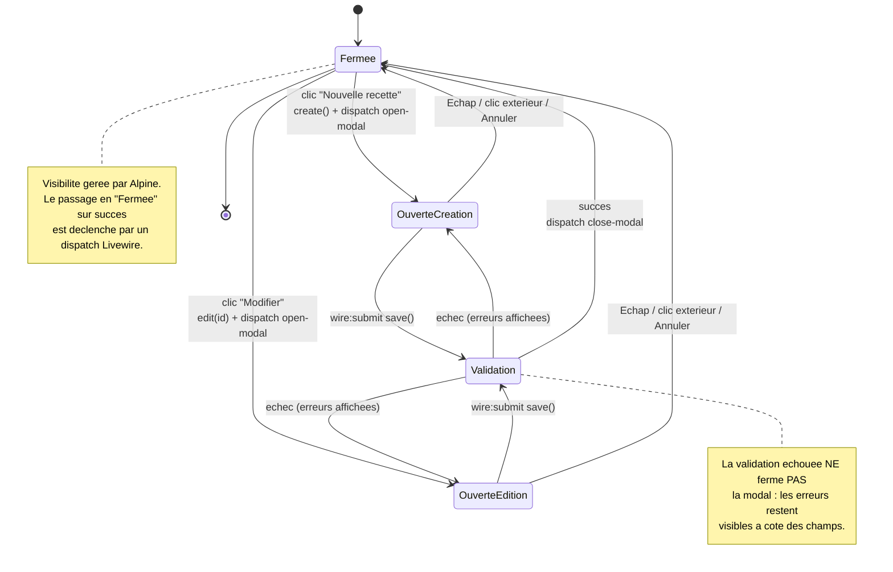
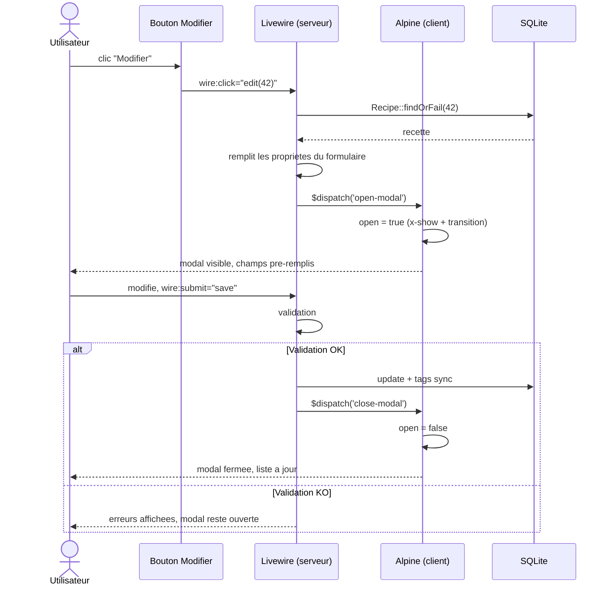
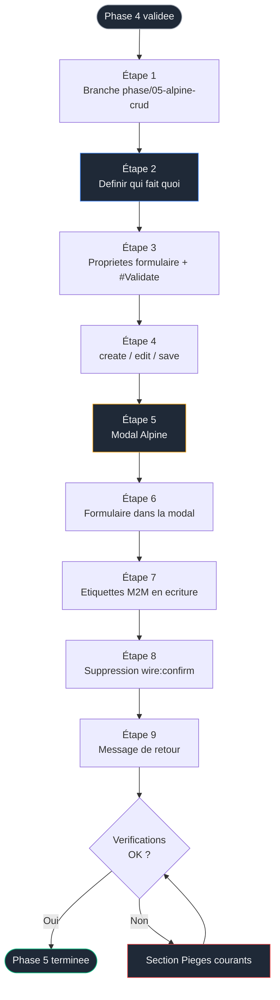

# Phase 5 — Alpine.js et CRUD : la frontière client / serveur en pratique


> [!IMPORTANT]
> ### Objectif
> Ajouter la création, l'édition et la suppression de recettes en enrichissant le composant `recipe-index` existant. Alpine.js fait son entrée, précisément là où Livewire seul ne suffit plus : l'ouverture et la fermeture d'une fenêtre modale sont des comportements purement client. Le formulaire, lui, reste piloté par Livewire avec validation serveur.

> Pré-requis strict : la [Phase 4 — Réactivité Livewire](./04-reactivite.md) est terminée. `/recettes` propose recherche, filtres, tri et pagination, en lecture seule.

<br>

---

<br>

> Phase précédente : [04-reactivite.md](./04-reactivite.md)
> Phase suivante : [06-dashboard.md](./06-dashboard.md)

<br>

---

## Sommaire

- [Le lien avec la Phase 4](#le-lien-avec-la-phase-4)
- [La frontière Livewire / Alpine](#la-frontière-livewire--alpine)
- [Concepts introduits dans cette phase](#concepts-introduits-dans-cette-phase)
- [Diagramme d'état de la modal](#diagramme-détat-de-la-modal)
- [Diagramme de séquence : éditer une recette](#diagramme-de-séquence--éditer-une-recette)
- [Flux de la phase](#flux-de-la-phase)
- [Étape 1 — Brancher](#étape-1--brancher)
- [Étape 2 — Décider qui fait quoi avant de coder](#étape-2--décider-qui-fait-quoi-avant-de-coder)
- [Étape 3 — Propriétés du formulaire et validation](#étape-3--propriétés-du-formulaire-et-validation)
- [Étape 4 — Méthodes create, edit, save](#étape-4--méthodes-create-edit-save)
- [Étape 5 — La modal Alpine](#étape-5--la-modal-alpine)
- [Étape 6 — Le formulaire dans la modal](#étape-6--le-formulaire-dans-la-modal)
- [Étape 7 — Gérer les étiquettes (relation many-to-many en écriture)](#étape-7--gérer-les-étiquettes-relation-many-to-many-en-écriture)
- [Étape 8 — Suppression avec wire:confirm](#étape-8--suppression-avec-wireconfirm)
- [Étape 9 — Message de retour](#étape-9--message-de-retour)
- [Vérifications finales](#vérifications-finales)
- [Pièges courants](#pièges-courants)
- [Ce que tu as à la fin de cette phase](#ce-que-tu-as-à-la-fin-de-cette-phase)

---

## Le lien avec la Phase 4

En Phase 4, ton composant `recipe-index` lisait et filtrait des données. En Phase 5, **ce même composant** apprend à les écrire. Tu n'introduis pas de second composant : la communication inter-composants est un concept lourd, reporté en axe d'amélioration en fin de phase. Tout vit dans `recipe-index`, qui grossit de façon maîtrisée.

---

## La frontière Livewire / Alpine

C'est le concept central de cette phase, annoncé depuis le README. Avant tout code, intériorise ce tableau. La majorité des erreurs d'architecture TALL viennent d'une confusion sur cette frontière.

| Besoin | Outil correct | Pourquoi |
|---|---|---|
| Ouvrir / fermer la modal | **Alpine** | État visuel pur, aucun aller-retour serveur nécessaire |
| Animation d'apparition de la modal | **Alpine** (`x-transition`) | Purement client |
| Fermer la modal avec Échap ou clic extérieur | **Alpine** | Interaction navigateur, pas de logique métier |
| Pré-remplir le formulaire pour une édition | **Livewire** | Les données viennent de la base |
| Valider les champs | **Livewire** (`#[Validate]`) | La validation fiable est serveur |
| Enregistrer / mettre à jour | **Livewire** | Écriture en base |
| Confirmer une suppression | **Livewire** (`wire:confirm`) | Livewire fournit déjà l'outil ; inutile de réinventer en Alpine |
| Synchroniser la fermeture après succès | **Livewire dispatch → Alpine écoute** | Le serveur décide du succès, le client réagit visuellement |

Retiens la règle : **si ça touche la base ou la validation, c'est Livewire ; si c'est purement visuel et instantané, c'est Alpine.** La coordination se fait par événements.

---

## Concepts introduits dans cette phase

| Concept | Rôle | Nouveauté |
|---|---|---|
| Alpine `x-data` | Déclarer un état local client | Nouveau |
| Alpine `x-show` / `x-transition` | Afficher/masquer avec animation | Nouveau |
| Alpine `@click.outside`, `@keydown.escape` | Fermeture intuitive de la modal | Nouveau |
| `$dispatch` (Livewire) → écoute Alpine | Coordonner serveur et client | Nouveau |
| `#[Validate]` | Règles de validation déclaratives | Nouveau |
| `wire:submit` | Soumettre un formulaire sans rechargement | Nouveau |
| `@error` | Afficher les messages de validation | Nouveau |
| `wire:confirm` | Confirmation native avant action | Nouveau |
| `sync()` sur relation many-to-many | Écrire les étiquettes d'une recette | Nouveau (lecture vue en Phase 2) |
| `$this->reset()` / `resetValidation()` | Nettoyer l'état entre deux ouvertures | Nouveau |

---

## Diagramme d'état de la modal



---

## Diagramme de séquence : éditer une recette



---

## Flux de la phase



---

## Étape 1 — Brancher

### Initialisation de la Phase 5

#### Windows (PowerShell)
```powershell
cd $env:USERPROFILE\Documents\Projets\recettebox
git status
git checkout -b phase/05-alpine-crud
```

#### macOS / Linux (Terminal)
```bash
cd ~/Documents/Projets\recettebox
git status
git checkout -b phase/05-alpine-crud
```

---

## Étape 2 — Décider qui fait quoi avant de coder

Reprends le tableau de la section « frontière » et formule-le pour ton projet :

- L'état `open` de la modal est une variable **Alpine**, vivant dans le navigateur.
- Les champs (`title`, `category`, …) sont des propriétés **Livewire**, vivant côté serveur.
- Ton bouton « Nouvelle recette » appelle une méthode **Livewire** (`create()`), car il faut vider proprement le formulaire côté serveur, puis cette méthode **dispatche** un événement qu'**Alpine** écoute pour ouvrir la modal.
- Ton bouton « Supprimer » utilise `wire:confirm` (**Livewire**) : pas besoin d'Alpine, l'outil existe déjà.

Coder sans avoir fixé cette répartition mène systématiquement à des modals qui ne se ferment pas ou des états incohérents.

---

## Étape 3 — Propriétés du formulaire et validation

Ajoute au composant `recipe-index` les propriétés du formulaire et leurs règles via l'attribut `#[Validate]` (validation déclarative de Livewire 4, qui remplace l'ancien tableau `$rules`).

### Définition de l'état du formulaire

#### resources/views/livewire/pages/recipe-index.blade.php

```php
use Livewire\Attributes\Validate;

// --- État du formulaire ---

// null = mode creation ; un id = mode edition.
public ?int $editingId = null;

#[Validate('required|string|max:255')]
public string $title = '';

#[Validate('required|string')]
public string $category = '';

#[Validate('required|string')]
public string $difficulty = '';

#[Validate('required|integer|min:1|max:1440')]
public int $prep_minutes = 30;

#[Validate('required|integer|min:1|max:50')]
public int $servings = 4;

#[Validate('required|string|min:10')]
public string $instructions = '';

#[Validate('nullable|url|max:255')]
public ?string $source_url = null;

#[Validate('nullable|string|max:500')]
public ?string $notes = null;

public bool $is_favorite = false;

// Identifiants des etiquettes cochees (relation many-to-many).
#[Validate('array')]
public array $selectedTags = [];
```

> `#[Validate]` attache la règle directement à la propriété. Tes messages d'erreur deviennent accessibles dans le template via `@error('title')`. Plus de tableau `$rules` à maintenir séparément.

---

## Étape 4 — Méthodes create, edit, save

Trois méthodes vont piloter le cycle. Note bien où chacune **dispatche** un événement vers Alpine.

### Logique PHP des actions CRUD

#### resources/views/livewire/pages/recipe-index.blade.php

```php
use App\Models\Recipe;

/**
 * Mode creation : vide le formulaire, nettoie les erreurs
 * residuelles, puis demande a Alpine d'ouvrir la modal.
 */
public function create(): void
{
    $this->reset([
        'editingId', 'title', 'category', 'difficulty',
        'prep_minutes', 'servings', 'instructions',
        'source_url', 'notes', 'is_favorite', 'selectedTags',
    ]);
    $this->resetValidation(); // efface d'eventuelles erreurs precedentes

    // dispatch cote Livewire : Alpine ecoutera 'open-modal'
    $this->dispatch('open-modal');
}

/**
 * Mode edition : charge la recette dans le formulaire,
 * puis demande l'ouverture de la modal.
 */
public function edit(int $id): void
{
    $recipe = Recipe::with('tags')->findOrFail($id);

    $this->editingId    = $recipe->id;
    $this->title        = $recipe->title;
    // category est un enum cote modele : on stocke sa VALEUR (chaine)
    // car les <select> du formulaire manipulent des chaines.
    $this->category     = $recipe->category->value;
    $this->difficulty   = $recipe->difficulty->value;
    $this->prep_minutes = $recipe->prep_minutes;
    $this->servings     = $recipe->servings;
    $this->instructions = $recipe->instructions;
    $this->source_url   = $recipe->source_url;
    $this->notes        = $recipe->notes;
    $this->is_favorite  = $recipe->is_favorite;
    $this->selectedTags = $recipe->tags->pluck('id')->all();

    $this->resetValidation();
    $this->dispatch('open-modal');
}

/**
 * Enregistre (creation ou mise a jour selon $editingId).
 * En cas d'echec de validation, l'execution s'arrete ici
 * et les erreurs s'affichent : la modal NE se ferme pas.
 */
public function save(): void
{
    // validate() applique toutes les regles #[Validate].
    // S'il echoue, il leve une exception geree par Livewire
    // et le reste de la methode n'est pas execute.
    $validated = $this->validate();

    $recipe = Recipe::updateOrCreate(
        ['id' => $this->editingId], // si null -> creation
        [
            'title'        => $this->title,
            'category'     => $this->category,
            'difficulty'   => $this->difficulty,
            'prep_minutes' => $this->prep_minutes,
            'servings'     => $this->servings,
            'instructions' => $this->instructions,
            'source_url'   => $this->source_url,
            'notes'        => $this->notes,
            'is_favorite'  => $this->is_favorite,
        ]
    );

    // Relation many-to-many : sync remplace l'ensemble des tags.
    $recipe->tags()->sync($this->selectedTags);

    // Message de retour (affiche a l'Étape 9).
    session()->flash('message',
        $this->editingId ? 'Recette mise à jour.' : 'Recette créée.'
    );

    // Demande a Alpine de fermer la modal.
    $this->dispatch('close-modal');

    // Vide le formulaire pour la prochaine ouverture.
    $this->reset([
        'editingId', 'title', 'category', 'difficulty',
        'prep_minutes', 'servings', 'instructions',
        'source_url', 'notes', 'is_favorite', 'selectedTags',
    ]);
}

/**
 * Suppression. Appelee apres confirmation (wire:confirm, Étape 8).
 */
public function delete(int $id): void
{
    Recipe::findOrFail($id)->delete();
    session()->flash('message', 'Recette supprimée.');
}
```

> `updateOrCreate` choisit création ou mise à jour selon que `editingId` est `null` ou non : une seule méthode pour les deux cas, sans branchement manuel.

---

## Étape 5 — La modal Alpine

La modal est un bloc Alpine. Son état `open` ne quitte jamais le navigateur. Elle écoute les événements dispatchés par Livewire pour s'ouvrir ou se fermer.

### Structure de la modal Alpine

#### resources/views/livewire/pages/recipe-index.blade.php

```blade
{{-- x-data declare l'etat local Alpine.
     x-on:open-modal.window : ecoute l'evenement dispatche par Livewire
     (create()/edit()). .window car l'evenement remonte jusqu'a window.
     x-on:close-modal.window : ferme apres un save() reussi. --}}
<div
    x-data="{ open: false }"
    x-on:open-modal.window="open = true"
    x-on:close-modal.window="open = false"
    x-cloak
>
    {{-- Fond semi-transparent + centrage. x-show pilote la visibilite. --}}
    <div
        x-show="open"
        x-transition.opacity
        class="fixed inset-0 z-40 bg-black/50"
    ></div>

    <div
        x-show="open"
        x-transition
        class="fixed inset-0 z-50 flex items-center justify-center p-4"
    >
        {{-- @click.outside ferme si on clique hors du panneau.
             @keydown.escape.window ferme avec la touche Echap. --}}
        <div
            @click.outside="open = false"
            @keydown.escape.window="open = false"
            class="w-full max-w-lg rounded-xl bg-white p-6 shadow-xl"
        >
            {{-- Le formulaire Livewire vient ici (Étape 6) --}}
        </div>
    </div>
</div>
```

### La règle CSS x-cloak

Ajoute la règle CSS `x-cloak` pour éviter un flash de la modal au chargement.

#### resources/css/app.css

```css
/* Masque les elements Alpine tant qu'Alpine n'est pas initialise */
[x-cloak] { display: none !important; }
```

### Bouton d'ouverture (Création)

Ajoute le bouton d'ouverture en mode création, en haut de ta page (près du titre) :

#### resources/views/livewire/pages/recipe-index.blade.php

```blade
<button
    wire:click="create"
    class="rounded-lg bg-gray-900 px-4 py-2 text-sm font-medium text-white hover:bg-gray-700"
>
    Nouvelle recette
</button>
```

> Pourquoi ne pas faire `@click="open = true"` directement sur le bouton ? Parce qu'avant d'ouvrir, il faut **vider le formulaire côté serveur** (`create()`). C'est l'illustration exacte de la frontière : Livewire prépare l'état, puis délègue l'ouverture visuelle à Alpine via un événement.

---

## Étape 6 — Le formulaire dans la modal

À l'intérieur du panneau de la modal (là où tu as mis le commentaire), place le formulaire Livewire. `wire:submit` empêche le rechargement et appelle `save()`.

### Champs du formulaire

#### resources/views/livewire/pages/recipe-index.blade.php

```blade
<form wire:submit="save" class="space-y-4">
    <h2 class="text-lg font-semibold">
        {{ $editingId ? 'Modifier la recette' : 'Nouvelle recette' }}
    </h2>

    <div>
        <label class="block text-sm font-medium">Titre</label>
        <input type="text" wire:model="title"
               class="mt-1 w-full rounded-lg border border-gray-300 px-3 py-2">
        {{-- @error affiche le message de la regle #[Validate] echouee --}}
        @error('title')
            <p class="mt-1 text-sm text-red-600">{{ $message }}</p>
        @enderror
    </div>

    <div class="flex gap-3">
        <div class="flex-1">
            <label class="block text-sm font-medium">Catégorie</label>
            <select wire:model="category"
                    class="mt-1 w-full rounded-lg border border-gray-300 px-3 py-2">
                <option value="">—</option>
                @foreach ($this->categories as $value => $label)
                    <option value="{{ $value }}">{{ $label }}</option>
                @endforeach
            </select>
            @error('category')
                <p class="mt-1 text-sm text-red-600">{{ $message }}</p>
            @enderror
        </div>

        <div class="flex-1">
            <label class="block text-sm font-medium">Difficulté</label>
            <select wire:model="difficulty"
                    class="mt-1 w-full rounded-lg border border-gray-300 px-3 py-2">
                <option value="">—</option>
                @foreach ($this->difficulties as $value => $label)
                    <option value="{{ $value }}">{{ $label }}</option>
                @endforeach
            </select>
            @error('difficulty')
                <p class="mt-1 text-sm text-red-600">{{ $message }}</p>
            @enderror
        </div>
    </div>

    <div class="flex gap-3">
        <div class="flex-1">
            <label class="block text-sm font-medium">Temps (min)</label>
            <input type="number" wire:model="prep_minutes"
                   class="mt-1 w-full rounded-lg border border-gray-300 px-3 py-2">
            @error('prep_minutes')
                <p class="mt-1 text-sm text-red-600">{{ $message }}</p>
            @enderror
        </div>
        <div class="flex-1">
            <label class="block text-sm font-medium">Portions</label>
            <input type="number" wire:model="servings"
                   class="mt-1 w-full rounded-lg border border-gray-300 px-3 py-2">
            @error('servings')
                <p class="mt-1 text-sm text-red-600">{{ $message }}</p>
            @enderror
        </div>
    </div>

    <div>
        <label class="block text-sm font-medium">Instructions</label>
        <textarea wire:model="instructions" rows="4"
                  class="mt-1 w-full rounded-lg border border-gray-300 px-3 py-2"></textarea>
        @error('instructions')
            <p class="mt-1 text-sm text-red-600">{{ $message }}</p>
        @enderror
    </div>

    <div>
        <label class="block text-sm font-medium">Lien source (optionnel)</label>
        <input type="url" wire:model="source_url"
               class="mt-1 w-full rounded-lg border border-gray-300 px-3 py-2">
        @error('source_url')
            <p class="mt-1 text-sm text-red-600">{{ $message }}</p>
        @enderror
    </div>

    {{-- Etiquettes : voir Étape 7 --}}

    <label class="flex items-center gap-2 text-sm">
        <input type="checkbox" wire:model="is_favorite"
               class="rounded border-gray-300">
        Marquer comme favori
    </label>

    <div class="flex justify-end gap-2 pt-2">
        {{-- Annuler : pur client, ferme via Alpine sans toucher au serveur --}}
        <button type="button" @click="open = false"
                class="rounded-lg border border-gray-300 px-4 py-2 text-sm">
            Annuler
        </button>
        <button type="submit"
                class="rounded-lg bg-gray-900 px-4 py-2 text-sm text-white hover:bg-gray-700">
            Enregistrer
        </button>
    </div>
</form>
```

> Note la cohérence avec la frontière : le bouton « Annuler » utilise `@click="open = false"` (Alpine pur, aucun intérêt à solliciter le serveur pour fermer), alors que « Enregistrer » passe par `wire:submit` (écriture serveur).

> `wire:model` (sans `.live`) est volontaire ici : dans un formulaire, on ne veut **pas** une requête serveur à chaque frappe. La synchronisation se fait à la soumission. C'est l'inverse du choix de la Phase 4 pour la recherche, et c'est délibéré.

---

## Étape 7 — Gérer les étiquettes (relation many-to-many en écriture)

En Phase 2, tu lisais les tags. Ici tu les écris, via `sync()`. Le formulaire propose les tags existants en cases à cocher. Il faut exposer la liste des tags ; ajoute une propriété calculée :

### Logique PHP des étiquettes

#### resources/views/livewire/pages/recipe-index.blade.php

```php
use App\Models\Tag;

#[Computed]
public function allTags()
{
    return Tag::orderBy('name')->get();
}
```

### Cases à cocher Blade

#### resources/views/livewire/pages/recipe-index.blade.php

```blade
<div>
    <label class="block text-sm font-medium mb-1">Étiquettes</label>
    <div class="flex flex-wrap gap-2">
        @foreach ($this->allTags as $tag)
            <label class="flex items-center gap-1.5 text-sm">
                {{-- wire:model="selectedTags" sur plusieurs cases :
                     Livewire agrege les valeurs cochees dans le tableau. --}}
                <input type="checkbox"
                       value="{{ $tag->id }}"
                       wire:model="selectedTags"
                       class="rounded border-gray-300">
                {{ $tag->name }}
            </label>
        @endforeach
    </div>
</div>
```

Le `sync($this->selectedTags)` déjà écrit dans `save()` (Étape 4) fait le reste : il aligne exactement la table pivot sur les cases cochées (ajoute les nouvelles, retire les décochées). C'est la différence avec `attach()`, qui ne ferait qu'ajouter.

---

## Étape 8 — Suppression avec wire:confirm

Pas besoin d'Alpine : Livewire fournit `wire:confirm`, qui déclenche une confirmation native du navigateur avant d'exécuter l'action. Ajoute un bouton sur chaque carte de recette (dans la boucle `@foreach` de ta grille).

### Actions sur les cartes

#### resources/views/livewire/pages/recipe-index.blade.php

```blade
<button
    wire:click="delete({{ $recipe->id }})"
    wire:confirm="Supprimer définitivement « {{ $recipe->title }} » ?"
    class="text-sm text-red-600 hover:underline"
>
    Supprimer
</button>
```

Ajoute aussi un bouton « Modifier » sur chaque carte :

```blade
<button
    wire:click="edit({{ $recipe->id }})"
    class="text-sm text-gray-600 hover:underline"
>
    Modifier
</button>
```

> Pourquoi `wire:confirm` et pas une modale de confirmation Alpine ? Parce que la frontière dit : ne pas réinventer ce que Livewire fournit déjà. Une modale de confirmation custom serait du sur-travail pour cette phase. Tu pourras la sophistiquer plus tard si besoin (axe d'amélioration).

---

## Étape 9 — Message de retour

`save()` et `delete()` posent un message via `session()->flash('message', ...)`. Tu l'affiches en haut de la page. Version simple ici ; la version animée (toast) est le sujet de la Phase 7.

### Affichage du message flash

#### resources/views/livewire/pages/recipe-index.blade.php

```blade
@if (session('message'))
    <div class="mb-4 rounded-lg bg-green-50 px-4 py-2 text-sm text-green-800">
        {{ session('message') }}
    </div>
@endif
```

Commit :

```powershell
git add .
git commit -m "feat: CRUD recettes via modal Alpine + validation Livewire + wire:confirm"
```

---

## Vérifications finales

- [ ] « Nouvelle recette » ouvre une modal vide
- [ ] La modal s'ouvre avec une transition, sans flash au chargement de page (`x-cloak`)
- [ ] Échap et clic extérieur ferment la modal
- [ ] Soumettre un formulaire invalide affiche les erreurs **et ne ferme pas** la modal
- [ ] Soumettre un formulaire valide crée la recette, ferme la modal, affiche le message
- [ ] « Modifier » ouvre la modal pré-remplie avec les bonnes valeurs
- [ ] Les étiquettes cochées sont correctement enregistrées (vérifier en rééditant)
- [ ] Décocher une étiquette puis enregistrer la retire bien (preuve que `sync` fonctionne)
- [ ] « Supprimer » demande confirmation puis retire la recette
- [ ] Après création, la nouvelle recette respecte les filtres/tri en cours
- [ ] Rouvrir la modal après une erreur ne conserve pas les anciens messages d'erreur
- [ ] Commits de la Phase 5 sur la branche `phase/05-alpine-crud`

---

## Pièges courants

| Symptôme | Cause | Résolution |
|---|---|---|
| La modal ne s'ouvre pas | Événement mal nommé ou `.window` manquant | `x-on:open-modal.window` doit correspondre exactement au nom dispatché |
| Flash visuel de la modal au chargement | `x-cloak` absent ou règle CSS non ajoutée | Ajouter `[x-cloak]{display:none!important}` dans `app.css` et `x-cloak` sur le conteneur |
| La modal reste ouverte après un enregistrement réussi | `$this->dispatch('close-modal')` absent dans `save()` | Dispatcher l'événement de fermeture en fin de `save()` |
| Les erreurs de validation ne s'affichent pas | `@error('champ')` absent ou nom de champ erroné | Le nom dans `@error` doit correspondre exactement au nom de la propriété |
| Anciennes erreurs visibles à la réouverture | `resetValidation()` non appelé dans `create()`/`edit()` | Appeler `$this->resetValidation()` avant de dispatcher l'ouverture |
| Champs résiduels entre création et édition | `reset()` incomplet | Lister **toutes** les propriétés du formulaire dans `$this->reset([...])` |
| Étiquettes non mises à jour | Usage d'`attach()` au lieu de `sync()` | `sync()` aligne la table pivot ; `attach()` ne fait qu'ajouter |
| Perte de l'état Alpine après mise à jour Livewire | Élément de liste sans clé stable | Ajouter `wire:key="recipe-{{ $recipe->id }}"` sur l'élément racine de chaque carte dans la boucle |
| `prep_minutes` rejeté comme chaîne | `<input type=number>` renvoie une chaîne | Le typage `public int $prep_minutes` + règle `integer` gère la conversion ; vérifier que la propriété est bien typée |
| `wire:confirm` sans effet | JS Livewire non chargé sur la page | Vérifier que le composant est bien rendu et `@vite` présent dans le layout |
| Modale dupliquée ou DOM cassé | Plusieurs racines, ou modal hors du `<div>` racine du composant | Garder un unique élément racine ; placer la modal à l'intérieur |

---

## Ce que tu as à la fin de cette phase

| Élément | État |
|---|---|
| Création | Modal Alpine + formulaire Livewire validé |
| Édition | Pré-remplissage serveur, même modal |
| Suppression | `wire:confirm` natif |
| Validation | Déclarative via `#[Validate]`, erreurs inline |
| Étiquettes | Écriture de la relation many-to-many via `sync()` |
| Frontière | Alpine pour le visuel, Livewire pour les données, coordination par événements |
| UX | Message de retour simple après chaque action |
| Git | Branche `phase/05-alpine-crud`, commits atomiques |

L'application est désormais pleinement fonctionnelle : on consulte, filtre, crée, modifie et supprime des recettes. La stack TALL est au complet — Tailwind, Alpine, Livewire, Laravel travaillent ensemble, chacun à sa place.

Axe d'amélioration identifié (non traité, volontairement) : le composant `recipe-index` commence à être volumineux. Une évolution naturelle serait d'extraire le formulaire dans un composant Livewire dédié (`recipe-form`) communiquant par événements. Ce serait l'occasion d'aborder la communication inter-composants — un concept à part entière, hors périmètre de ce parcours d'initiation.

La Phase 6 ne touchera plus au CRUD : elle ajoutera un **tableau de bord** de statistiques (répartition par catégorie, temps moyen, nombre de favoris) sur un second composant page, pour montrer la composition de plusieurs composants et les propriétés calculées persistées.

---

> Phase suivante : [06-dashboard.md](./06-dashboard.md) — second composant page, statistiques via `#[Computed]`, agrégations Eloquent, composition de composants.