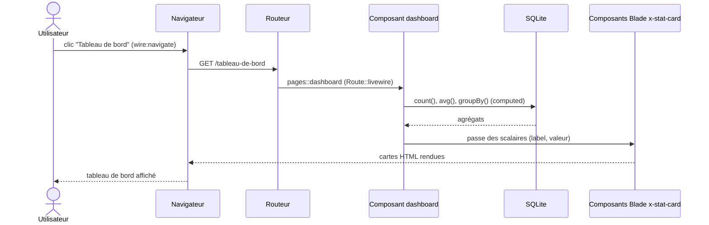
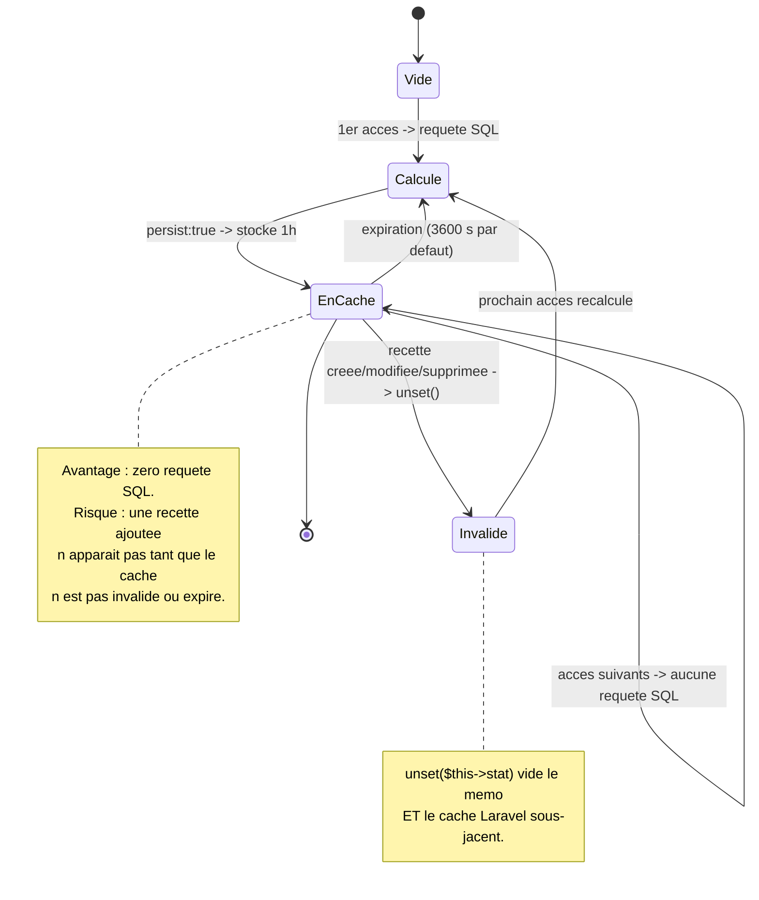
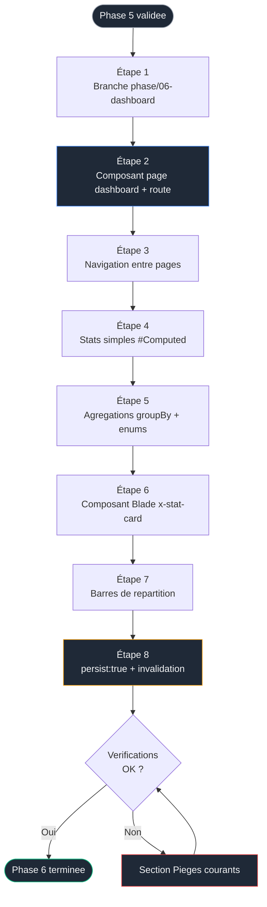

# Phase 6 — Tableau de bord : statistiques calculées et composition


> [!IMPORTANT]
> ### Objectif
> Créer un second composant page (le tableau de bord) qui agrège les recettes en statistiques — répartition par catégorie, par difficulté, temps moyen, favoris. On y aborde les propriétés calculées persistées et la composition de composants, en s'appuyant sur la frontière déjà posée en Phase 5.

> Pré-requis strict : la [Phase 5 — Alpine.js et CRUD](./05-crud-alpine.md) est terminée. L'application gère le CRUD complet des recettes sur la page `/recettes`.

<br>

---

<br>

> Phase précédente : [05-crud-alpine.md](./05-crud-alpine.md)
> Phase suivante : [07-finitions.md](./07-finitions.md)

<br>

---

## Sommaire

- [Le lien avec les phases précédentes](#le-lien-avec-les-phases-précédentes)
- [Concepts introduits dans cette phase](#concepts-introduits-dans-cette-phase)
- [Composant Livewire ou composant Blade : la bonne question](#composant-livewire-ou-composant-blade--la-bonne-question)
- [Diagramme de séquence : chargement du tableau de bord](#diagramme-de-séquence--chargement-du-tableau-de-bord)
- [Diagramme d'état du cache d'une statistique](#diagramme-détat-du-cache-dune-statistique)
- [Flux de la phase](#flux-de-la-phase)
- [Étape 1 — Brancher](#étape-1--brancher)
- [Étape 2 — Créer le composant page dashboard](#étape-2--créer-le-composant-page-dashboard)
- [Étape 3 — Navigation entre les deux pages](#étape-3--navigation-entre-les-deux-pages)
- [Étape 4 — Premières statistiques avec #[Computed]](#étape-4--premières-statistiques-avec-computed)
- [Étape 5 — Agrégations groupées et gestion des enums](#étape-5--agrégations-groupées-et-gestion-des-enums)
- [Étape 6 — Une carte de statistique réutilisable (composant Blade)](#étape-6--une-carte-de-statistique-réutilisable-composant-blade)
- [Étape 7 — Visualiser les répartitions en barres](#étape-7--visualiser-les-répartitions-en-barres)
- [Étape 8 — Optimiser avec #[Computed(persist: true)]](#étape-8--optimiser-avec-computedpersist-true)
- [Vérifications finales](#vérifications-finales)
- [Pièges courants](#pièges-courants)
- [Ce que tu as à la fin de cette phase](#ce-que-tu-as-à-la-fin-de-cette-phase)

---

## Le lien avec les phases précédentes

Jusqu'ici, un seul composant page (`recipe-index`) faisait tout. La Phase 6 introduit un **deuxième** composant page indépendant : `dashboard`. Il ne modifie aucune recette ; il lit et agrège celles que les phases 2 et 5 ont produites. C'est l'occasion de montrer comment plusieurs pages cohabitent et comment un affichage pur se factorise — sans toucher au CRUD existant.

---

## Concepts introduits dans cette phase

| Concept | Rôle | Nouveauté |
|---|---|---|
| Second composant page | Une seconde URL servie par un composant | Nouveau |
| Agrégations Eloquent (`count`, `avg`, `groupBy`) | Calculer des statistiques en base | Nouveau |
| `selectRaw` + `groupBy` | Répartition par catégorie/difficulté | Nouveau |
| Composant Blade (`<x-...>`) | Factoriser un affichage pur, sans état | Nouveau |
| `#[Computed(persist: true)]` | Mettre en cache une stat entre les requêtes | Nouveau |
| Invalidation de cache (`unset`) | Garder des stats fraîches après modification | Nouveau |
| Navigation `wire:navigate` | Passer d'une page à l'autre sans rechargement complet | Nouveau |

---

## Composant Livewire ou composant Blade : la bonne question

Rappel de la frontière posée en Phase 5, déclinée ici. Une erreur fréquente : tout transformer en composant Livewire. Or :

| Élément | Type correct | Raison |
|---|---|---|
| La page tableau de bord | **Composant Livewire** (page) | Elle a une logique serveur (agrégations) et une URL |
| Une carte affichant « 42 recettes » | **Composant Blade** | Affichage pur, aucun état, aucune interactivité |
| Une barre de répartition | **Composant Blade** ou simple markup | Présentation, pas de comportement |

Règle : **un composant Livewire coûte un cycle serveur ; ne l'utilise que s'il y a un état ou une interaction.** Pour de l'affichage paramétré par des valeurs scalaires, un composant Blade est le bon outil — plus léger, sans surcoût réseau.

Piège connexe (constaté en production) : ne **jamais** passer une collection Eloquent en propriété publique à un composant Livewire enfant. La re-sérialisation entre requêtes perd les contraintes et relations de la requête. Les composants Blade n'ont pas ce problème : ils reçoivent les données au rendu, sans cycle de vie.

---

## Diagramme de séquence : chargement du tableau de bord



---

## Diagramme d'état du cache d'une statistique

Concept central de l'étape 8. Une stat persistée a un cycle de vie qu'il faut comprendre pour ne pas afficher des chiffres périmés.



---

## Flux de la phase



---

## Étape 1 — Brancher

### Initialisation de la Phase 6

#### Windows (PowerShell)
```powershell
cd $env:USERPROFILE\Documents\Projets\recettebox
git status
git checkout -b phase/06-dashboard
```

#### macOS / Linux (Terminal)
```bash
cd ~/Documents/Projets\recettebox
git status
git checkout -b phase/06-dashboard
```

---

## Étape 2 — Créer le composant page dashboard

### Création du composant

#### Terminal
```powershell
# Second composant page, dans le namespace pages::
php artisan make:livewire pages.dashboard
```

Contenu minimal du SFC pour valider l'affichage avant d'ajouter la logique.

### Squelette du dashboard

#### resources/views/livewire/pages/dashboard.blade.php

```blade
<?php

use Livewire\Attributes\Title;
use Livewire\Component;

new
#[Title('Tableau de bord')]
class extends Component {
};
?>

<div class="mx-auto max-w-5xl px-4 py-8">
    <h1 class="text-3xl font-bold tracking-tight mb-6">Tableau de bord</h1>
    <p class="text-gray-500">Statistiques à venir.</p>
</div>
```

Déclare la route dans `routes/web.php` :

### Définition des routes

#### routes/web.php
// Premiere page : la liste (Phase 3)
Route::livewire('/recettes', 'pages::recipe-index')->name('recipes.index');

// Seconde page : le tableau de bord (Phase 6)
Route::livewire('/tableau-de-bord', 'pages::dashboard')->name('dashboard');
```

Vérifie : `http://127.0.0.1:8000/tableau-de-bord` affiche le titre.

---

## Étape 3 — Navigation entre les deux pages

Pour relier les deux pages, ajoute une barre de navigation dans le layout. `wire:navigate` charge la page cible sans rechargement complet (navigation type SPA), ce qui préserve la rapidité.

### Barre de navigation

#### resources/views/components/layouts/app.blade.php

```blade
<nav class="border-b border-gray-200 bg-white">
    <div class="mx-auto max-w-5xl px-4 py-3 flex gap-6 text-sm">
        {{-- wire:navigate : navigation sans rechargement complet de page.
             route() genere l'URL a partir du nom de route, jamais en dur. --}}
        <a href="{{ route('recipes.index') }}" wire:navigate
           class="font-medium hover:text-gray-900">Recettes</a>
        <a href="{{ route('dashboard') }}" wire:navigate
           class="font-medium hover:text-gray-900">Tableau de bord</a>
    </div>
</nav>
```

---

## Étape 4 — Premières statistiques avec #[Computed]

Ajoute des agrégations simples. Chaque statistique est une propriété calculée : mémoïsée pour la durée de la requête (pas de double requête si tu l'affiches plusieurs fois).

### Logique PHP des statistiques simples

#### resources/views/livewire/pages/dashboard.blade.php

```php
<?php

use App\Models\Recipe;
use Livewire\Attributes\Computed;
use Livewire\Attributes\Title;
use Livewire\Component;

new
#[Title('Tableau de bord')]
class extends Component {

    #[Computed]
    public function total()
    {
        return Recipe::count();
    }

    #[Computed]
    public function favorites()
    {
        return Recipe::where('is_favorite', true)->count();
    }

    #[Computed]
    public function averageMinutes()
    {
        // avg() renvoie null si la table est vide : on retombe sur 0.
        return (int) round(Recipe::avg('prep_minutes') ?? 0);
    }

    #[Computed]
    public function longest()
    {
        // Recette la plus longue a preparer, ou null si aucune.
        return Recipe::orderByDesc('prep_minutes')->first();
    }
};
?>
```

### Markup de validation

#### resources/views/livewire/pages/dashboard.blade.php

```blade
<div class="mx-auto max-w-5xl px-4 py-8">
    <h1 class="text-3xl font-bold tracking-tight mb-6">Tableau de bord</h1>

    <ul class="space-y-1 text-sm">
        <li>Total : {{ $this->total }}</li>
        <li>Favoris : {{ $this->favorites }}</li>
        <li>Temps moyen : {{ $this->averageMinutes }} min</li>
        <li>
            La plus longue :
            {{ $this->longest?->title ?? '—' }}
        </li>
    </ul>
</div>
```

> `$this->longest?->title` : l'opérateur `?->` évite une erreur si aucune recette n'existe (la méthode renvoie `null`). Ce genre de garde est indispensable sur un tableau de bord, qui doit fonctionner même base vide.

---

## Étape 5 — Agrégations groupées et gestion des enums

La répartition par catégorie nécessite un `GROUP BY`. Point d'attention sur les enums : `selectRaw` court-circuite le cast Eloquent, donc la clé retournée est la **chaîne brute** stockée (`'plat'`), pas l'objet enum. Tu dois reconvertir à l'affichage.

### Logique PHP des répartitions

#### resources/views/livewire/pages/dashboard.blade.php

```php
use App\Enums\RecipeCategory;
use App\Enums\RecipeDifficulty;

#[Computed]
public function byCategory()
{
    // selectRaw + groupBy : COUNT par categorie.
    // pluck('total', 'category') -> ['plat' => 12, 'dessert' => 7, ...]
    // La cle est la VALEUR brute (selectRaw ignore le cast enum).
    return Recipe::query()
        ->selectRaw('category, COUNT(*) as total')
        ->groupBy('category')
        ->pluck('total', 'category');
}

#[Computed]
public function byDifficulty()
{
    return Recipe::query()
        ->selectRaw('difficulty, COUNT(*) as total')
        ->groupBy('difficulty')
        ->pluck('total', 'difficulty');
}
```

Pour réafficher le libellé français, reconstruis l'enum depuis la valeur dans le template.

### Affichage des libellés (Blade)

#### resources/views/livewire/pages/dashboard.blade.php

```blade
<h2 class="font-semibold mt-6 mb-2">Par catégorie</h2>
<ul class="text-sm space-y-1">
    @foreach ($this->byCategory as $value => $count)
        <li>
            {{-- RecipeCategory::from($value) : reconstruit l'enum a partir
                 de la chaine brute, puis ->label() pour le francais. --}}
            {{ \App\Enums\RecipeCategory::from($value)->label() }} :
            {{ $count }}
        </li>
    @endforeach
</ul>
```

> Si une valeur en base ne correspond à aucun cas d'enum, `from()` lève une exception. C'est voulu : cela signale une donnée corrompue. Pour tolérer le cas, `tryFrom()` renvoie `null` au lieu de lever ; à utiliser seulement si tu acceptes des valeurs hors enum, ce qui n'est pas le cas ici.

---

## Étape 6 — Une carte de statistique réutilisable (composant Blade)

Les quatre chiffres clés méritent une présentation homogène. Factorise avec un **composant Blade** (et non Livewire : affichage pur, aucun état).

### Création du composant Blade

#### Terminal
```powershell
# Genere un composant Blade (pas Livewire)
php artisan make:component StatCard --view
```

Cela crée `resources/views/components/stat-card.blade.php`. Remplace son contenu.

### Markup de la carte

#### resources/views/components/stat-card.blade.php

```blade
{{-- Composant Blade de presentation pure.
     @props declare les attributs attendus avec leurs valeurs par defaut. --}}
@props([
    'label',
    'value',
    'unit' => null,
])

<div class="rounded-xl border border-gray-200 bg-white p-5 shadow-sm">
    <p class="text-sm text-gray-500">{{ $label }}</p>
    <p class="mt-1 text-3xl font-bold tracking-tight">
        {{ $value }}<span class="text-base font-normal text-gray-400">{{ $unit ? ' '.$unit : '' }}</span>
    </p>
</div>
```

### Utilisation dans le dashboard

#### resources/views/livewire/pages/dashboard.blade.php

```blade
<div class="grid grid-cols-2 gap-4 lg:grid-cols-4">
    {{-- Chaque <x-stat-card> est un composant Blade, sans cycle serveur.
         On lui passe uniquement des scalaires. --}}
    <x-stat-card label="Recettes" :value="$this->total" />
    <x-stat-card label="Favoris" :value="$this->favorites" />
    <x-stat-card label="Temps moyen" :value="$this->averageMinutes" unit="min" />
    <x-stat-card label="Plus longue" :value="$this->longest?->prep_minutes ?? 0" unit="min" />
</div>
```

> On passe `$this->total` (un entier), jamais une collection Eloquent. C'est la règle de composition propre : les composants Blade reçoivent des valeurs simples, pas des modèles à re-sérialiser.

---

## Étape 7 — Visualiser les répartitions en barres

Pas de librairie de graphes : une barre proportionnelle en Tailwind suffit, sans dépendance JavaScript supplémentaire (décision assumée pour rester léger). La largeur est un pourcentage du total.

### Barres de répartition Blade

#### resources/views/livewire/pages/dashboard.blade.php

```blade
<h2 class="mt-8 mb-3 text-lg font-semibold">Répartition par catégorie</h2>
<div class="space-y-2">
    @foreach ($this->byCategory as $value => $count)
        @php
            // Pourcentage relatif au total. Garde contre la division par zero.
            $pct = $this->total > 0 ? round($count * 100 / $this->total) : 0;
        @endphp
        <div>
            <div class="flex justify-between text-sm">
                <span>{{ \App\Enums\RecipeCategory::from($value)->label() }}</span>
                <span class="text-gray-500">{{ $count }} ({{ $pct }} %)</span>
            </div>
            <div class="mt-1 h-2 rounded-full bg-gray-100">
                {{-- Largeur dynamique via style inline : le pourcentage
                     est une donnee, pas une classe utilitaire fixe. --}}
                <div class="h-2 rounded-full bg-gray-900"
                     style="width: {{ $pct }}%"></div>
            </div>
        </div>
    @endforeach
</div>
```

> Pourquoi `style="width: X%"` et pas une classe Tailwind ? Parce que le pourcentage est une valeur calculée à l'exécution. Tailwind ne génère que les classes présentes dans le code source au build ; une largeur dynamique doit passer par un style inline. C'est un cas légitime, à ne pas confondre avec un usage paresseux du style inline.

---

## Étape 8 — Optimiser avec #[Computed(persist: true)]

Recalculer toutes les agrégations à chaque rendu est inutile si les recettes changent rarement. `persist: true` met le résultat en cache **entre les requêtes** (1 heure par défaut). Le compromis doit être compris.

### Mise en cache et invalidation

#### resources/views/livewire/pages/dashboard.blade.php

| Sans `persist` | Avec `persist: true` |
|---|---|
| Recalcul à chaque rendu | Calcul une fois, réutilisé 1 h |
| Toujours à jour | Peut afficher des chiffres périmés |
| Plus de charge SQL | Quasi zéro charge SQL |

Applique-le aux statistiques, et gère l'invalidation pour ne pas afficher de chiffres faux après une modification :

```php
// persist: true -> resultat mis en cache 3600 s entre les requetes.
#[Computed(persist: true)]
public function total()
{
    return Recipe::count();
}

#[Computed(persist: true)]
public function byCategory()
{
    return Recipe::query()
        ->selectRaw('category, COUNT(*) as total')
        ->groupBy('category')
        ->pluck('total', 'category');
}

/**
 * Invalide les statistiques en cache.
 * unset() vide a la fois le memo de requete ET le cache Laravel
 * sous-jacent des proprietes persistees.
 */
public function refreshStats(): void
{
    unset($this->total, $this->favorites, $this->averageMinutes,
          $this->longest, $this->byCategory, $this->byDifficulty);
}
```

Décision pédagogique honnête : dans RecetteBox, les recettes peuvent changer souvent (CRUD en Phase 5). Un cache d'une heure afficherait des stats fausses juste après un ajout. Deux stratégies correctes :

1. **Conserver `#[Computed]` simple** (sans `persist`) : toujours juste, coût SQL acceptable à cette échelle. **Recommandé ici.**
2. **Garder `persist: true`** et invalider activement : appeler `refreshStats()` après chaque création/suppression, par exemple via un événement Livewire émis par `recipe-index` et écouté par `dashboard`.

La stratégie 2 introduit la communication inter-composants — hors périmètre de ce parcours. On retient donc la stratégie 1 pour le projet, mais `persist: true` est documenté et testé pour que tu en maîtrises le mécanisme et le compromis. Laisse `#[Computed]` simple dans la version finale.

Commit :

```powershell
git add .
git commit -m "feat: tableau de bord (stats agregees, composant Blade, barres)"
```

---

## Vérifications finales

- [ ] `/tableau-de-bord` affiche les quatre cartes de chiffres
- [ ] La navigation entre Recettes et Tableau de bord fonctionne sans rechargement complet
- [ ] Les totaux correspondent aux données réelles (vérifiable via Tinker : `Recipe::count()`)
- [ ] Le temps moyen est cohérent et ne plante pas base vide
- [ ] La répartition par catégorie affiche les libellés français corrects
- [ ] Les barres sont proportionnelles et somment visuellement à 100 %
- [ ] `x-stat-card` est un composant Blade (pas Livewire) et reçoit des scalaires
- [ ] Ajouter une recette puis revenir au dashboard reflète le nouveau total (version `#[Computed]` simple)
- [ ] Le dashboard fonctionne même sans aucune recette (gardes `?->` et division par zéro)
- [ ] Commits de la Phase 6 sur la branche `phase/06-dashboard`

---

## Pièges courants

| Symptôme | Cause | Résolution |
|---|---|---|
| `ValueError ... not a valid backing value` sur le dashboard | Une valeur en base hors enum, reconstruite via `from()` | Corriger la donnée, ou utiliser `tryFrom()` si des valeurs hors enum sont tolérées (pas le cas ici) |
| Temps moyen `null` ou erreur base vide | `avg()` renvoie `null` sans lignes | `?? 0` après l'agrégat, comme dans le code fourni |
| Barres toutes à 0 % ou erreur division | `total` à 0 utilisé en dénominateur | Garde `$this->total > 0 ? ... : 0` |
| Stats périmées après un ajout de recette | `persist: true` actif sans invalidation | Revenir à `#[Computed]` simple, ou invalider via `unset()` |
| Largeur de barre ignorée | Tentative de classe Tailwind dynamique (`w-[{{ $pct }}%]`) | Utiliser `style="width: {{ $pct }}%"` : Tailwind ne génère pas de classes calculées à l'exécution |
| Double requête pour une même stat | Stat appelée sans `#[Computed]` ou via une méthode | Toujours exposer en `#[Computed]` et accéder via `$this->stat` |
| `x-stat-card` introuvable | Mauvais nom de fichier ou non `--view` | Le fichier doit être `resources/views/components/stat-card.blade.php` |
| Page enfant casse après navigation | Collection Eloquent passée en prop à un composant Livewire enfant | Ne pas faire ; passer des scalaires, ou utiliser un composant Blade |
| `wire:navigate` recharge toute la page | Layout non compatible navigation | Vérifier que la navigation cible des composants page sous le même layout à slot |

---

## Ce que tu as à la fin de cette phase

| Élément | État |
|---|---|
| Pages | Deux composants page : `recipe-index` et `dashboard` |
| Statistiques | Total, favoris, temps moyen, plus longue, répartitions |
| Agrégations | `count`, `avg`, `selectRaw` + `groupBy` |
| Composition | Carte factorisée en composant Blade, navigation `wire:navigate` |
| Cache | `#[Computed(persist: true)]` compris et son compromis maîtrisé ; version finale en `#[Computed]` simple |
| Robustesse | Fonctionne base vide, pas de division par zéro |
| Git | Branche `phase/06-dashboard`, commits atomiques |

L'application a maintenant deux faces : la gestion (Phase 5) et la lecture analytique (Phase 6). Le cœur fonctionnel est complet.

Axe d'amélioration identifié (non traité) : synchroniser le dashboard en temps réel après une modification depuis `recipe-index` nécessiterait un événement Livewire émis par un composant et écouté par l'autre. C'est la communication inter-composants, un concept à part entière, volontairement hors de ce parcours d'initiation.

La Phase 7 ne change plus aucune fonctionnalité : elle polit l'expérience — mode sombre Tailwind, indicateurs de chargement `wire:loading`, notifications animées (le vrai toast, là où la Phase 5 posait un simple message), transitions. C'est la phase de finition du cœur, après quoi seul le bonus d'authentification (Phase 9) reste.

---

> Phase suivante : `07-finitions.md` — mode sombre, `wire:loading`, `wire:dirty`, toasts animés, transitions. Polissage final du cœur du projet.