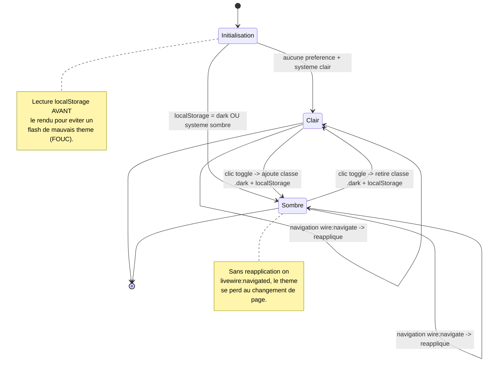
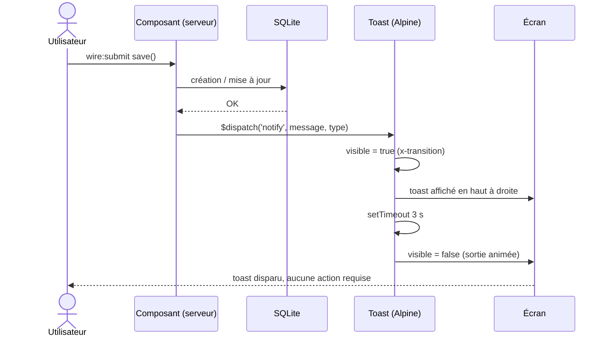
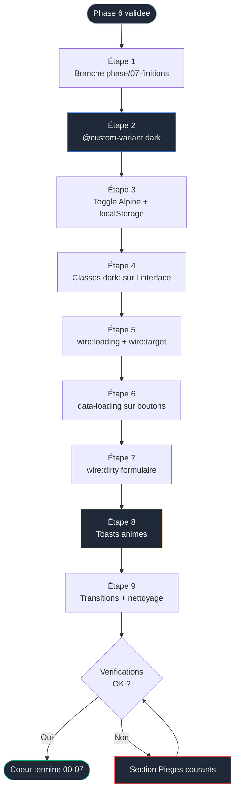

# Phase 7 — Finitions : mode sombre, états de chargement, toasts


> [!IMPORTANT]
> ### Objectif
> Polir l'expérience sans ajouter de fonctionnalité. Mode sombre Tailwind 4, indicateurs de chargement, signalement des champs modifiés, notifications animées remplaçant les messages bruts des phases 5 et 6. C'est la dernière phase du cœur.

> Pré-requis strict : la [Phase 6 — Tableau de bord](./06-dashboard.md) est terminée. L'application gère le CRUD et un tableau de bord, sur deux pages reliées.
<br>

---

<br>
> Phase précédente : [06-dashboard.md](./06-dashboard.md)
> Phase suivante : [08-tests.md](./08-tests.md)
<br>

---

<br>

## Sommaire

- [Le lien avec les phases précédentes](#le-lien-avec-les-phases-précédentes)
- [Concepts introduits dans cette phase](#concepts-introduits-dans-cette-phase)
- [Diagramme d'état du mode sombre](#diagramme-détat-du-mode-sombre)
- [Diagramme de séquence : un toast après enregistrement](#diagramme-de-séquence--un-toast-après-enregistrement)
- [Flux de la phase](#flux-de-la-phase)
- [Étape 1 — Brancher](#étape-1--brancher)
- [Étape 2 — Activer le mode sombre par classe (le piège Tailwind 4)](#étape-2--activer-le-mode-sombre-par-classe-le-piège-tailwind-4)
- [Étape 3 — Le bouton de bascule (Alpine, pas Livewire)](#étape-3--le-bouton-de-bascule-alpine-pas-livewire)
- [Étape 4 — Décliner l'interface en sombre](#étape-4--décliner-linterface-en-sombre)
- [Étape 5 — Indicateurs de chargement wire:loading](#étape-5--indicateurs-de-chargement-wireloading)
- [Étape 6 — Boutons réactifs avec data-loading](#étape-6--boutons-réactifs-avec-data-loading)
- [Étape 7 — Signaler les champs modifiés avec wire:dirty](#étape-7--signaler-les-champs-modifiés-avec-wiredirty)
- [Étape 8 — Toasts animés](#étape-8--toasts-animés)
- [Étape 9 — Transitions et nettoyage final](#étape-9--transitions-et-nettoyage-final)
- [Vérifications finales](#vérifications-finales)
- [Pièges courants](#pièges-courants)
- [Bilan du cœur](#bilan-du-cœur)

<br>

---

<br>

## Le lien avec les phases précédentes

Aucune fonctionnalité nouvelle ici. On reprend ce qui existe et on le rend agréable et lisible. Le message brut posé par `session()->flash()` en Phases 5 et 6 devient un vrai toast animé. La règle de frontière (Phase 5) guide chaque choix : le mode sombre et les toasts sont du **visuel pur**, donc Alpine, déclenchés au besoin par un événement Livewire.

<br>

---

<br>

## Concepts introduits dans cette phase

| Concept | Rôle | Nouveauté |
|---|---|---|
| `@custom-variant dark` | Activer le mode sombre par classe en Tailwind 4 | Nouveau |
| Toggle thème Alpine + `localStorage` | Persister le choix sans serveur | Nouveau |
| Réapplication sur `livewire:navigated` | Conserver le thème après navigation SPA | Nouveau |
| `wire:loading` / `wire:target` | Afficher un indicateur pendant une requête | Nouveau |
| Variante `data-loading:` | Styler l'élément déclencheur (Livewire 4) | Nouveau |
| `wire:dirty` | Signaler un champ modifié non enregistré | Nouveau |
| Toast via `$dispatch` → Alpine | Notification animée auto-dismissée | Nouveau |
| `x-transition` | Animations client propres | Approfondi |

<br>

---

<br>

Ce diagramme illustre la machine à états complexe derrière la persistance du thème. Comprendre ce flux est crucial pour garantir une expérience utilisateur fluide et sans éclats lumineux (FOUC) lors de la navigation SPA.



_Ce schéma d'état détaille la logique de bascule entre les modes clair et sombre, en mettant l'accent sur la synchronisation avec le localStorage et la réapplication du thème lors des navigations Livewire._

<br>

---

<br>

## Diagramme de séquence : un toast après enregistrement

La gestion des notifications repose sur une communication asynchrone entre le serveur et le client. Ce diagramme de séquence montre l'importance du découpage des responsabilités : le serveur décide du message, le client gère l'affichage animé.



_Cette séquence décrit le cycle de vie d'une notification, depuis le déclenchement de l'action par l'utilisateur jusqu'à la disparition automatique du toast gérée par Alpine.js._

<br>

---

<br>

## Flux de la phase

Avant de plonger dans le code, voici la roadmap visuelle de cette phase finale. Ce flux permet de garder une vue d'ensemble sur l'ordre logique d'implémentation des finitions UX.



_Ce logigramme présente les 9 étapes clés de la Phase 07, guidant le développeur de la création de la branche jusqu'au bilan final du cœur de l'application._

<br>

---

<br>

## Étape 1 — Brancher

### Initialisation de la Phase 7

#### Windows (PowerShell)
```powershell
cd $env:USERPROFILE\Documents\Projets\recettebox
git status
git checkout -b phase/07-finitions
```

#### macOS / Linux (Terminal)
```bash
cd ~/Documents/Projets/recettebox
git status
git checkout -b phase/07-finitions
```

<br>

---

<br>

## Étape 2 — Activer le mode sombre par classe (le piège Tailwind 4)

Piège majeur, qui coûte des heures à beaucoup : en Tailwind 4, `darkMode: 'class'` **n'existe plus** (il n'y a plus de `tailwind.config.js`). Par défaut, `dark:` suit `@media (prefers-color-scheme)`, **non contrôlable en JavaScript**. Un bouton de bascule serait donc sans effet tant que tu n'as pas redéfini la variante.

### Configuration Tailwind 4

#### resources/css/app.css

```css
@import "tailwindcss";

/* Redefinit la variante dark : au lieu de suivre la preference systeme,
   les utilitaires dark:* s'appliquent quand la classe .dark est presente
   plus haut dans l'arbre HTML. INDISPENSABLE en Tailwind 4 pour un
   toggle manuel. Sans cette ligne, aucun dark: ne reagira au bouton. */
@custom-variant dark (&:where(.dark, .dark *));

/* ... les @source des phases precedentes restent en dessous ... */
[x-cloak] { display: none !important; }
```

Relance `npm run dev` après cette modification.

<br>

---

<br>

## Étape 3 — Le bouton de bascule (Alpine, pas Livewire)

Décision conforme à la frontière posée en Phase 5 : changer une couleur est **purement visuel**, sans donnée ni validation. Aucun cycle serveur justifié. Tu fais donc un toggle **Alpine + `localStorage`**, pas un composant Livewire avec session.

Deux problèmes à traiter, sinon l'expérience est cassée :

1. **FOUC** (flash of unstyled content) : si tu lis `localStorage` après le rendu, tu vois brièvement le mauvais thème. Il faut appliquer le thème **avant** le rendu, via un script dans le `<head>`.
2. **Navigation SPA** : `wire:navigate` ne recharge pas la page ; le thème doit être réappliqué sur l'événement `livewire:navigated`.

### Script de gestion du thème

#### resources/views/components/layouts/app.blade.php

```blade
<head>
    <meta charset="utf-8">
    <meta name="viewport" content="width=device-width, initial-scale=1">
    <title>{{ $title ?? 'RecetteBox' }}</title>

    {{-- Applique le theme AVANT le rendu pour eviter le flash.
         Script volontairement inline et synchrone : il doit s'executer
         avant que le navigateur peigne la page. --}}
    <script>
        (function () {
            const stored = localStorage.getItem('theme');
            const prefersDark = window.matchMedia('(prefers-color-scheme: dark)').matches;
            if (stored === 'dark' || (!stored && prefersDark)) {
                document.documentElement.classList.add('dark');
            }
        })();

        // wire:navigate ne recharge pas la page : on reapplique le theme
        // a chaque navigation Livewire pour ne pas le perdre.
        document.addEventListener('livewire:navigated', function () {
            const stored = localStorage.getItem('theme');
            document.documentElement.classList.toggle('dark', stored === 'dark');
        });
    </script>

    @vite(['resources/css/app.css', 'resources/js/app.js'])
</head>
```

Dans la barre de navigation (toujours dans le layout), ajoute le bouton de bascule géré par Alpine.

### Bouton de toggle

#### resources/views/components/layouts/app.blade.php

```blade
<nav class="border-b border-gray-200 bg-white dark:border-gray-800 dark:bg-gray-900">
    <div class="mx-auto max-w-5xl px-4 py-3 flex items-center gap-6 text-sm">
        <a href="{{ route('recipes.index') }}" wire:navigate
           class="font-medium hover:text-gray-900 dark:text-gray-200 dark:hover:text-white">Recettes</a>
        <a href="{{ route('dashboard') }}" wire:navigate
           class="font-medium hover:text-gray-900 dark:text-gray-200 dark:hover:text-white">Tableau de bord</a>

        {{-- Toggle 100 % Alpine. isDark lit l'etat reel du DOM a l'init.
             Au clic : on bascule la classe, on persiste dans localStorage. --}}
        <button
            x-data="{ isDark: document.documentElement.classList.contains('dark') }"
            @click="
                isDark = !isDark;
                document.documentElement.classList.toggle('dark', isDark);
                localStorage.setItem('theme', isDark ? 'dark' : 'light');
            "
            class="ml-auto rounded-lg border border-gray-300 px-3 py-1 dark:border-gray-700 dark:text-gray-200"
        >
            <span x-show="!isDark">Mode sombre</span>
            <span x-show="isDark" x-cloak>Mode clair</span>
        </button>
    </div>
</nav>
```

<br>

---

<br>

## Étape 4 — Décliner l'interface en sombre

Le mode sombre n'a d'effet que sur les éléments portant des classes `dark:`. Parcours l'existant et ajoute les variantes. Principe : chaque surface claire reçoit son équivalent sombre.

### Adaptations du layout

#### resources/views/components/layouts/app.blade.php

```blade
<body class="h-full bg-gray-50 text-gray-900 antialiased dark:bg-gray-950 dark:text-gray-100">
```

Cartes de recettes (`recipe-index`) et cartes de stats (`stat-card`), exemple de transformation :

```blade
{{-- Avant --}}
<article class="rounded-xl border border-gray-200 bg-white p-5 shadow-sm">

{{-- Apres : on ajoute les variantes dark: --}}
<article class="rounded-xl border border-gray-200 bg-white p-5 shadow-sm
                dark:border-gray-800 dark:bg-gray-900">
```

Champs de formulaire et de filtres :

```blade
class="... border-gray-300 dark:border-gray-700 dark:bg-gray-800 dark:text-gray-100"
```

Panneau de la modal :

```blade
class="w-full max-w-lg rounded-xl bg-white p-6 shadow-xl dark:bg-gray-900"
```

> Méthode recommandée : passer page par page en mode sombre activé, repérer chaque zone restée blanche, lui ajouter sa variante `dark:`. C'est fastidieux mais mécanique. Ne cherche pas à automatiser : la cohérence visuelle se vérifie à l'Å“il.

<br>

---

<br>

## Étape 5 — Indicateurs de chargement wire:loading

Quand une requête Livewire est en cours (recherche, enregistrement), tu dois le voir. `wire:loading` affiche un élément uniquement pendant une requête ; `wire:target` restreint à une action précise.

### Indicateur global

#### resources/views/components/layouts/app.blade.php

```blade
{{-- Visible uniquement pendant qu'une requete Livewire est en cours --}}
<div wire:loading.flex
     class="fixed inset-x-0 top-0 z-50 h-1 bg-gray-900 dark:bg-gray-100">
</div>
```

### Indicateur ciblé

#### resources/views/livewire/pages/recipe-index.blade.php

```blade
{{-- wire:target="search" : ne s'affiche que pour les requetes
     declenchees par la propriete search, pas pour tout le composant. --}}
<span wire:loading wire:target="search"
      class="text-xs text-gray-400">Recherche...</span>
```

### Bouton d'enregistrement

#### resources/views/livewire/pages/recipe-index.blade.php

```blade
<button type="submit"
        class="rounded-lg bg-gray-900 px-4 py-2 text-sm text-white">
    <span wire:loading.remove wire:target="save">Enregistrer</span>
    <span wire:loading wire:target="save">Enregistrement...</span>
</button>
```

<br>

---

<br>

## Étape 6 — Boutons réactifs avec data-loading

Livewire 4 ajoute automatiquement l'attribut `data-loading` sur l'élément qui déclenche une requête. Tu peux le cibler directement en CSS via la variante `data-loading:`, sans bloc `wire:loading` séparé. C'est plus concis pour un simple effet visuel.

### Style de chargement direct

#### resources/views/livewire/pages/recipe-index.blade.php

```blade
{{-- Pendant la requete declenchee par ce bouton, Livewire pose
     data-loading dessus. data-loading:opacity-50 l'attenue,
     data-loading:pointer-events-none empeche un double-clic. --}}
<button
    wire:click="create"
    class="rounded-lg bg-gray-900 px-4 py-2 text-sm font-medium text-white
           hover:bg-gray-700
           data-loading:opacity-50 data-loading:pointer-events-none"
>
    Nouvelle recette
</button>
```

> `wire:loading` (bloc affiché/masqué) et `data-loading:` (style de l'élément déclencheur) coexistent. Le premier sert à afficher un message ailleurs ; le second à griser le bouton cliqué. Choisis selon l'effet voulu.

<br>

---

<br>

## Étape 7 — Signaler les champs modifiés avec wire:dirty

Dans la modal d'édition, indiquer qu'un champ a changé mais n'est pas encore enregistré aide l'utilisateur. `wire:dirty` cible un élément dont la valeur diffère de l'état serveur.

### Feedback de modification

#### resources/views/livewire/pages/recipe-index.blade.php

```blade
<div>
    <label class="block text-sm font-medium dark:text-gray-200">
        Titre
        {{-- Visible uniquement si le champ a ete modifie sans soumission --}}
        <span wire:dirty wire:target="title"
              class="text-xs text-amber-600">non enregistré</span>
    </label>
    <input type="text" wire:model="title"
           class="mt-1 w-full rounded-lg border px-3 py-2
                  border-gray-300 dark:border-gray-700 dark:bg-gray-800
                  wire:dirty:border-amber-500">
    @error('title')
        <p class="mt-1 text-sm text-red-600">{{ $message }}</p>
    @enderror
</div>
```

> `wire:dirty:border-amber-500` applique une bordure ambre tant que le champ est « sale ». C'est purement indicatif : la validation reste serveur (Phase 5).

<br>

---

<br>

## Étape 8 — Toasts animés

Remplace les messages bruts de `session()->flash()` (Phases 5-6) par un toast. Pattern conforme à la frontière : le serveur **dispatche** un événement, Alpine **affiche** et **auto-dismisse**. Le serveur ne s'occupe pas du visuel.

### Émission d'événements (PHP)

#### resources/views/livewire/pages/recipe-index.blade.php

```php
// Avant : session()->flash('message', 'Recette créée.');
// Apres : on dispatche un evenement que le toast Alpine ecoutera.
$this->dispatch('notify',
    message: $this->editingId ? 'Recette mise à jour.' : 'Recette créée.',
    type: 'success'
);
```

Fais de même dans `delete()` (message « Recette supprimée. »).

### Composant Blade de Toast

#### resources/views/components/toast.blade.php

```blade
{{-- Toast global. x-data gere une file de messages.
     x-on:notify.window : ecoute l'evenement dispatche par Livewire
     (remonte jusqu'a window). Chaque toast s'auto-supprime apres 3 s. --}}
<div
    x-data="{
        toasts: [],
        add(detail) {
            const id = Date.now();
            this.toasts.push({ id, ...detail });
            setTimeout(() => this.remove(id), 3000);
        },
        remove(id) {
            this.toasts = this.toasts.filter(t => t.id !== id);
        }
    }"
    x-on:notify.window="add($event.detail)"
    class="fixed top-4 right-4 z-[60] space-y-2"
>
    <template x-for="toast in toasts" :key="toast.id">
        <div
            x-transition:enter="transition ease-out duration-200"
            x-transition:enter-start="opacity-0 translate-x-4"
            x-transition:enter-end="opacity-100 translate-x-0"
            x-transition:leave="transition ease-in duration-150"
            x-transition:leave-start="opacity-100"
            x-transition:leave-end="opacity-0"
            class="rounded-lg px-4 py-2 text-sm shadow-lg text-white"
            :class="toast.type === 'success'
                ? 'bg-green-600'
                : (toast.type === 'error' ? 'bg-red-600' : 'bg-gray-800')"
        >
            <span x-text="toast.message"></span>
        </div>
    </template>
</div>
```

Inclus le toast une seule fois, dans le layout, juste avant `</body>`.

### Inclusion du toast

#### resources/views/components/layouts/app.blade.php

```blade
    <x-toast />
</body>
```

Supprime enfin les blocs `@if (session('message'))` ajoutés en Phases 5 et 6 : ils sont remplacés par ce système.

<br>

---

<br>

## Étape 9 — Transitions et nettoyage final

Note importante : les modificateurs de transition de Livewire 3 (`wire:transition.opacity`, `.scale`, `.duration`) **ont été supprimés en Livewire 4**. Les transitions passent désormais par Alpine (`x-transition`, comme dans le toast et la modal) ou par les CSS View Transitions. N'utilise plus l'ancienne syntaxe : elle est silencieusement ignorée.

### Nettoyage et compilation

#### Terminal

Vérifie la cohérence des transitions déjà en place :
- Modal (Phase 5) : `x-transition` sur l'apparition. Conforme.
- Toast (Étape 8) : `x-transition:enter/leave` détaillé. Conforme.

Nettoyage final avant de clore le cœur :

```powershell
# Supprime les vues compilees et caches pour un etat propre
php artisan view:clear
php artisan config:clear

# Compile les assets en mode production pour verifier qu'il n'y a
# pas d'erreur de build (different de npm run dev)
npm run build

git add .
git commit -m "feat: mode sombre, etats de chargement, wire:dirty, toasts animes"
```

<br>

---

<br>

## Vérifications finales

- [ ] Le bouton bascule clair/sombre et le choix persiste après rechargement
- [ ] Aucun flash de mauvais thème au chargement (script `<head>` en place)
- [ ] Le thème survit à la navigation Recettes ↔ Tableau de bord (`livewire:navigated`)
- [ ] Toutes les surfaces ont une variante sombre (aucune zone blanche en mode sombre)
- [ ] Une barre de chargement apparaît pendant les requêtes Livewire
- [ ] Le bouton « Enregistrer » affiche « Enregistrement... » pendant la sauvegarde
- [ ] Le bouton déclencheur se grise via `data-loading:` pendant sa requête
- [ ] Un champ modifié non enregistré est signalé (`wire:dirty`)
- [ ] Créer / modifier / supprimer affiche un toast animé qui disparaît seul
- [ ] Les anciens blocs `session('message')` ont été retirés
- [ ] `npm run build` se termine sans erreur
- [ ] Commits de la Phase 7 sur la branche `phase/07-finitions`

<br>

---

<br>

## Pièges courants

| Symptôme | Cause | Résolution |
|---|---|---|
| Les classes `dark:` ne réagissent pas au bouton | `@custom-variant dark` absent de `app.css` | Ajouter la ligne `@custom-variant dark (&:where(.dark, .dark *));` et relancer `npm run dev` |
| Flash bref du mauvais thème au chargement | Thème appliqué après le rendu | Script synchrone dans le `<head>` **avant** `@vite`, comme fourni |
| Thème perdu en changeant de page | `wire:navigate` ne recharge pas la page | Réappliquer sur `document.addEventListener('livewire:navigated', ...)` |
| Zones blanches résiduelles en sombre | Variantes `dark:` oubliées sur certains éléments | Parcourir chaque page en mode sombre et compléter, à l'Å“il |
| Barre de chargement clignote en permanence | `wire:loading` sans cible sur un composant très actif | Restreindre avec `wire:target="action"` |
| Toast ne s'affiche pas | Nom d'événement incohérent ou `.window` manquant | `x-on:notify.window` doit correspondre exactement au nom dispatché |
| Toast ne disparaît jamais | `setTimeout`/`remove` mal câblés | Vérifier l'`id` unique et le filtre dans `remove()` |
| Anciennes transitions Livewire sans effet | Syntaxe Livewire 3 (`wire:transition.opacity`) | Supprimée en v4 ; utiliser `x-transition` (Alpine) |
| `data-loading:` ignoré | Variante non reconnue | Vérifier la version de Livewire (4.x) ; sinon utiliser un bloc `wire:loading` classique |
| `localStorage` indisponible (navigation privée stricte) | Cas limite navigateur | Encapsuler les accès dans un `try/catch` si tu veux durcir ; non bloquant pour le projet |

<br>

---

<br>

## Bilan du cœur

Le cœur du projet (phases 00 à 07) est terminé. Récapitulatif de ce qui a été construit, et de l'outil introduit à chaque étape, dans l'ordre où il devenait nécessaire :

| Phase | Acquis | Outil(s) introduit(s) au bon moment |
|---|---|---|
| 00 | Environnement reproductible | PHP 8.4, Composer, Node 22, Git, VS Code |
| 01 | MVC nu compris | Routes, contrôleur, Blade |
| 02 | Persistance réelle | Eloquent, migrations, enums, factory, seeder |
| 03 | Composant full-stack stylé | Tailwind 4, Livewire 4 SFC |
| 04 | Interface réactive | `wire:model.live`, filtres, tri, pagination, `#[Url]` |
| 05 | Écriture des données | Alpine, modal, `#[Validate]`, `wire:confirm` |
| 06 | Lecture analytique | Agrégations, composant Blade, `#[Computed(persist)]` |
| 07 | Expérience polie | Dark mode Tailwind 4, `wire:loading`, `wire:dirty`, toasts |

La stack TALL a été assemblée pièce par pièce : Laravel d'abord (le socle), Eloquent ensuite (les données), Tailwind et Livewire quand il fallait une interface réactive, Alpine quand le client devait agir seul, et le polissage en dernier. Aucun outil n'est arrivé avant d'être nécessaire.

Reste, en option indépendante, le bonus déjà documenté : Phase 9 — authentification via Laravel Breeze, à n'aborder que maintenant que le cœur est stable.

Axe d'amélioration global identifié (hors parcours) : tests automatisés (Pest), qui constitueraient une Phase 8 naturelle. Volontairement non traité ici pour rester centré sur la stack TALL ; l'emplacement `08` du README lui reste réservé.

<br>

---

<br>

> Le cœur est complet. Suite optionnelle : `09-bonus-authentification.md` (déjà disponible) — greffer l'authentification sur cette application saine.

<br>

