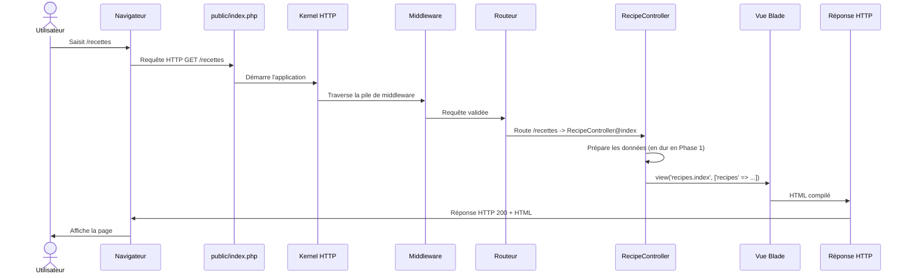
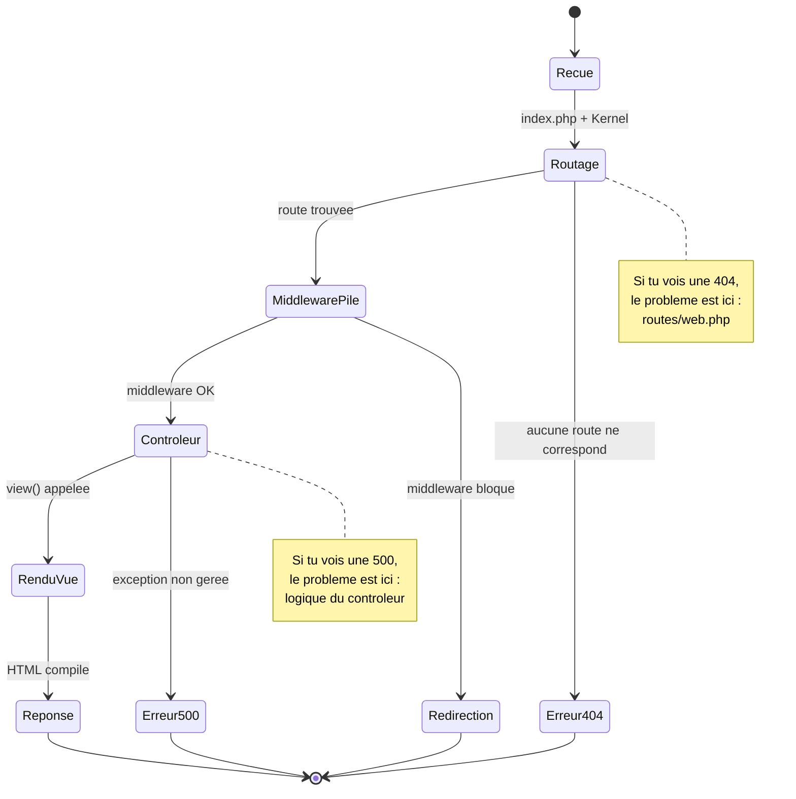
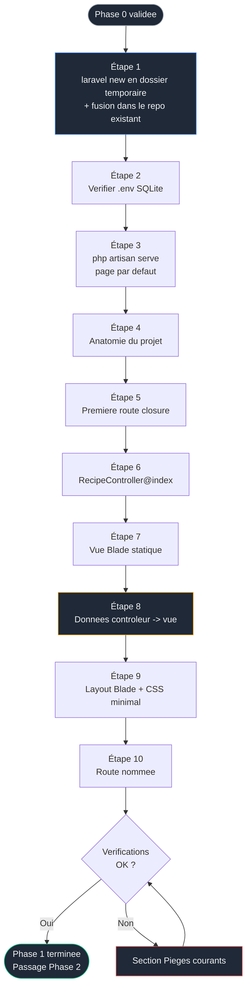
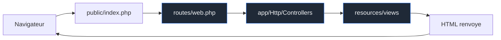

# Phase 1 — Squelette Laravel : le MVC sans magie

> Objectif : créer le projet Laravel 13, comprendre le cycle requête-réponse, et afficher une première liste de recettes **en dur**, sans base de données, sans Livewire, sans Tailwind. On isole le patron MVC avant d'y greffer la moindre couche réactive.

> Pré-requis strict : la Phase 0 est terminée et validée. Le dossier `recettebox/` existe, contient `README.md` + `docs/`, est sous Git, branche `phase/00-environnement`.

<br>

---

<br>

## Sommaire

- [Phase 1 — Squelette Laravel : le MVC sans magie](#phase-1--squelette-laravel--le-mvc-sans-magie)
  - [Sommaire](#sommaire)
  - [Pourquoi commencer sans base de données ni Livewire](#pourquoi-commencer-sans-base-de-données-ni-livewire)
  - [Concepts introduits dans cette phase](#concepts-introduits-dans-cette-phase)
  - [Le cycle requête-réponse de Laravel](#le-cycle-requête-réponse-de-laravel)
  - [Diagramme d'état d'une requête HTTP](#diagramme-détat-dune-requête-http)
  - [Flux de la phase](#flux-de-la-phase)
  - [Étape 1 — Créer le projet sans détruire la documentation](#étape-1--créer-le-projet-sans-détruire-la-documentation)
  - [Étape 2 — Vérifier la configuration SQLite](#étape-2--vérifier-la-configuration-sqlite)
  - [Étape 3 — Lancer le serveur et voir la page par défaut](#étape-3--lancer-le-serveur-et-voir-la-page-par-défaut)
  - [Étape 4 — Anatomie du projet Laravel](#étape-4--anatomie-du-projet-laravel)
  - [Étape 5 — Première route : comprendre le routage](#étape-5--première-route--comprendre-le-routage)
  - [Étape 6 — Déplacer la logique dans un contrôleur](#étape-6--déplacer-la-logique-dans-un-contrôleur)
  - [Étape 7 — Créer la vue Blade](#étape-7--créer-la-vue-blade)
  - [Étape 8 — Passer des données du contrôleur à la vue](#étape-8--passer-des-données-du-contrôleur-à-la-vue)
  - [Étape 9 — Factoriser avec un layout Blade](#étape-9--factoriser-avec-un-layout-blade)
  - [Étape 10 — Nommer la route](#étape-10--nommer-la-route)
  - [Vérifications finales](#vérifications-finales)
  - [Pièges courants](#pièges-courants)
  - [Ce que tu as à la fin de cette phase](#ce-que-tu-as-à-la-fin-de-cette-phase)

<br>

---

<br>

## Pourquoi commencer sans base de données ni Livewire

Décision pédagogique assumée, sans raccourci :

| Choix | Raison |
|---|---|
| Données **en dur** dans le contrôleur | Isoler le flux route → contrôleur → vue. Tant qu'Eloquent n'est pas là (Phase 2), tu vois exactement d'où viennent les données |
| **Pas** de Livewire | Livewire masque le cycle requête-réponse standard. Le comprendre nu est indispensable avant de le voir « disparaître » en Phase 3 |
| **Pas** de Tailwind | Le style arrive en Phase 3. Ici, un CSS minimal suffit : l'objectif n'est pas l'esthétique mais la mécanique |
| **Pas** de Starter Kit | On construit nous-mêmes pour comprendre ce que les Starter Kits automatisent |

À la fin de cette phase, la page sera volontairement austère. C'est normal et voulu.

<br>

---

<br>

## Concepts introduits dans cette phase

| Concept | Rôle | Fichier concerné |
|---|---|---|
| Routage | Associer une URL à du code | `routes/web.php` |
| Contrôleur | Recevoir la requête, préparer les données, choisir la vue | `app/Http/Controllers/RecipeController.php` |
| Vue Blade | Produire le HTML | `resources/views/recipes/index.blade.php` |
| Passage de données | Transmettre du contrôleur vers la vue | `view('...', [...])` |
| Directives Blade | Boucles et conditions dans le HTML | `@foreach`, `@if`, `{{ }}` |
| Layout (héritage de gabarit) | Mutualiser l'ossature HTML | `resources/views/layouts/app.blade.php` |
| Route nommée | Référencer une route sans coder l'URL en dur | `->name('recipes.index')` |

<br>

---

<br>

## Le cycle requête-réponse de Laravel

Avant d'écrire la moindre route, voici ce qui se passe quand un navigateur demande une page. C'est le socle mental de tout le reste du projet.



Point clé : **le contrôleur ne renvoie jamais directement du HTML**. Il renvoie le résultat de `view(...)`, que Laravel transforme en réponse. Cette séparation est ce que Livewire viendra réorganiser en Phase 3, sans la supprimer.

<br>

---

<br>

## Diagramme d'état d'une requête HTTP

La même requête, vue comme une machine à états. Utile pour situer où une erreur survient quand tu débogues.



<br>

---

<br>

## Flux de la phase



<br>

---

<br>

## Étape 1 — Créer le projet sans détruire la documentation

Problème annoncé en fin de Phase 0 : `laravel new recettebox` veut créer un dossier neuf, or `recettebox/` existe déjà avec `.git`, `README.md` et `docs/`. L'installeur refuse d'écrire dans un dossier non vide. On génère donc Laravel dans un dossier temporaire **à côté**, puis on fusionne en préservant l'historique Git.

```powershell
# Se placer dans le dossier PARENT du projet (pas dans recettebox/)
cd $env:USERPROFILE\Documents\Projets

# Generer le projet Laravel dans un dossier temporaire neuf
laravel new recettebox-tmp
```

L'installeur pose des questions interactives. Réponds ainsi :

| Question de l'installeur | Réponse | Pourquoi |
|---|---|---|
| Which starter kit would you like to install? | **None** | On construit nous-mêmes pour comprendre |
| Which testing framework do you prefer? | Laisser le défaut (Pest) | Hors périmètre du projet, sans impact |
| Which database will your application use? | **SQLite** | Choix du projet, zéro configuration |
| Would you like to run `npm install` and `npm run build`? | **Yes** | Prépare les dépendances front pour les phases suivantes |

Une fois `Application ready!` affiché, fusionne le projet généré dans ton repository existant :

```powershell
# Copier tout le contenu de recettebox-tmp DANS recettebox,
# SANS ecraser le dossier .git ni la documentation existante.
# robocopy est natif Windows. /E = sous-dossiers inclus (meme vides).
# /XD .git exclut le dossier .git du SOURCE (il n'y en a pas, mais par securite).
robocopy recettebox-tmp recettebox /E /XD .git

# Supprimer le dossier temporaire devenu inutile
Remove-Item -Recurse -Force recettebox-tmp

# Entrer dans le projet
cd recettebox
```

Vérifie que rien n'a été écrasé :

```powershell
# README.md et docs/ doivent toujours etre la, AINSI QUE
# la nouvelle arborescence Laravel (app, routes, resources, etc.)
git status
```

Git va lister une grande quantité de nouveaux fichiers (tout Laravel). C'est attendu. Commit :

```powershell
# Basculer sur la branche de la Phase 1
git checkout -b phase/01-squelette

# Indexer et commiter le squelette Laravel
git add .
git commit -m "feat: generer le squelette Laravel 13 (sqlite, sans starter kit)"
```

> Note importante sur le `.gitignore` : Laravel fournit son propre `.gitignore` qui exclut `/vendor`, `/node_modules`, `.env`. C'est correct et voulu : ces dossiers se régénèrent via `composer install` et `npm install`. Ne les versionne jamais.

<br>

---

<br>

## Étape 2 — Vérifier la configuration SQLite

Comme tu as choisi SQLite à l'installation, Laravel a déjà créé `database/database.sqlite` et exécuté les migrations par défaut (tables système : `users`, `sessions`, `cache`, `jobs`). On n'ajoute **aucune** table métier en Phase 1 : les recettes seront en dur.

Ouvre le fichier `.env` à la racine et confirme :

```dotenv
# Le pilote de base. SQLite ne demande ni hote, ni port, ni mot de passe.
DB_CONNECTION=sqlite

# Les lignes DB_HOST, DB_PORT, DB_DATABASE, DB_USERNAME, DB_PASSWORD
# sont absentes ou commentees : c'est normal avec SQLite.
```

Vérifie que la connexion répond :

```powershell
# Doit afficher la liste des tables systeme deja migrees,
# preuve que SQLite est operationnel
php artisan db:show
```

<br>

---

<br>

## Étape 3 — Lancer le serveur et voir la page par défaut

```powershell
# Demarre le serveur de developpement integre de Laravel
# Accessible sur http://127.0.0.1:8000
php artisan serve
```

Ouvre `http://127.0.0.1:8000` dans ton navigateur : la page d'accueil Laravel par défaut s'affiche. Cette page provient de la route `/` définie dans `routes/web.php` et de la vue `welcome.blade.php`. On va la remplacer.

Laisse ce terminal ouvert (le serveur tourne). Ouvre un **second** terminal pour les commandes suivantes.

<br>

---

<br>

## Étape 4 — Anatomie du projet Laravel

Ne saute pas cette lecture. Connaître l'emplacement des choses évite des heures de confusion ultérieure.

| Dossier / fichier | Rôle | Tu y travailleras à partir de |
|---|---|---|
| `routes/web.php` | Définition des URL de l'application | Phase 1 |
| `app/Http/Controllers/` | Contrôleurs : logique de traitement des requêtes | Phase 1 |
| `resources/views/` | Vues Blade : génération du HTML | Phase 1 |
| `app/Models/` | Modèles Eloquent (représentation des tables) | Phase 2 |
| `database/migrations/` | Définition du schéma de base | Phase 2 |
| `database/factories/` | Génération de données de test | Phase 2 |
| `database/seeders/` | Peuplement de la base | Phase 2 |
| `app/Livewire/` | Composants Livewire | Phase 3 (n'existe pas encore) |
| `resources/css/` `resources/js/` | Sources front compilées par Vite | Phase 3 |
| `config/` | Fichiers de configuration | Au besoin |
| `.env` | Variables d'environnement (secrets, base) | Au besoin, jamais versionné |
| `public/` | Racine web publique, `index.php` (point d'entrée) | Rarement |
| `storage/logs/laravel.log` | Journal des erreurs | Au débogage |

Graphe mental de la circulation d'une requête à travers ces dossiers :



<br>

---

<br>

## Étape 5 — Première route : comprendre le routage

Avant de créer un contrôleur, on écrit une route « fermée » (closure) pour voir le mécanisme nu. Ouvre `routes/web.php`.

```php
<?php

use Illuminate\Support\Facades\Route;

// Route par defaut de Laravel : on la conserve pour l'instant
Route::get('/', function () {
    return view('welcome');
});

// Notre premiere route a nous.
// 1er argument : le chemin URL (/recettes)
// 2e argument : une fonction anonyme (closure) executee quand l'URL est appelee
Route::get('/recettes', function () {
    // Pour l'instant, on renvoie une simple chaine de texte.
    // Objectif : prouver que le routage fonctionne, rien de plus.
    return 'La route /recettes repond.';
});
```

Recharge `http://127.0.0.1:8000/recettes`. Tu dois voir le texte. Tu viens de prouver que **URL → code** fonctionne. On va maintenant remplacer la closure par un contrôleur, car mettre la logique dans les routes ne tient pas à l'échelle.

<br>

---

<br>

## Étape 6 — Déplacer la logique dans un contrôleur

```powershell
# Genere app/Http/Controllers/RecipeController.php
php artisan make:controller RecipeController
```

Édite `app/Http/Controllers/RecipeController.php` :

```php
<?php

namespace App\Http\Controllers;

class RecipeController extends Controller
{
    /**
     * Affiche la liste des recettes.
     *
     * En Phase 1, les recettes sont DEFINIES EN DUR ici.
     * En Phase 2, ce tableau sera remplace par une requete Eloquent
     * (Recipe::all()). Garde ce point en tete : c'est le meme
     * emplacement logique, seule la SOURCE des donnees changera.
     */
    public function index()
    {
        // Donnees temporaires, codees en dur.
        // Chaque recette est un simple tableau associatif.
        $recipes = [
            ['title' => 'Soupe de potiron',      'category' => 'entree',  'minutes' => 35],
            ['title' => 'Boeuf bourguignon',     'category' => 'plat',    'minutes' => 180],
            ['title' => 'Tarte aux pommes',      'category' => 'dessert', 'minutes' => 60],
            ['title' => 'Houmous maison',        'category' => 'entree',  'minutes' => 15],
        ];

        // On renvoie la vue 'recipes.index' en lui passant les recettes.
        // 'recipes.index' designe le fichier resources/views/recipes/index.blade.php
        return view('recipes.index', [
            'recipes' => $recipes,
        ]);
    }
}
```

Modifie maintenant la route pour qu'elle pointe vers ce contrôleur, dans `routes/web.php` :

```php
<?php

use App\Http\Controllers\RecipeController;
use Illuminate\Support\Facades\Route;

Route::get('/', function () {
    return view('welcome');
});

// La route appelle desormais la methode index() du RecipeController.
// Syntaxe : [Classe::class, 'nomDeLaMethode']
Route::get('/recettes', [RecipeController::class, 'index']);
```

> Note Laravel 13 : tu pourrais aussi attacher middleware et configuration via des attributs PHP 8 directement sur le contrôleur. On reste sur la syntaxe classique, plus universelle et mieux documentée pour l'apprentissage. L'approche par attributs sera mentionnée quand elle apportera un gain concret.

<br>

---

<br>

## Étape 7 — Créer la vue Blade

La route renvoie `view('recipes.index', ...)`, mais ce fichier n'existe pas encore. Crée l'arborescence :

```powershell
# Cree le sous-dossier des vues de recettes
mkdir resources\views\recipes
```

Crée le fichier `resources/views/recipes/index.blade.php` avec un contenu minimal pour valider que la vue se charge :

```blade
{{-- Ceci est un commentaire Blade : "il n\'apparait pas dans le HTML genere" --}}
<!DOCTYPE html>
<html lang="fr">
<head>
    <meta charset="utf-8">
    <title>RecetteBox</title>
</head>
<body>
    <h1>Mes recettes</h1>
    <p>Si tu vois ce texte, la vue est bien chargee.</p>
</body>
</html>
```

Recharge `http://127.0.0.1:8000/recettes`. Tu dois voir le titre. La chaîne route → contrôleur → vue est complète.

<br>

---

<br>

## Étape 8 — Passer des données du contrôleur à la vue

Le contrôleur transmet déjà `$recipes`. On l'exploite dans la vue avec les directives Blade. Remplace le corps de `resources/views/recipes/index.blade.php` :

```blade
<!DOCTYPE html>
<html lang="fr">
<head>
    <meta charset="utf-8">
    <title>RecetteBox</title>
</head>
<body>
    <h1>Mes recettes</h1>

    {{-- @if : affichage conditionnel.
         count($recipes) compte les elements du tableau passe par le controleur. --}}
    @if (count($recipes) === 0)
        <p>Aucune recette pour le moment.</p>
    @else
        <ul>
            {{-- @foreach : boucle sur chaque recette.
                 $recipe prend successivement la valeur de chaque element. --}}
            @foreach ($recipes as $recipe)
                <li>
                    {{-- {{ }} affiche une valeur en l'echappant (securite XSS).
                         C'est la syntaxe Blade standard d'affichage. --}}
                    <strong>{{ $recipe['title'] }}</strong>
                    — {{ $recipe['category'] }}
                    ({{ $recipe['minutes'] }} min)
                </li>
            @endforeach
        </ul>
    @endif
</body>
</html>
```

Recharge la page : les quatre recettes s'affichent. Tu viens de boucler le MVC complet : la **donnée** vient du contrôleur, la **présentation** vit dans la vue, le **routage** les relie.

<br>

---

<br>

## Étape 9 — Factoriser avec un layout Blade

Répéter `<!DOCTYPE html>`, `<head>`, etc. dans chaque vue ne tient pas. Blade fournit l'héritage de gabarit. On crée un layout maître et un style minimal (toujours sans Tailwind, qui arrive en Phase 3).

Crée `resources/views/layouts/app.blade.php` :

```blade
<!DOCTYPE html>
<html lang="fr">
<head>
    <meta charset="utf-8">
    <meta name="viewport" content="width=device-width, initial-scale=1">
    {{-- @yield('title') sera remplace par le titre defini dans chaque page --}}
    <title>@yield('title', 'RecetteBox')</title>
    <style>
        /* CSS volontairement minimal. Le vrai design arrive en Phase 3 avec Tailwind. */
        body { font-family: system-ui, sans-serif; margin: 2rem; line-height: 1.5; }
        h1 { border-bottom: 2px solid #333; padding-bottom: .3rem; }
        li { margin: .4rem 0; }
    </style>
</head>
<body>
    {{-- @yield('content') sera remplace par le contenu specifique de chaque page --}}
    @yield('content')
</body>
</html>
```

Réécris `resources/views/recipes/index.blade.php` pour qu'elle hérite du layout :

```blade
{{-- @extends indique le layout parent dont cette vue herite --}}
@extends('layouts.app')

{{-- @section('title', ...) alimente le @yield('title') du layout --}}
@section('title', 'Mes recettes')

{{-- @section('content') ... @endsection alimente le @yield('content') du layout --}}
@section('content')
    <h1>Mes recettes</h1>

    @if (count($recipes) === 0)
        <p>Aucune recette pour le moment.</p>
    @else
        <ul>
            @foreach ($recipes as $recipe)
                <li>
                    <strong>{{ $recipe['title'] }}</strong>
                    — {{ $recipe['category'] }}
                    ({{ $recipe['minutes'] }} min)
                </li>
            @endforeach
        </ul>
    @endif
@endsection
```

Recharge : visuellement très proche, mais la structure HTML est désormais mutualisée. Toute nouvelle page réutilisera `layouts.app`.

> Évolution à connaître : Laravel propose aussi les **composants Blade** (`<x-app-layout>`), une syntaxe plus moderne que `@extends`/`@yield`. On reste sur l'héritage classique en Phase 1 car il rend l'imbrication parent/enfant explicite, ce qui est plus formateur. Les composants Blade seront introduits quand ils apporteront un gain réel.

<br>

---

<br>

## Étape 10 — Nommer la route

Coder l'URL `/recettes` en dur dans des liens est fragile : si l'URL change, tout casse. On nomme la route. Dans `routes/web.php` :

```php
// ->name('recipes.index') attribue un nom logique a la route.
// On pourra desormais generer son URL avec route('recipes.index')
// au lieu d'ecrire '/recettes' en dur.
Route::get('/recettes', [RecipeController::class, 'index'])->name('recipes.index');
```

Vérifie que la route nommée est bien enregistrée :

```powershell
# Liste toutes les routes ; tu dois voir la colonne Name = recipes.index
php artisan route:list
```

Tu pourras, dès la Phase 3, écrire `route('recipes.index')` dans tes vues et composants au lieu de chemins en dur.

Commit final de la phase :

```powershell
git add .
git commit -m "feat: MVC nu pour la liste des recettes (route nommee, controleur, vue, layout)"
```

<br>

---

<br>

## Vérifications finales

- [ ] `http://127.0.0.1:8000/recettes` affiche les 4 recettes en dur
- [ ] La logique est dans `RecipeController@index`, pas dans une closure de route
- [ ] La vue `resources/views/recipes/index.blade.php` hérite de `layouts.app`
- [ ] `php artisan route:list` montre la route nommée `recipes.index`
- [ ] `php artisan db:show` répond (SQLite opérationnel, même si aucune table métier)
- [ ] `git log --oneline` montre les commits de la Phase 1 sur la branche `phase/01-squelette`
- [ ] `vendor/` et `node_modules/` ne sont **pas** suivis par Git (vérifier avec `git status`)
- [ ] Tu peux expliquer, sans regarder, le trajet d'une requête de `/recettes` jusqu'au HTML

<br>

---

<br>

## Pièges courants

| Symptôme | Cause | Résolution |
|---|---|---|
| `laravel new` échoue : « directory already exists » | Tu as lancé la commande sur `recettebox` au lieu de `recettebox-tmp` | Générer dans un dossier temporaire puis fusionner (Étape 1) |
| `git status` montre des milliers de fichiers dans `vendor/` | Le `.gitignore` de Laravel n'a pas été pris en compte (fusion incomplète) | Vérifier qu'un fichier `.gitignore` existe à la racine et contient `/vendor`. Sinon, le copier depuis `recettebox-tmp` |
| Page blanche ou erreur 500 sur `/recettes` | Faute de frappe dans le contrôleur ou la vue | Lire `storage/logs/laravel.log` (dernières lignes) : le message d'erreur y est explicite |
| `View [recipes.index] not found` | Le fichier n'est pas au bon endroit ou mal nommé | Le chemin doit être exactement `resources/views/recipes/index.blade.php` |
| `Class "App\Http\Controllers\RecipeController" not found` | Import manquant dans `routes/web.php` | Ajouter `use App\Http\Controllers\RecipeController;` en haut du fichier |
| Les modifications de vue ne s'affichent pas | Cache de vues compilées | `php artisan view:clear`, puis recharger |
| `php artisan serve` : « address already in use » | Un serveur tourne déjà sur le port 8000 | Fermer l'autre terminal, ou `php artisan serve --port=8001` |
| Accents cassés dans la page | Encodage du fichier Blade | Enregistrer les fichiers en UTF-8 (VS Code : en bas à droite, « UTF-8 ») |

<br>

---

<br>

## Ce que tu as à la fin de cette phase

| Élément | État |
|---|---|
| Projet Laravel 13 | Créé, fusionné dans le repository sans perte de documentation |
| Base SQLite | Opérationnelle (tables système uniquement, aucune table métier) |
| Route | `/recettes` nommée `recipes.index`, pointant vers un contrôleur |
| Contrôleur | `RecipeController@index` avec données en dur |
| Vue | `recipes/index.blade.php` héritant de `layouts/app.blade.php` |
| Style | CSS minimal inline dans le layout (Tailwind reporté en Phase 3) |
| Compréhension | Cycle requête-réponse maîtrisé, emplacement des dossiers connu |
| Git | Branche `phase/01-squelette`, commits atomiques |

Tu n'as **pas** touché à la base de données métier ni à Livewire. C'est volontaire. La Phase 2 remplacera le tableau en dur du contrôleur par une vraie table `recipes` via une migration, un modèle Eloquent, une factory et un seeder : exactement le même emplacement de code, mais une source de données réelle.

<br>

---

<br>

> Phase suivante : `02-modele.md` — migrations, modèle Eloquent `Recipe`, enum PHP 8.3 pour `category` et `difficulty`, factory et seeder pour disposer de 30 recettes réalistes.