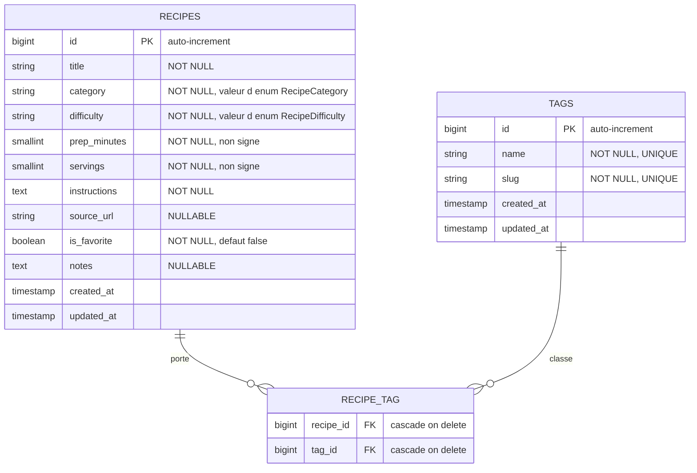
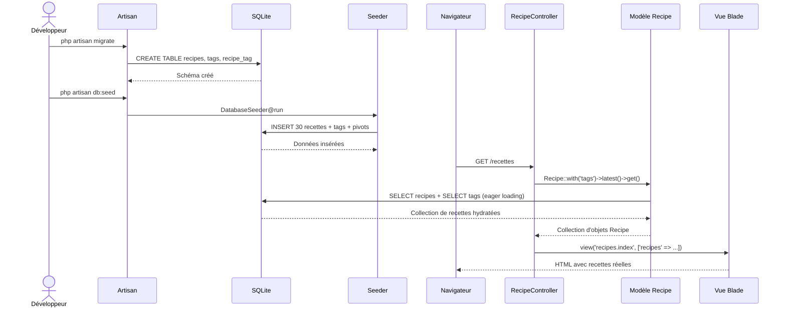
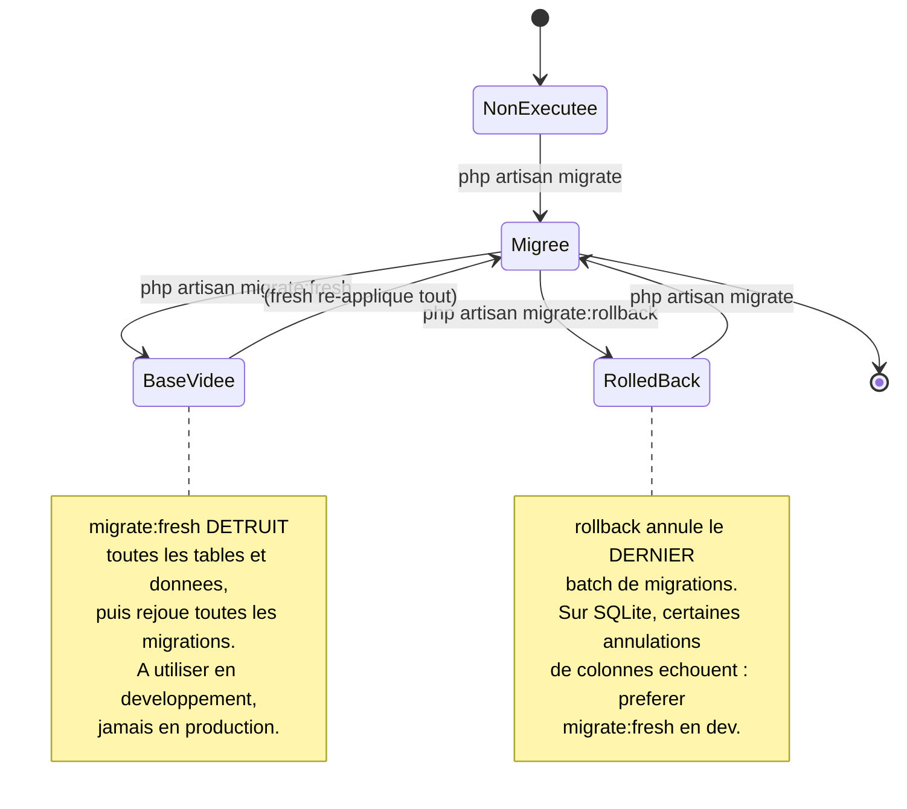
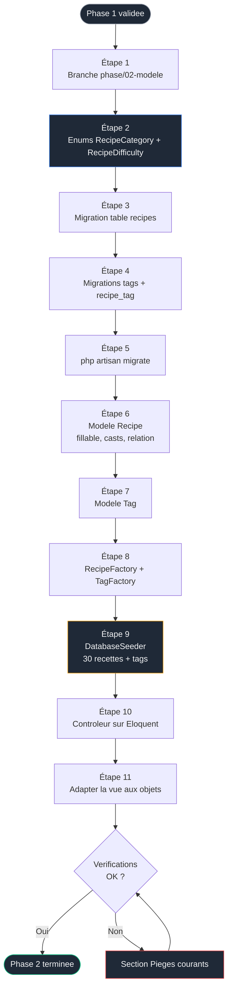

# Phase 2 — Modèle de données : Eloquent, migrations, enums, factory, seeder


> [!IMPORTANT]
> ### 🎯 Objectif
> Remplacer le tableau de recettes codé en dur dans le contrôleur (Phase 1) par une vraie persistance SQLite, via une migration, un modèle Eloquent, des enums PHP 8.3, une factory et un seeder. À la fin, 30 recettes réalistes sont en base et s'affichent sans changer la route ni la vue dans leur structure.

> Pré-requis strict : la Phase 1 est terminée et validée. La page `/recettes` affiche les 4 recettes en dur via `RecipeController@index`.

<br>

---

<br>

## Sommaire

- [Phase 2 — Modèle de données : Eloquent, migrations, enums, factory, seeder](#phase-2--modèle-de-données--eloquent-migrations-enums-factory-seeder)
  - [Sommaire](#sommaire)
  - [Le lien avec la Phase 1](#le-lien-avec-la-phase-1)
  - [Concepts introduits dans cette phase](#concepts-introduits-dans-cette-phase)
  - [Modèle de données détaillé](#modèle-de-données-détaillé)
  - [Diagramme de séquence : de la migration à l'affichage](#diagramme-de-séquence--de-la-migration-à-laffichage)
  - [Diagramme d'état d'une migration](#diagramme-détat-dune-migration)
  - [Flux de la phase](#flux-de-la-phase)
  - [Étape 1 — Brancher](#étape-1--brancher)
  - [Étape 2 — Créer les enums PHP 8.3](#étape-2--créer-les-enums-php-83)
  - [Étape 3 — Migration de la table recipes](#étape-3--migration-de-la-table-recipes)
  - [Étape 4 — Migration des tables tags et recipe\_tag](#étape-4--migration-des-tables-tags-et-recipe_tag)
  - [Étape 5 — Exécuter les migrations](#étape-5--exécuter-les-migrations)
  - [Étape 6 — Le modèle Recipe](#étape-6--le-modèle-recipe)
  - [Étape 7 — Le modèle Tag](#étape-7--le-modèle-tag)
  - [Étape 8 — Les factories](#étape-8--les-factories)
  - [Étape 9 — Le seeder](#étape-9--le-seeder)
  - [Étape 10 — Brancher le contrôleur sur Eloquent](#étape-10--brancher-le-contrôleur-sur-eloquent)
  - [Étape 11 — Adapter la vue aux objets Eloquent](#étape-11--adapter-la-vue-aux-objets-eloquent)
  - [Vérifications finales](#vérifications-finales)
  - [Pièges courants](#pièges-courants)
  - [Ce que tu as à la fin de cette phase](#ce-que-tu-as-à-la-fin-de-cette-phase)

<br>

---

<br>

## Le lien avec la Phase 1

En Phase 1, le contrôleur contenait ceci, avec un commentaire annonçant la suite :

```php
// Donnees temporaires, codees en dur.
$recipes = [
    ['title' => 'Soupe de potiron', 'category' => 'entree', 'minutes' => 35],
    // ...
];
```

En Phase 2, **ce même emplacement** devient :

```php
// Source de donnees reelle : la base SQLite, via Eloquent.
$recipes = Recipe::with('tags')->latest()->get();
```

La route ne change pas. La vue ne change que dans le détail d'accès aux propriétés (`$recipe->title` au lieu de `$recipe['title']`). Tout le travail de cette phase consiste à construire ce qui se cache derrière `Recipe::...`.

<br>

---

<br>

## Concepts introduits dans cette phase

| Concept | Rôle | Nouveauté |
|---|---|---|
| Migration | Décrire le schéma de base en PHP, versionné | Nouveau |
| Enum PHP 8.3 *backed* | Restreindre `category` et `difficulty` à des valeurs valides | Nouveau |
| Modèle Eloquent | Représenter une table comme une classe PHP | Nouveau |
| Cast | Convertir automatiquement colonne ↔ type PHP (enum, booléen) | Nouveau |
| Assignation de masse (`$fillable`) | Autoriser explicitement les colonnes remplissables | Nouveau |
| Relation `belongsToMany` | Lier recettes et étiquettes via une table pivot | Nouveau |
| Factory | Générer des données de test crédibles | Nouveau |
| Seeder | Peupler la base de façon reproductible | Nouveau |
| Eager loading (`with`) | Éviter le problème de requêtes N+1 | Nouveau |

<br>

---

<br>

## Modèle de données détaillé

Version technique du diagramme du README, avec types et contraintes réels. La table `users` n'apparaît pas : elle est réservée à la Phase 9 bonus.



Décision assumée : `category` et `difficulty` sont stockés en `string`, pas en type ENUM SQL. SQLite n'a pas de type ENUM natif, et même sur MySQL la bonne pratique moderne est de gérer la contrainte côté application via un **enum PHP**. Le cast Eloquent garantit qu'on manipule toujours un objet enum typé, jamais une chaîne libre.

<br>

---

<br>

## Diagramme de séquence : de la migration à l'affichage



<br>

---

<br>

## Diagramme d'état d'une migration

Comprendre cet état évite la panique quand une migration échoue à mi-parcours.



<br>

---

<br>

## Flux de la phase



<br>

---

<br>

## Étape 1 — Brancher

```powershell
cd $env:USERPROFILE\Documents\Projets\recettebox

# Verifier que la Phase 1 est commitee proprement
git status

# Branche dediee a la Phase 2
git checkout -b phase/02-modele
```

<br>

---

<br>

## Étape 2 — Créer les enums PHP 8.3

Un enum *backed* associe chaque cas à une valeur scalaire (ici une chaîne) qui sera stockée en base. La méthode `label()` fournit le libellé français pour l'affichage. On sépare ainsi la **valeur stockée** (stable, technique) du **libellé affiché** (lisible, traduisible).

Crée le dossier et le fichier `app/Enums/RecipeCategory.php` :

```powershell
mkdir app\Enums
```

```php
<?php

namespace App\Enums;

// Enum "backed" par une chaine : chaque cas a une valeur string
// qui sera ce qui est reellement ecrit dans la colonne `category`.
enum RecipeCategory: string
{
    case Entree         = 'entree';
    case Plat           = 'plat';
    case Dessert        = 'dessert';
    case Boisson        = 'boisson';
    case Accompagnement = 'accompagnement';

    /**
     * Libelle affichable en francais.
     * On ne stocke jamais ce libelle : seule la valeur (entree, plat...)
     * va en base. Le libelle peut donc changer sans migration.
     */
    public function label(): string
    {
        return match ($this) {
            self::Entree         => 'Entrée',
            self::Plat           => 'Plat',
            self::Dessert        => 'Dessert',
            self::Boisson        => 'Boisson',
            self::Accompagnement => 'Accompagnement',
        };
    }
}
```

Crée `app/Enums/RecipeDifficulty.php` :

```php
<?php

namespace App\Enums;

enum RecipeDifficulty: string
{
    case Facile  = 'facile';
    case Moyen   = 'moyen';
    case Difficile = 'difficile';

    public function label(): string
    {
        return match ($this) {
            self::Facile    => 'Facile',
            self::Moyen     => 'Moyen',
            self::Difficile => 'Difficile',
        };
    }
}
```

> [!NOTE]
> ### Pourquoi un enum ?
> Utiliser un enum plutôt qu'une chaîne libre rend impossible l'insertion d'une catégorie invalide, fournit l'autocomplétion, et centralise les valeurs. C'est une garantie d'intégrité pour l'application.

<br>

---

<br>

## Étape 3 — Migration de la table recipes

```powershell
# Genere une migration de CREATION de table
php artisan make:migration create_recipes_table
```

Édite le fichier généré dans `database/migrations/` (préfixé d'un horodatage) :

```php
public function up(): void
{
    Schema::create('recipes', function (Blueprint $table) {
        $table->id(); // bigint auto-increment, cle primaire

        $table->string('title');

        // On stocke la VALEUR de l'enum (chaine). La validation que
        // cette chaine est une categorie valide est assuree par le
        // cast Eloquent + l'enum PHP, pas par une contrainte SQL.
        $table->string('category');
        $table->string('difficulty');

        // unsignedSmallInteger : entier positif jusqu'a 65535.
        // Largement suffisant pour des minutes et des portions.
        $table->unsignedSmallInteger('prep_minutes');
        $table->unsignedSmallInteger('servings');

        $table->text('instructions');

        // nullable() : la colonne accepte NULL (pas de source obligatoire)
        $table->string('source_url')->nullable();

        // Valeur par defaut a false si non precise a l'insertion
        $table->boolean('is_favorite')->default(false);

        $table->text('notes')->nullable();

        // Cree created_at et updated_at, gerees automatiquement par Eloquent
        $table->timestamps();
    });
}

public function down(): void
{
    // Annulation : on supprime la table entiere
    Schema::dropIfExists('recipes');
}
```

<br>

---

<br>

## Étape 4 — Migration des tables tags et recipe_tag

```powershell
php artisan make:migration create_tags_table
php artisan make:migration create_recipe_tag_table
```

Dans la migration `create_tags_table` :

```php
public function up(): void
{
    Schema::create('tags', function (Blueprint $table) {
        $table->id();
        // unique() : deux etiquettes ne peuvent pas avoir le meme nom
        $table->string('name')->unique();
        $table->string('slug')->unique();
        $table->timestamps();
    });
}

public function down(): void
{
    Schema::dropIfExists('tags');
}
```

Dans la migration `create_recipe_tag_table`. Le nom `recipe_tag` n'est pas arbitraire : Laravel attend, par convention, les deux noms de modèles au **singulier**, **ordre alphabétique**, séparés par un underscore. Respecter cette convention évite d'avoir à configurer la relation manuellement.

```php
public function up(): void
{
    Schema::create('recipe_tag', function (Blueprint $table) {
        // foreignId + constrained : cree la colonne recipe_id ET
        // la contrainte de cle etrangere vers recipes.id
        $table->foreignId('recipe_id')->constrained()->cascadeOnDelete();
        $table->foreignId('tag_id')->constrained()->cascadeOnDelete();

        // Cle primaire composite : un meme couple (recipe, tag)
        // ne peut exister qu'une seule fois
        $table->primary(['recipe_id', 'tag_id']);
    });
}

public function down(): void
{
    Schema::dropIfExists('recipe_tag');
}
```

<br>

---

<br>

## Étape 5 — Exécuter les migrations

```powershell
# Applique toutes les migrations non encore executees
php artisan migrate
```

Vérifie le schéma :

```powershell
# Apercu de la table recipes : colonnes, types, index
php artisan db:table recipes

# Liste de toutes les tables
php artisan db:show
```

<br>

---

<br>

## Étape 6 — Le modèle Recipe

```powershell
php artisan make:model Recipe
```

Édite `app/Models/Recipe.php` :

```php
<?php

namespace App\Models;

use App\Enums\RecipeCategory;
use App\Enums\RecipeDifficulty;
use Illuminate\Database\Eloquent\Factories\HasFactory;
use Illuminate\Database\Eloquent\Model;
use Illuminate\Database\Eloquent\Relations\BelongsToMany;

class Recipe extends Model
{
    use HasFactory;

    /**
     * Colonnes autorisees a l'assignation de masse.
     * Sans cette liste, Recipe::create([...]) leve une exception
     * pour proteger contre l'injection de colonnes non prevues.
     */
    protected $fillable = [
        'title',
        'category',
        'difficulty',
        'prep_minutes',
        'servings',
        'instructions',
        'source_url',
        'is_favorite',
        'notes',
    ];

    /**
     * Conversions automatiques colonne <-> type PHP.
     * Laravel 11+ utilise cette methode plutot que la propriete $casts.
     */
    protected function casts(): array
    {
        return [
            // La colonne 'category' (string) devient un objet RecipeCategory.
            // Lecture : $recipe->category est un enum. Ecriture : on peut
            // affecter l'enum directement, Laravel stocke sa ->value.
            'category'    => RecipeCategory::class,
            'difficulty'  => RecipeDifficulty::class,
            'is_favorite' => 'boolean',
        ];
    }

    /**
     * Relation plusieurs-a-plusieurs vers Tag.
     * Laravel deduit la table pivot 'recipe_tag' grace a la convention
     * de nommage respectee a l'Étape 4.
     */
    public function tags(): BelongsToMany
    {
        return $this->belongsToMany(Tag::class);
    }
}
```

<br>

---

<br>

## Étape 7 — Le modèle Tag

```powershell
php artisan make:model Tag
```

Édite `app/Models/Tag.php` :

```php
<?php

namespace App\Models;

use Illuminate\Database\Eloquent\Factories\HasFactory;
use Illuminate\Database\Eloquent\Model;
use Illuminate\Database\Eloquent\Relations\BelongsToMany;

class Tag extends Model
{
    use HasFactory;

    protected $fillable = ['name', 'slug'];

    /**
     * Cote inverse de la relation : un tag concerne plusieurs recettes.
     */
    public function recipes(): BelongsToMany
    {
        return $this->belongsToMany(Recipe::class);
    }
}
```

<br>

---

<br>

## Étape 8 — Les factories

Une factory décrit comment fabriquer une instance crédible du modèle. Pour des titres réalistes plutôt que des mots aléatoires, on pioche dans une liste de vraies recettes.

```powershell
php artisan make:factory RecipeFactory
php artisan make:factory TagFactory
```

`database/factories/RecipeFactory.php` :

```php
<?php

namespace Database\Factories;

use App\Enums\RecipeCategory;
use App\Enums\RecipeDifficulty;
use Illuminate\Database\Eloquent\Factories\Factory;

class RecipeFactory extends Factory
{
    public function definition(): array
    {
        // Liste de vrais noms de recettes pour un rendu credible.
        $titres = [
            'Soupe de potiron', 'Bœuf bourguignon', 'Tarte aux pommes',
            'Houmous maison', 'Risotto aux champignons', 'Quiche lorraine',
            'Ratatouille', 'Curry de lentilles', 'Gratin dauphinois',
            'Salade César', 'Chili sin carne', 'Crêpes sucrées',
            'Velouté de carottes', 'Lasagnes végétariennes', 'Tajine de poulet',
            'Pad thaï', 'Tarte tatin', 'Buddha bowl', 'Pesto de basilic',
            'Clafoutis aux cerises', 'Dahl de lentilles corail',
            'Burger végétarien', 'Soupe miso', 'Tiramisu', 'Gaspacho',
            'Couscous légumes', 'Pancakes', 'Brownie', 'Falafels',
            'Smoothie banane',
        ];

        return [
            // unique() pioche sans repetition dans la liste ci-dessus
            'title'        => fake()->unique()->randomElement($titres),

            // randomElement sur les cas de l'enum : on stocke un enum,
            // le cast s'occupe de la conversion en chaine
            'category'     => fake()->randomElement(RecipeCategory::cases()),
            'difficulty'   => fake()->randomElement(RecipeDifficulty::cases()),

            'prep_minutes' => fake()->numberBetween(5, 240),
            'servings'     => fake()->numberBetween(1, 8),
            'instructions' => fake()->paragraphs(3, true),

            // optional() renvoie parfois null : teste le cas nullable
            'source_url'   => fake()->optional()->url(),

            // boolean(20) : vrai environ 20 % du temps
            'is_favorite'  => fake()->boolean(20),
            'notes'        => fake()->optional()->sentence(),
        ];
    }
}
```

> [!TIP]
> ### Unicité des données
> La liste contient 30 titres et le seeder en crée exactement 30. Si tu augmentes ce nombre, pense à agrandir la liste de titres ou à retirer la contrainte `unique()`.

`database/factories/TagFactory.php` reste minimal ; les tags réels sont créés explicitement dans le seeder (liste fixe), donc cette factory ne sert qu'en cas de besoin ponctuel :

```php
<?php

namespace Database\Factories;

use Illuminate\Database\Eloquent\Factories\Factory;
use Illuminate\Support\Str;

class TagFactory extends Factory
{
    public function definition(): array
    {
        $name = fake()->unique()->word();

        return [
            'name' => $name,
            'slug' => Str::slug($name),
        ];
    }
}
```

<br>

---

<br>

## Étape 9 — Le seeder

Le seeder peuple la base de façon reproductible. Édite `database/seeders/DatabaseSeeder.php` :

```php
<?php

namespace Database\Seeders;

use App\Models\Recipe;
use App\Models\Tag;
use Illuminate\Database\Seeder;
use Illuminate\Support\Str;

class DatabaseSeeder extends Seeder
{
    public function run(): void
    {
        // Liste fixe d'etiquettes culinaires reelles.
        $tags = collect([
            'Végétarien', 'Vegan', 'Sans gluten', 'Rapide',
            'Économique', 'Batch cooking', 'Sans cuisson',
        ])->map(fn (string $name) => Tag::create([
            'name' => $name,
            'slug' => Str::slug($name),
        ]));

        // Cree 30 recettes, puis attache 1 a 3 tags aleatoires a chacune.
        Recipe::factory()
            ->count(30)
            ->create()
            ->each(function (Recipe $recipe) use ($tags) {
                $recipe->tags()->attach(
                    $tags->random(rand(1, 3))->pluck('id')
                );
            });
    }
}
```

Exécute le peuplement :

```powershell
# migrate:fresh DETRUIT et recree tout le schema, puis --seed lance le seeder.
# En developpement, c'est la commande de reset propre.
php artisan migrate:fresh --seed
```

Vérifie en base sans écrire de code, via le REPL Tinker :

```powershell
php artisan tinker
```

```php
// Dans tinker :
\App\Models\Recipe::count();                       // doit renvoyer 30
\App\Models\Recipe::with('tags')->first()->tags;   // collection de tags
\App\Models\Recipe::first()->category->label();    // libelle francais de l'enum
exit
```

<br>

---

<br>

## Étape 10 — Brancher le contrôleur sur Eloquent

Ouvre `app/Http/Controllers/RecipeController.php`. Remplace le tableau en dur de la Phase 1 par une requête Eloquent.

```php
<?php

namespace App\Http\Controllers;

use App\Models\Recipe;

class RecipeController extends Controller
{
    public function index()
    {
        // PHASE 2 : remplace le tableau en dur de la Phase 1.
        //
        // with('tags') : EAGER LOADING. Sans cela, afficher les tags
        // de 30 recettes declencherait 1 requete pour les recettes
        // + 30 requetes pour les tags (probleme N+1).
        // Avec with(), Laravel ne fait que 2 requetes au total.
        //
        // latest() : trie par created_at decroissant (plus recentes d'abord).
        $recipes = Recipe::with('tags')->latest()->get();

        return view('recipes.index', [
            'recipes' => $recipes,
        ]);
    }
}
```

<br>

---

<br>

## Étape 11 — Adapter la vue aux objets Eloquent

En Phase 1, `$recipe` était un tableau (`$recipe['title']`). C'est désormais un objet `Recipe` : on accède aux propriétés avec `->`. Les colonnes castées en enum exposent `->label()`.

Réécris la section `content` de `resources/views/recipes/index.blade.php` :

```blade
@extends('layouts.app')

@section('title', 'Mes recettes')

@section('content')
    <h1>Mes recettes</h1>

    {{-- $recipes est maintenant une Collection Eloquent.
         isEmpty() est la methode idiomatique pour tester le vide. --}}
    @if ($recipes->isEmpty())
        <p>Aucune recette pour le moment.</p>
    @else
        <ul>
            @foreach ($recipes as $recipe)
                <li>
                    {{-- Acces objet avec -> et non [] --}}
                    <strong>{{ $recipe->title }}</strong>
                    —
                    {{-- category est un enum : ->label() donne le francais --}}
                    {{ $recipe->category->label() }}
                    /
                    {{ $recipe->difficulty->label() }}
                    ({{ $recipe->prep_minutes }} min,
                     {{ $recipe->servings }} portions)

                    {{-- is_favorite est caste en booleen --}}
                    @if ($recipe->is_favorite)
                        <span title="Favori">[favori]</span>
                    @endif

                    {{-- Tags de la recette, charges via with('tags') --}}
                    @if ($recipe->tags->isNotEmpty())
                        <br>
                        <small>
                            Étiquettes :
                            {{-- implode sur une collection : noms separes par virgule --}}
                            {{ $recipe->tags->pluck('name')->implode(', ') }}
                        </small>
                    @endif
                </li>
            @endforeach
        </ul>
    @endif
@endsection
```

Recharge `http://127.0.0.1:8000/recettes` (relance `php artisan serve` si besoin) : 30 recettes réelles s'affichent, triées par date, avec catégorie en français et étiquettes.

Commit de la phase :

```powershell
git add .
git commit -m "feat: persistance Eloquent (migrations, enums, modeles, factory, seeder)"
```

<br>

---

<br>

## Vérifications finales

- [ ] `php artisan migrate:fresh --seed` s'exécute sans erreur
- [ ] `Recipe::count()` renvoie 30 dans Tinker
- [ ] `Recipe::first()->category` est un objet `RecipeCategory`, pas une chaîne
- [ ] `Recipe::first()->category->label()` renvoie un libellé français accentué
- [ ] `Recipe::first()->is_favorite` est un booléen PHP (`true`/`false`), pas `0`/`1`
- [ ] `Recipe::with('tags')->first()->tags` renvoie une collection de `Tag`
- [ ] La page `/recettes` affiche 30 recettes réelles avec leurs étiquettes
- [ ] La table pivot s'appelle exactement `recipe_tag` (`php artisan db:show`)
- [ ] Aucune requête N+1 : la page ne fait que 2 requêtes (vérifiable plus tard avec Debugbar, hors périmètre ici)
- [ ] Commits de la Phase 2 sur la branche `phase/02-modele`

<br>

---

<br>

## Pièges courants

| Symptôme | Cause | Résolution |
|---|---|---|
| `Add [title] to fillable property to allow mass assignment` | `$fillable` incomplet dans le modèle | Ajouter toutes les colonnes remplissables à `$fillable` |
| `ValueError: "x" is not a valid backing value for enum` | Une valeur en base ne correspond à aucun cas d'enum | Vérifier la factory : `category` doit être un cas d'enum, pas une chaîne libre. Refaire `migrate:fresh --seed` |
| Table pivot introuvable / relation vide | Pivot mal nommé (`recipes_tags`, `tag_recipe`…) | La convention impose `recipe_tag` : singulier, ordre alphabétique. Renommer la migration et `migrate:fresh` |
| Page très lente avec beaucoup de recettes | Problème N+1 : `with('tags')` oublié dans le contrôleur | Toujours charger les relations affichées via `with()` |
| `SQLSTATE... no such table: recipes` | Migrations non exécutées | `php artisan migrate` ou `migrate:fresh --seed` |
| `migrate:rollback` échoue sur SQLite | Limites de SQLite sur certaines annulations de colonnes | En développement, utiliser `migrate:fresh` plutôt que `rollback` |
| `fake()->unique()` lève « Maximum retries » | Plus de valeurs uniques disponibles que d'éléments dans la liste | Agrandir la liste de titres ou retirer `unique()` |
| Les libellés s'affichent en anglais technique (`entree`) | Appel de `$recipe->category` au lieu de `$recipe->category->label()` dans la vue | Toujours appeler `->label()` pour l'affichage utilisateur |
| `Class "App\Enums\RecipeCategory" not found` | Espace de noms ou chemin incorrect | Le fichier doit être `app/Enums/RecipeCategory.php` avec `namespace App\Enums;` |

<br>

---

<br>

## Ce que tu as à la fin de cette phase

| Élément | État |
|---|---|
| Schéma | Tables `recipes`, `tags`, `recipe_tag` créées par migration |
| Enums | `RecipeCategory` et `RecipeDifficulty` avec libellés français |
| Modèles | `Recipe` (fillable, casts enum + booléen, relation) et `Tag` |
| Données | 30 recettes réalistes, 7 étiquettes, associations pivot peuplées |
| Contrôleur | Branché sur Eloquent (`Recipe::with('tags')->latest()->get()`) |
| Vue | Adaptée aux objets Eloquent et aux enums |
| Performance | Eager loading en place, pas de N+1 |
| Git | Branche `phase/02-modele`, commits atomiques |

La page reste austère (toujours pas de Tailwind) et statique (toujours pas de Livewire) : c'est voulu. La donnée, elle, est désormais réelle et persistante.

La Phase 3 introduira **deux outils en même temps**, pour la première et seule fois du parcours : Tailwind 4 (pour que la page cesse d'être austère) et Livewire 4 (pour transformer cette liste statique en composant full-stack). Ces deux-là arrivent ensemble parce que tester Livewire sans aucun style rend le résultat illisible : ils se justifient mutuellement à ce moment précis, pas avant.

<br>

---

<br>

> Phase suivante : `03-livewire.md` — installation de Tailwind 4 via `@tailwindcss/vite`, installation de Livewire 4, conversion de la liste statique en premier Single-File Component, sur exactement les mêmes données.