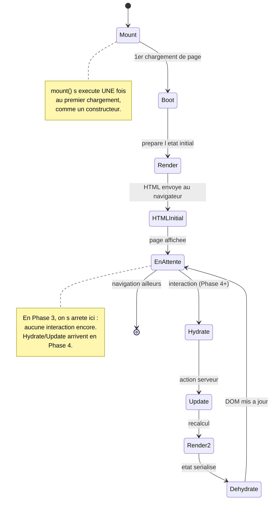
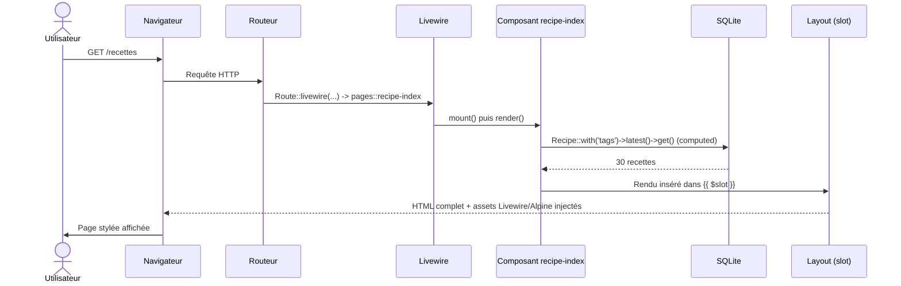
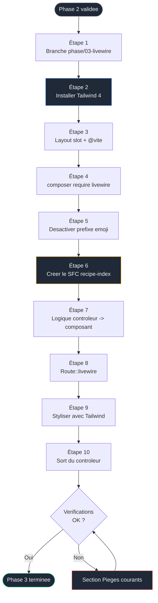

# Phase 3 — Premier composant Livewire : Tailwind 4 et Single-File Component

> Objectif : installer Tailwind 4 puis Livewire 4, et convertir la liste statique de la Phase 2 en un composant full-stack (Single-File Component), sur exactement les mêmes données. Aucune interactivité ici : la recherche et les filtres arrivent en Phase 4. Cette phase concerne la mécanique du composant et le style, pas la réactivité.

> Pré-requis strict : la Phase 2 est terminée. `/recettes` affiche 30 recettes réelles via `RecipeController@index`, sans style.

<br>

---

<br>

## Sommaire

- [Phase 3 — Premier composant Livewire : Tailwind 4 et Single-File Component](#phase-3--premier-composant-livewire--tailwind-4-et-single-file-component)
  - [Sommaire](#sommaire)
  - [Pourquoi deux outils dans la même phase](#pourquoi-deux-outils-dans-la-même-phase)
  - [Concepts introduits dans cette phase](#concepts-introduits-dans-cette-phase)
  - [Le cycle de vie d'un composant Livewire](#le-cycle-de-vie-dun-composant-livewire)
  - [Diagramme de séquence : une page rendue par Livewire](#diagramme-de-séquence--une-page-rendue-par-livewire)
  - [Flux de la phase](#flux-de-la-phase)
  - [Étape 1 — Brancher](#étape-1--brancher)
  - [Étape 2 — Installer Tailwind 4](#étape-2--installer-tailwind-4)
  - [Étape 3 — Faire évoluer le layout vers un layout Livewire](#étape-3--faire-évoluer-le-layout-vers-un-layout-livewire)
  - [Étape 4 — Installer Livewire 4](#étape-4--installer-livewire-4)
  - [Étape 5 — Désactiver le préfixe emoji des composants](#étape-5--désactiver-le-préfixe-emoji-des-composants)
  - [Étape 6 — Créer le premier Single-File Component](#étape-6--créer-le-premier-single-file-component)
  - [Étape 7 — Déplacer la logique du contrôleur vers le composant](#étape-7--déplacer-la-logique-du-contrôleur-vers-le-composant)
  - [Étape 8 — Router la page via Route::livewire()](#étape-8--router-la-page-via-routelivewire)
  - [Étape 9 — Styliser la liste avec Tailwind](#étape-9--styliser-la-liste-avec-tailwind)
  - [Étape 10 — Décider du sort du contrôleur](#étape-10--décider-du-sort-du-contrôleur)
  - [Vérifications finales](#vérifications-finales)
  - [Pièges courants](#pièges-courants)
  - [Ce que tu as à la fin de cette phase](#ce-que-tu-as-à-la-fin-de-cette-phase)

<br>

---

<br>

## Pourquoi deux outils dans la même phase

C'est la **seule** entorse du parcours à la règle « un outil à la fois », et elle est justifiée :

| Argument | Détail |
|---|---|
| Livewire sans style est inexploitable visuellement | Une liste Livewire sans Tailwind est aussi austère qu'en Phase 1. Impossible de juger le résultat |
| Tailwind sans Livewire n'aurait rien de neuf à styliser | La page de Phase 2 fonctionne déjà ; styliser une page statique n'apporte aucun concept |
| Les deux se valident mutuellement ici | Tailwind rend le composant lisible ; le composant donne à Tailwind quelque chose de réel à habiller |

Ordre imposé : **Tailwind d'abord, Livewire ensuite**. Ainsi, au moment où le composant Livewire apparaît, le style est déjà disponible pour l'habiller immédiatement.

<br>

---

<br>

## Concepts introduits dans cette phase

| Concept | Rôle | Nouveauté |
|---|---|---|
| Tailwind 4 via `@tailwindcss/vite` | Système de styles utilitaires, compilé par Vite | Nouveau |
| Directive `@vite` | Injecter le CSS/JS compilé dans le HTML | Nouveau |
| Single-File Component (SFC) | PHP + Blade dans un seul fichier (défaut Livewire 4) | Nouveau |
| Propriété calculée `#[Computed]` | Exposer des données au template, mises en cache par requête | Nouveau |
| `Route::livewire()` | Router directement vers un composant page (Livewire 4) | Nouveau |
| Layout à slot | Layout compatible composant full-page (`{{ $slot }}`) | Évolution du layout Phase 1 |

À la fin, le contrôleur de la Phase 1-2 n'est plus le point d'entrée de la liste : le composant Livewire l'est. La donnée ne change pas, seul l'aiguillage change.

<br>

---

<br>

## Le cycle de vie d'un composant Livewire

Indispensable avant d'écrire la moindre ligne : un composant Livewire n'est pas un simple template. Il a un cycle de vie côté serveur.



En Phase 3, on n'utilise que la moitié gauche du diagramme : montage, rendu initial, affichage. La moitié droite (hydratation, mise à jour) est le sujet de la Phase 4.

<br>

---

<br>

## Diagramme de séquence : une page rendue par Livewire



Point clé : Livewire injecte automatiquement son JavaScript **et Alpine.js** (Alpine est embarqué dans Livewire). Tu n'installes pas Alpine séparément ; il sera là, prêt pour la Phase 5.

<br>

---

<br>

## Flux de la phase



<br>

---

<br>

## Étape 1 — Brancher

```powershell
cd $env:USERPROFILE\Documents\Projets\recettebox
git status
git checkout -b phase/03-livewire
```

<br>

---

<br>

## Étape 2 — Installer Tailwind 4

Le projet ayant été créé **sans starter kit**, Tailwind n'est pas présent. On suit la procédure officielle Tailwind 4 pour Laravel + Vite.

```powershell
# Installe Tailwind 4 et son plugin Vite officiel
npm install tailwindcss @tailwindcss/vite
```

Édite `vite.config.js` à la racine pour enregistrer le plugin Tailwind :

```javascript
import { defineConfig } from 'vite';
import laravel from 'laravel-vite-plugin';
import tailwindcss from '@tailwindcss/vite'; // ajoute cet import

export default defineConfig({
    plugins: [
        laravel({
            input: ['resources/css/app.css', 'resources/js/app.js'],
            refresh: true,
        }),
        tailwindcss(), // ajoute ce plugin
    ],
});
```

Remplace le contenu de `resources/css/app.css` par l'import Tailwind 4 et les directives de scan. En Tailwind 4, il n'y a plus de `tailwind.config.js` : la configuration vit dans le CSS.

```css
/* Importe tout Tailwind 4 en une ligne */
@import "tailwindcss";

/* @source indique a Tailwind ou chercher les classes utilisees,
   afin de ne compiler que le CSS reellement employe. */
@source "../../vendor/laravel/framework/src/Illuminate/Pagination/resources/views/*.blade.php";
@source "../../storage/framework/views/*.php";
@source "../**/*.blade.php";
@source "../**/*.js";
```

Lance le serveur de build Vite. Il doit rester actif en parallèle de `php artisan serve` (deux terminaux distincts).

```powershell
# Compile les assets et surveille les changements en continu
npm run dev
```

> Astuce projet : Laravel fournit un script combiné. `composer run dev` lance en parallèle le serveur PHP, le worker de queue et Vite. Tu peux l'utiliser à la place de deux terminaux séparés, une fois à l'aise.

<br>

---

<br>

## Étape 3 — Faire évoluer le layout vers un layout Livewire

Point pédagogique important. En Phase 1, le layout `resources/views/layouts/app.blade.php` utilisait l'héritage Blade classique (`@yield('content')`). Un composant Livewire **full-page** ne s'insère pas via `@yield` mais via un **slot** (`{{ $slot }}`). Le layout doit donc évoluer. C'est une transition normale : la Phase 1 utilisait l'outil adapté à l'époque, la Phase 3 utilise celui adapté à Livewire.

Livewire 4 cherche par défaut son layout dans `resources/views/components/layouts/app.blade.php`. Crée cette arborescence :

```powershell
mkdir resources\views\components\layouts
```

Crée `resources/views/components/layouts/app.blade.php` :

```blade
<!DOCTYPE html>
<html lang="fr" class="h-full">
<head>
    <meta charset="utf-8">
    <meta name="viewport" content="width=device-width, initial-scale=1">

    {{-- $title est fourni par le composant via "l'attribut" #[Title] --}}
    <title>{{ $title ?? 'RecetteBox' }}</title>

    {{-- @vite injecte le CSS Tailwind compile ET le JS de "l'app".
         Sans cette ligne, aucun style Tailwind ne "s'applique". --}}
    @vite(['resources/css/app.css', 'resources/js/app.js'])
</head>
<body class="h-full bg-gray-50 text-gray-900 antialiased">
    {{-- {{ $slot }} : c'est ICI que le composant full-page s'insere.
         Remplace le @yield('content') de la Phase 1. --}}
    {{ $slot }}
</body>
</html>
```

Tu peux conserver l'ancien `resources/views/layouts/app.blade.php` de la Phase 1 pour référence, ou le supprimer puisque plus aucune vue n'en hérite après cette phase. Documente ton choix dans le commit.

<br>

---

<br>

## Étape 4 — Installer Livewire 4

```powershell
# Installe le paquet Livewire 4
composer require livewire/livewire
```

Livewire 4 est « zéro configuration » : il auto-injecte son JavaScript et Alpine.js dans les pages contenant un composant. Aucune directive `@livewireScripts` à ajouter manuellement dans le cas standard.

Vérifie la version installée :

```powershell
# Doit afficher Livewire dans la section "Livewire" avec une version 4.x
php artisan about
```

<br>

---

<br>

## Étape 5 — Désactiver le préfixe emoji des composants

Livewire 4 préfixe par défaut les fichiers de composants d'un caractère éclair (`⚡`). C'est purement cosmétique et désactivable. On le désactive pour garder des noms de fichiers sobres et sans caractère spécial.

```powershell
# Publie le fichier de configuration de Livewire
php artisan livewire:publish --config
```

Ouvre `config/livewire.php` et règle l'option de génération pour ne pas utiliser l'emoji. Selon la version mineure, l'option se nomme autour de `use_emoji` / `emoji` dans la section de génération de composants :

```php
// Dans config/livewire.php, section de configuration des composants generes.
// Mettre la valeur a false pour des noms de fichiers sans caractere eclair.
'use_emoji' => false,
```

> Si tu ne trouves pas l'option exacte (le nom peut varier selon la version), exécute `php artisan make:livewire --help` : l'aide indique les options de format et de nommage disponibles dans ta version précise. Ne devine pas, vérifie.

<br>

---

<br>

## Étape 6 — Créer le premier Single-File Component

On crée un composant **page** (full-page), dans le namespace `pages::` introduit par Livewire 4.

```powershell
# Genere un Single-File Component de page nomme recipe-index.
# Selon la version, le fichier sera place sous resources/views/pages/.
php artisan make:livewire pages.recipe-index
```

Le fichier généré est un SFC : un bloc PHP en tête (classe anonyme étendant `Livewire\Component`), suivi du markup Blade. Remplace son contenu par une version minimale qui affiche un titre, pour valider le rendu avant d'y mettre la logique :

```blade
<?php

use Livewire\Component;

new class extends Component {
    // Vide pour l'instant : on valide d'abord que le composant s'affiche.
};
?>

<div>
    <h1 class="text-2xl font-bold">Mes recettes (composant Livewire)</h1>
</div>
```

> Un composant Livewire doit avoir **un seul élément racine** dans son markup (ici le `<div>`). Plusieurs éléments frères à la racine provoquent une erreur. C'est une contrainte structurelle de Livewire, pas un détail de style.

<br>

---

<br>

## Étape 7 — Déplacer la logique du contrôleur vers le composant

La logique « récupérer les recettes » quitte le contrôleur pour rejoindre le composant. On l'expose via une propriété calculée `#[Computed]`, mise en cache pour la durée de la requête.

Remplace le contenu du SFC `recipe-index` :

```blade
<?php

use App\Models\Recipe;
use Livewire\Attributes\Computed;
use Livewire\Attributes\Title;
use Livewire\Component;

// #[Title] alimente le {{ $title }} du layout.
new
#[Title('Mes recettes')]
class extends Component {

    /**
     * Propriete calculee : accessible dans le template via $this->recipes.
     * #[Computed] met le resultat en cache pour la duree de la requete
     * (pas entre les requetes). Equivalent fonctionnel de ce que faisait
     * RecipeController@index en Phase 2 : MEME requete, autre emplacement.
     */
    #[Computed]
    public function recipes()
    {
        return Recipe::with('tags')->latest()->get();
    }
};
?>

<div>
    <h1 class="text-2xl font-bold mb-4">Mes recettes</h1>

    @if ($this->recipes->isEmpty())
        <p>Aucune recette pour le moment.</p>
    @else
        <ul>
            @foreach ($this->recipes as $recipe)
                <li>
                    <strong>{{ $recipe->title }}</strong>
                    — {{ $recipe->category->label() }}
                    / {{ $recipe->difficulty->label() }}
                    ({{ $recipe->prep_minutes }} min,
                     {{ $recipe->servings }} portions)
                    @if ($recipe->is_favorite)
                        <span>[favori]</span>
                    @endif
                    @if ($recipe->tags->isNotEmpty())
                        <br><small>{{ $recipe->tags->pluck('name')->implode(', ') }}</small>
                    @endif
                </li>
            @endforeach
        </ul>
    @endif
</div>
```

Note la différence d'accès : en Phase 2 la vue recevait `$recipes` (variable passée). Ici on accède à `$this->recipes` : c'est la propriété calculée du composant. Le `$this->` déclenche le calcul et le cache.

<br>

---

<br>

## Étape 8 — Router la page via Route::livewire()

Livewire 4 introduit `Route::livewire()` pour pointer une URL directement sur un composant page, sans contrôleur. Ouvre `routes/web.php` :

```php
<?php

use Illuminate\Support\Facades\Route;

Route::get('/', function () {
    return view('welcome');
});

// AVANT (Phases 1-2) : la route passait par un controleur
// Route::get('/recettes', [RecipeController::class, 'index'])->name('recipes.index');

// APRES (Phase 3) : la route pointe directement sur le composant page.
// 'pages::recipe-index' designe le SFC place dans le namespace pages::.
// Le nom de route 'recipes.index' est conserve : aucun lien existant ne casse.
Route::livewire('/recettes', 'pages::recipe-index')->name('recipes.index');
```

Recharge `http://127.0.0.1:8000/recettes`. La liste s'affiche, désormais produite par le composant Livewire. Visuellement encore sobre : on style à l'étape suivante.

> Vérifie via `php artisan route:list` que `recipes.index` pointe bien sur le composant. Si la résolution `pages::recipe-index` échoue, le nom ou l'emplacement du composant ne correspond pas au namespace : reporte-toi aux Pièges.

<br>

---

<br>

## Étape 9 — Styliser la liste avec Tailwind

On remplace la liste brute par une grille de cartes responsive. Tout le style passe par des classes Tailwind ; aucune feuille CSS séparée. Remplace le markup (la partie après `?>`) du SFC :

```blade
<div class="mx-auto max-w-5xl px-4 py-8">
    <h1 class="text-3xl font-bold tracking-tight mb-6">Mes recettes</h1>

    @if ($this->recipes->isEmpty())
        <p class="text-gray-500">Aucune recette pour le moment.</p>
    @else
        {{-- grid responsive : 1 colonne sur mobile, 2 sur tablette, 3 sur desktop --}}
        <div class="grid grid-cols-1 gap-4 sm:grid-cols-2 lg:grid-cols-3">
            @foreach ($this->recipes as $recipe)
                <article class="rounded-xl border border-gray-200 bg-white p-5 shadow-sm transition hover:shadow-md">
                    <div class="flex items-start justify-between gap-2">
                        <h2 class="font-semibold text-lg leading-tight">
                            {{ $recipe->title }}
                        </h2>
                        @if ($recipe->is_favorite)
                            <span class="shrink-0 rounded-full bg-amber-100 px-2 py-0.5 text-xs font-medium text-amber-800">
                                Favori
                            </span>
                        @endif
                    </div>

                    <p class="mt-2 text-sm text-gray-600">
                        {{ $recipe->category->label() }}
                        ·
                        {{ $recipe->difficulty->label() }}
                    </p>

                    <p class="mt-1 text-sm text-gray-500">
                        {{ $recipe->prep_minutes }} min ·
                        {{ $recipe->servings }} portions
                    </p>

                    @if ($recipe->tags->isNotEmpty())
                        <div class="mt-3 flex flex-wrap gap-1.5">
                            @foreach ($recipe->tags as $tag)
                                <span class="rounded-md bg-gray-100 px-2 py-0.5 text-xs text-gray-700">
                                    {{ $tag->name }}
                                </span>
                            @endforeach
                        </div>
                    @endif
                </article>
            @endforeach
        </div>
    @endif
</div>
```

Assure-toi que `npm run dev` tourne. Recharge la page : grille de cartes responsive, étiquettes en pastilles, badge favori. C'est le premier rendu présentable du projet.

Commit :

```powershell
git add .
git commit -m "feat: Tailwind 4 + Livewire 4, liste de recettes en Single-File Component"
```

<br>

---

<br>

## Étape 10 — Décider du sort du contrôleur

`RecipeController@index` n'est plus utilisé : la route pointe sur le composant. Deux options, à choisir consciemment :

| Option | Conséquence | Recommandation |
|---|---|---|
| Supprimer `RecipeController` | Code mort retiré, projet plus propre | Recommandé si plus aucune route ne l'utilise |
| Le conserver | Utile si tu prévois une API ou un export plus tard | Acceptable, mais documenter pourquoi |

Pour ce parcours, on supprime le contrôleur d'index : la logique vit désormais dans le composant, le garder vide serait du bruit.

```powershell
# Supprime le controleur devenu inutile
Remove-Item app\Http\Controllers\RecipeController.php

# Verifie qu'aucune route ne le reference plus
php artisan route:list
git add .
git commit -m "refactor: supprimer RecipeController, remplace par le composant Livewire"
```

<br>

---

<br>

## Vérifications finales

- [ ] `npm run dev` compile sans erreur, Tailwind actif
- [ ] La page `/recettes` est stylée (grille de cartes responsive)
- [ ] Le composant est un Single-File Component (PHP + Blade dans un fichier)
- [ ] La donnée vient de `#[Computed] recipes()`, plus d'aucun contrôleur
- [ ] `php artisan route:list` : `recipes.index` pointe sur le composant page
- [ ] `php artisan about` indique Livewire 4.x
- [ ] Le markup du composant a un **seul** élément racine
- [ ] Les noms de fichiers de composants n'ont pas le préfixe éclair
- [ ] Le layout à slot (`{{ $slot }}`) est en place et charge `@vite`
- [ ] Redimensionner la fenêtre : la grille passe de 1 à 2 à 3 colonnes
- [ ] Commits de la Phase 3 sur la branche `phase/03-livewire`

<br>

---

<br>

## Pièges courants

| Symptôme | Cause | Résolution |
|---|---|---|
| Page sans aucun style | `@vite` absent du layout, ou `npm run dev` non lancé | Vérifier la présence de `@vite([...])` dans `components/layouts/app.blade.php` et qu'un terminal exécute `npm run dev` |
| Classes Tailwind ignorées | Directives `@source` absentes de `app.css` | Recopier les `@source` de l'Étape 2, relancer `npm run dev` |
| `Component [pages::recipe-index] not found` | Nom ou emplacement du composant non conforme au namespace `pages::` | Vérifier l'emplacement du fichier généré et le nom passé à `Route::livewire()`. Au besoin, `php artisan livewire:list` pour voir les composants résolus |
| `Multiple root elements detected` | Le markup du composant a plusieurs balises à la racine | Tout envelopper dans un unique `<div>` racine |
| Style cassé après installation | Reliquat d'une configuration Tailwind 3 (PostCSS, `tailwind.config.js`) | Tailwind 4 n'utilise plus PostCSS ni `tailwind.config.js`. Supprimer ces fichiers s'ils existent |
| `@vite` : « Unable to locate file in Vite manifest » | Le serveur Vite ne tourne pas, ou build absent | Lancer `npm run dev` (développement) ou `npm run build` (statique) |
| Le préfixe éclair persiste sur les nouveaux composants | Option de config non prise en compte | Vider le cache de config : `php artisan config:clear`. Vérifier le nom exact de l'option via `make:livewire --help` |
| Modifications du composant non visibles | Cache de vues compilées | `php artisan view:clear`, recharger |
| Alpine semble manquant | Tentative d'installer Alpine manuellement | Ne pas l'installer : Livewire 4 l'embarque et l'injecte. Une double installation casse les directives |

<br>

---

<br>

## Ce que tu as à la fin de cette phase

| Élément | État |
|---|---|
| Tailwind 4 | Installé via `@tailwindcss/vite`, compilé par Vite, sans `tailwind.config.js` |
| Livewire 4 | Installé, assets et Alpine auto-injectés |
| Composant | `recipe-index` en Single-File Component, namespace `pages::` |
| Données | Identiques à la Phase 2, désormais via `#[Computed]` |
| Routage | `Route::livewire()`, nom de route `recipes.index` conservé |
| Contrôleur | Supprimé, logique migrée dans le composant |
| Rendu | Première interface présentable : grille de cartes responsive |
| Git | Branche `phase/03-livewire`, commits atomiques |

Important : la page est désormais belle mais toujours **statique**. Aucune interaction n'existe encore — pas de recherche, pas de filtre, pas de tri. C'est volontaire et conforme à la règle « un concept majeur par phase » : la Phase 3 portait sur la mécanique du composant et le style, pas la réactivité.

La Phase 4 exploitera enfin la moitié droite du diagramme de cycle de vie (hydratation, mise à jour) : champ de recherche en temps réel avec `wire:model.live`, filtres par catégorie et difficulté, tri, pagination. Le composant que tu viens de créer en est le support direct : on ne repart pas de zéro, on l'enrichit.

<br>

---

<br>

> Phase suivante : `04-reactivite.md` — `wire:model.live`, filtres dynamiques (catégorie, difficulté, favoris), tri, et pagination Livewire, en transformant le composant `recipe-index` actuel sans le réécrire.