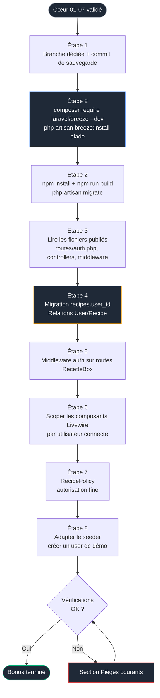
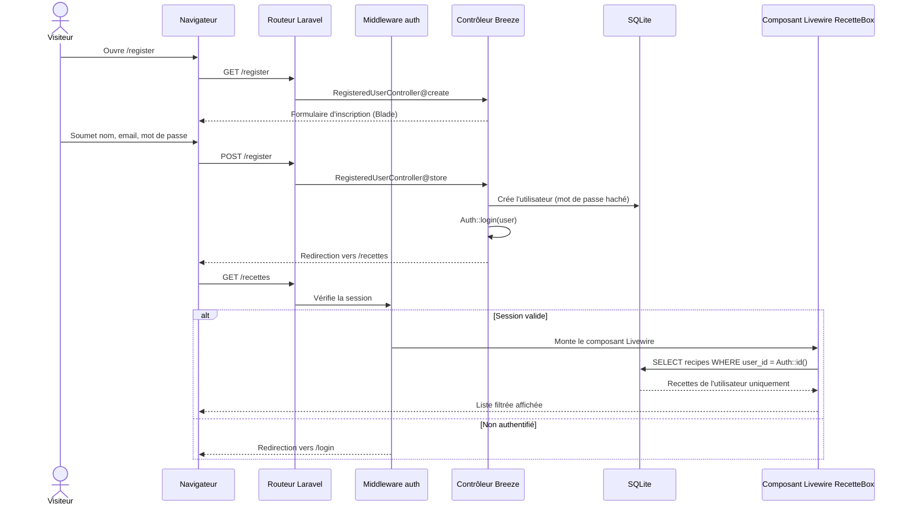
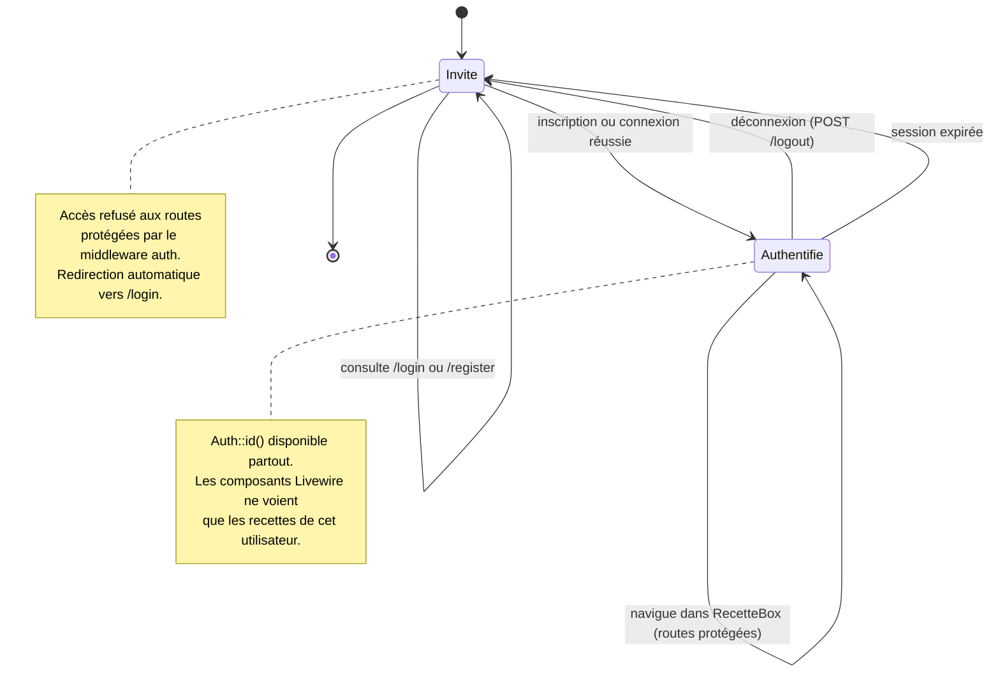

# Phase 9 — Bonus : Authentification avec Laravel Breeze

> Objectif : transformer le carnet de recettes partagé en carnets individuels protégés par compte utilisateur, en greffant l'authentification sur une application déjà complète, sans casser le travail des phases 01 à 07.

> Pré-requis strict : les phases 00 à 07 sont terminées et validées. Cette phase est un **bonus optionnel** : RecetteBox fonctionne parfaitement sans elle.

<br>

---

<br>

## Sommaire

- [Phase 9 — Bonus : Authentification avec Laravel Breeze](#phase-9--bonus--authentification-avec-laravel-breeze)
  - [Sommaire](#sommaire)
  - [Avertissement : statut de Breeze en 2026](#avertissement--statut-de-breeze-en-2026)
  - [Pourquoi la stack Blade de Breeze et non la stack Livewire](#pourquoi-la-stack-blade-de-breeze-et-non-la-stack-livewire)
  - [Concepts introduits dans cette phase](#concepts-introduits-dans-cette-phase)
  - [Flux d'installation](#flux-dinstallation)
  - [Diagramme de séquence : inscription puis accès protégé](#diagramme-de-séquence--inscription-puis-accès-protégé)
  - [Diagramme d'état : cycle de vie de la session](#diagramme-détat--cycle-de-vie-de-la-session)
  - [Étape 1 — Brancher et sauvegarder](#étape-1--brancher-et-sauvegarder)
  - [Étape 2 — Installer Laravel Breeze](#étape-2--installer-laravel-breeze)
  - [Étape 3 — Comprendre les fichiers publiés](#étape-3--comprendre-les-fichiers-publiés)
  - [Étape 4 — Lier les recettes à un utilisateur](#étape-4--lier-les-recettes-à-un-utilisateur)
  - [Étape 5 — Protéger les routes de RecetteBox](#étape-5--protéger-les-routes-de-recettebox)
  - [Étape 6 — Scoper les données dans les composants Livewire](#étape-6--scoper-les-données-dans-les-composants-livewire)
  - [Étape 7 — Autorisation fine avec une Policy](#étape-7--autorisation-fine-avec-une-policy)
  - [Étape 8 — Adapter le seeder](#étape-8--adapter-le-seeder)
  - [Vérifications finales](#vérifications-finales)
  - [Pièges courants](#pièges-courants)
  - [Ce que tu as à la fin de cette phase](#ce-que-tu-as-à-la-fin-de-cette-phase)
    - [Pour information : l'alternative officielle 2026](#pour-information--lalternative-officielle-2026)

<br>

---

<br>

## Avertissement : statut de Breeze en 2026

État réel vérifié le 15 mai 2026, à connaître avant de commencer :

| Fait | Conséquence pour toi |
|---|---|
| Depuis Laravel 12 (février 2025), Laravel a consolidé Breeze et Jetstream en trois **Starter Kits officiels** (React, Vue, Livewire) | Breeze n'est plus proposé dans le prompt de `laravel new` |
| Breeze **reste maintenu et installable manuellement** via Composer | La phase reste valable, mais Breeze n'est plus la voie "par défaut" |
| Le Starter Kit Livewire officiel utilise Flux UI et le système d'auth intégré | C'est l'alternative moderne, mais elle s'installe **à la création du projet**, pas après coup |

Position retenue pour ce projet, sans complaisance : un Starter Kit officiel s'impose **au moment de `laravel new`**, ce qui aurait contraint toute la pédagogie des phases 01 à 07 dès le départ et masqué une grande partie de ce que tu viens d'apprendre. Breeze, lui, **s'ajoute sur un projet existant** et **publie son code directement dans ton application** (routes, contrôleurs, vues, middleware visibles et modifiables). Pour un objectif d'apprentissage de l'authentification, c'est exactement ce qu'il faut : rien n'est caché dans un package.

L'alternative officielle est documentée en fin de phase pour information ; elle n'est pas la voie de ce bonus.

<br>

---

<br>

## Pourquoi la stack Blade de Breeze et non la stack Livewire

Breeze propose plusieurs stacks à l'installation : Blade, Livewire, ou Inertia (React/Vue). Choix retenu : **Blade**, pour des raisons précises.

| Critère | Stack Blade | Stack Livewire de Breeze |
|---|---|---|
| Code d'auth lisible et figé | Oui, contrôleurs explicites dans `app/Http/Controllers/Auth` | Logique répartie dans des composants |
| Dépendance à Volt | Aucune | Historiquement basée sur Volt, friction possible avec Livewire 4 et ses Single-File Components |
| Risque de collision avec tes composants Livewire des phases 03 à 07 | Faible | Plus élevé (deux conventions de composants cohabitent) |
| Objectif pédagogique "comprendre l'auth" | Optimal | Mélange auth et réactivité, brouille le propos |

Ton interface RecetteBox **reste en Livewire** : on ne touche pas aux composants des phases 03 à 07. Breeze n'apporte ici que la couche authentification (formulaires login/register/reset, profil, middleware). Les deux mondes cohabitent proprement : Blade pour l'auth, Livewire pour le métier.

<br>

---

<br>

## Concepts introduits dans cette phase

| Concept | Où il sert | Nouveauté par rapport aux phases précédentes |
|---|---|---|
| Authentification de session | Login, register, logout | Nouveau |
| Middleware `auth` | Protection des routes RecetteBox | Nouveau |
| Relation `User hasMany Recipe` / `Recipe belongsTo User` | Rattacher chaque recette à son auteur | Étend l'Eloquent vu en Phase 2 |
| Clé étrangère ajoutée par migration sur table existante | `recipes.user_id` | Migration de modification, pas de création |
| Scoping des requêtes par utilisateur connecté | Composants Livewire des phases 04 à 06 | Étend la réactivité de la Phase 4 |
| Policy d'autorisation | Empêcher de modifier la recette d'autrui | Nouveau |
| Adaptation d'un seeder à un schéma authentifié | Phase 2 revisitée | Nouveau |

<br>

---

<br>

## Flux d'installation



<br>

---

<br>

## Diagramme de séquence : inscription puis accès protégé



<br>

---

<br>

## Diagramme d'état : cycle de vie de la session



<br>

---

<br>

## Étape 1 — Brancher et sauvegarder

L'authentification touche au schéma de base de données et aux routes. On isole tout sur une branche dédiée pour pouvoir revenir en arrière sans douleur.

```powershell
# Se placer dans le projet
cd $env:USERPROFILE\Documents\Projets\recettebox

# Vérifier que le cœur est propre (aucune modification non commitée)
git status

# Créer la branche bonus à partir de l'état stable du cœur
git checkout -b phase/09-bonus-auth
```

> Règle du projet : cette branche n'est **pas** fusionnée dans `main` tant que tu n'es pas certain que le cœur reste stable. Le bonus doit pouvoir être abandonné sans conséquence.

<br>

---

<br>

## Étape 2 — Installer Laravel Breeze

```powershell
# Installer Breeze en dépendance de développement uniquement
# (le scaffolding n'est utile qu'une fois, en développement)
composer require laravel/breeze --dev

# Publier le scaffolding d'authentification en stack Blade
# Le mot-clé "blade" évite le prompt interactif et la stack Livewire/Volt
php artisan breeze:install blade
```

À l'issue de cette commande, Breeze a publié dans ton projet : routes d'auth, contrôleurs, vues Blade, requêtes de formulaire, et a modifié `package.json` / la configuration Vite si nécessaire.

```powershell
# Installer les dépendances front ajoutées par Breeze, puis compiler
npm install
npm run build

# Appliquer les migrations : Breeze crée notamment la table users,
# password_reset_tokens et sessions
php artisan migrate
```

> Si `php artisan migrate` demande confirmation de création de la base SQLite, accepte. Le fichier `database/database.sqlite` issu de la Phase 2 est conservé ; Breeze ajoute seulement de nouvelles tables.

Lance le serveur et teste les écrans :

```powershell
# Démarre le serveur de développement Laravel
php artisan serve
```

Ouvre `http://127.0.0.1:8000/register`, crée un compte de test, vérifie que `/login` et `/logout` fonctionnent. À ce stade, RecetteBox n'est **pas encore protégée** : c'est normal, on s'en occupe à l'étape 5.

<br>

---

<br>

## Étape 3 — Comprendre les fichiers publiés

Ne passe pas à la suite sans avoir ouvert et lu ces fichiers. C'est le cœur de l'apprentissage de cette phase.

| Fichier publié | Rôle | Point d'attention |
|---|---|---|
| `routes/auth.php` | Toutes les routes d'authentification | Inclus depuis `routes/web.php` via `require __DIR__.'/auth.php';` |
| `app/Http/Controllers/Auth/RegisteredUserController.php` | Inscription | Hachage du mot de passe via `Hash::make`, connexion automatique après inscription |
| `app/Http/Controllers/Auth/AuthenticatedSessionController.php` | Connexion / déconnexion | Régénération de session pour prévenir la fixation de session |
| `app/Http/Requests/Auth/LoginRequest.php` | Validation + limitation de tentatives | Contient le `throttle` anti-brute-force |
| `app/Http/Controllers/Auth/PasswordResetLinkController.php` | Réinitialisation par e-mail | Nécessite un driver mail configuré pour fonctionner réellement |
| `resources/views/auth/*.blade.php` | Écrans login, register, reset | Vues Blade Tailwind, modifiables librement |
| `app/View/Components/AppLayout.php` + `resources/views/layouts/app.blade.php` | Layout authentifié de Breeze | Source de collision potentielle avec ton layout des phases 03-07 (voir Pièges) |

Concept clé à retenir : Breeze n'est **pas un package qui agit en boîte noire**. Tout le code est dans ton projet, sous ton contrôle, modifiable. C'est précisément pourquoi il convient à l'apprentissage.

<br>

---

<br>

## Étape 4 — Lier les recettes à un utilisateur

Jusqu'ici, une recette n'appartient à personne. On ajoute la colonne `user_id` à la table `recipes` **existante** (migration de modification, pas de création).

```powershell
# Générer une migration de modification de la table recipes
php artisan make:migration add_user_id_to_recipes_table --table=recipes
```

Édite la migration générée dans `database/migrations/` :

```php
public function up(): void
{
    Schema::table('recipes', function (Blueprint $table) {
        // Clé étrangère vers users.
        // nullable() est volontaire : les recettes créées avant l'auth
        // (seeder de la Phase 2) n'ont pas d'utilisateur. On gère ce cas
        // à l'étape 8 plutôt que de faire échouer la migration.
        $table->foreignId('user_id')
            ->nullable()
            ->after('id')
            ->constrained()      // référence users.id
            ->cascadeOnDelete(); // supprimer un user supprime ses recettes
    });
}

public function down(): void
{
    Schema::table('recipes', function (Blueprint $table) {
        // L'ordre est important : retirer la contrainte avant la colonne
        $table->dropForeignIdFor(\App\Models\User::class);
        $table->dropColumn('user_id');
    });
}
```

> SQLite a des limites sur la modification de colonnes existantes. L'ajout d'une colonne avec clé étrangère fonctionne, mais une suppression via `down()` peut nécessiter la recréation de table sur d'anciennes versions. En cas d'échec du rollback, voir Pièges courants.

Applique la migration :

```powershell
php artisan migrate
```

Déclare maintenant les relations Eloquent.

Dans `app/Models/User.php`, ajoute la méthode :

```php
/**
 * Un utilisateur possède plusieurs recettes.
 * Type de retour explicite pour l'analyse statique (Intelephense).
 */
public function recipes(): \Illuminate\Database\Eloquent\Relations\HasMany
{
    return $this->hasMany(Recipe::class);
}
```

Dans `app/Models/Recipe.php`, ajoute l'inverse :

```php
/**
 * Une recette appartient à un utilisateur.
 * Nullable tant que d'anciennes recettes du seeder n'ont pas d'auteur.
 */
public function user(): \Illuminate\Database\Eloquent\Relations\BelongsTo
{
    return $this->belongsTo(User::class);
}
```

Pense aussi à ajouter `user_id` dans la propriété `$fillable` (ou l'attribut `#[Fillable]` si tu utilises la syntaxe attributs de Laravel 13) du modèle `Recipe`, sinon l'assignation de masse l'ignorera.

---

## Étape 5 — Protéger les routes de RecetteBox

Ouvre `routes/web.php`. Les routes RecetteBox des phases 01 à 07 doivent passer derrière le middleware `auth`.

```php
// Avant : routes accessibles à tous
// Route::get('/recettes', \App\Livewire\RecipeIndex::class);

// Après : groupe protégé par le middleware auth.
// 'verified' est volontairement omis : la vérification d'e-mail
// nécessiterait un serveur mail, hors périmètre de ce bonus.
Route::middleware(['auth'])->group(function () {
    Route::get('/recettes', \App\Livewire\RecipeIndex::class)->name('recipes.index');
    Route::get('/tableau-de-bord', \App\Livewire\Dashboard::class)->name('dashboard');
    // Reporter ici toutes les routes métier des phases 01 à 07
});

// Inclut les routes d'authentification publiées par Breeze
require __DIR__.'/auth.php';
```

Teste : déconnecté, l'accès à `/recettes` doit rediriger vers `/login`. Connecté, l'accès doit fonctionner.

<br>

---

<br>

## Étape 6 — Scoper les données dans les composants Livewire

Le point le plus important du bonus. Sans cette étape, tous les utilisateurs verraient toutes les recettes : l'authentification serait cosmétique.

Dans chaque composant Livewire qui interroge les recettes (issus des phases 04 et 06), la requête doit être restreinte à l'utilisateur connecté.

Exemple, dans la requête du composant `RecipeIndex` :

```php
use Illuminate\Support\Facades\Auth;

// Avant : toutes les recettes
// $recipes = Recipe::query()->...

// Après : uniquement celles de l'utilisateur authentifié.
// Auth::id() est disponible car la route est protégée par 'auth'.
$recipes = Recipe::query()
    ->where('user_id', Auth::id())
    ->when($this->search, fn ($q) =>
        $q->where('title', 'like', "%{$this->search}%")
    )
    // ... reste des filtres des phases 04 à 06 inchangés
    ->paginate(12);
```

Applique le même `where('user_id', Auth::id())` :
- au composant de tableau de bord (Phase 6) pour que les statistiques ne comptent que les recettes de l'utilisateur ;
- à toute création de recette (Phase 5), où il faut **affecter** `user_id` :

```php
// Lors de la création d'une recette dans le composant CRUD de la Phase 5
Recipe::create([
    'user_id' => Auth::id(), // rattachement automatique à l'auteur
    'title' => $this->title,
    // ... autres champs validés
]);
```

> Alternative plus robuste à connaître : passer par la relation, `Auth::user()->recipes()->create([...])`, qui renseigne `user_id` automatiquement. Tu peux refactorer ainsi une fois le scoping compris.

<br>

---

<br>

## Étape 7 — Autorisation fine avec une Policy

Le scoping de l'étape 6 empêche d'**afficher** les recettes d'autrui, mais pas forcément de les **modifier** via une requête forgée sur un identifiant. Une Policy verrouille les actions d'écriture.

```powershell
# Générer une policy liée au modèle Recipe
php artisan make:policy RecipePolicy --model=Recipe
```

Dans `app/Policies/RecipePolicy.php` :

```php
/**
 * Seul le propriétaire peut modifier sa recette.
 */
public function update(User $user, Recipe $recipe): bool
{
    return $user->id === $recipe->user_id;
}

/**
 * Seul le propriétaire peut supprimer sa recette.
 */
public function delete(User $user, Recipe $recipe): bool
{
    return $user->id === $recipe->user_id;
}
```

Dans les composants Livewire d'édition et de suppression (Phase 5), appelle l'autorisation avant l'action :

```php
// Lève une AuthorizationException (403) si l'utilisateur n'est pas le propriétaire
$this->authorize('update', $recipe);
```

<br>

---

<br>

## Étape 8 — Adapter le seeder

Le seeder de la Phase 2 crée des recettes sans `user_id`. Désormais, une recette sans propriétaire n'est visible par personne (le scoping de l'étape 6 l'exclut). On corrige le seeder pour qu'il crée d'abord un utilisateur de démonstration.

Dans `database/seeders/DatabaseSeeder.php` :

```php
public function run(): void
{
    // Utilisateur de démonstration, identifiants connus pour les tests locaux
    $demo = \App\Models\User::factory()->create([
        'name' => 'Démo RecetteBox',
        'email' => 'demo@recettebox.test',
        // Mot de passe par défaut de la factory User : "password"
    ]);

    // Rattacher toutes les recettes générées à cet utilisateur
    \App\Models\Recipe::factory()
        ->count(30)
        ->for($demo) // renseigne automatiquement user_id
        ->hasAttached(
            \App\Models\Tag::factory()->count(2)
        )
        ->create();
}
```

Réinitialise et re-seede la base :

```powershell
# Recrée le schéma et réinjecte des données cohérentes avec l'auth
php artisan migrate:fresh --seed
```

Connecte-toi avec `demo@recettebox.test` / `password` : tu dois voir les 30 recettes. Crée un second compte : il doit voir une liste vide. C'est la preuve que le scoping fonctionne.

<br>

---

<br>

## Vérifications finales

- [ ] `/register`, `/login`, `/logout` fonctionnent
- [ ] Déconnecté, `/recettes` redirige vers `/login`
- [ ] La table `recipes` possède une colonne `user_id` (`php artisan db:show` ou inspection SQLite)
- [ ] Relations `User::recipes()` et `Recipe::user()` opérationnelles (test rapide via `php artisan tinker`)
- [ ] Un utilisateur ne voit que ses propres recettes
- [ ] Le tableau de bord ne compte que les recettes de l'utilisateur connecté
- [ ] Une tentative de modification d'une recette d'autrui renvoie une erreur 403
- [ ] Le seeder crée le compte `demo@recettebox.test` avec 30 recettes rattachées
- [ ] Le cœur (phases 01-07) reste fonctionnel pour l'utilisateur connecté
- [ ] La branche `phase/09-bonus-auth` est commitée, `main` reste intacte

<br>

---

<br>

## Pièges courants

| Symptôme | Cause | Résolution |
|---|---|---|
| Collision de layout : double barre de navigation ou style cassé après `breeze:install` | Breeze publie son propre `layouts/app.blade.php` qui peut entrer en conflit avec le layout des phases 03-07 | Choisir un layout maître unique : soit conserver le tien et n'emprunter à Breeze que les vues d'auth, soit adopter celui de Breeze et y réintégrer ton entête. Documenter le choix dans un commit dédié |
| Tailwind : classes Breeze non stylées | Breeze suppose parfois une configuration Tailwind 3 alors que le projet est en Tailwind 4 (`@tailwindcss/vite`, plus de `tailwind.config.js`) | Vérifier que `resources/css/app.css` contient bien `@import "tailwindcss";` et les directives `@source` couvrant `resources/views/**/*.blade.php`. Relancer `npm run build` |
| `php artisan migrate` échoue sur la clé étrangère SQLite | Ancienne version de SQLite ou contraintes désactivées | Vérifier la version SQLite ; en dernier recours, `php artisan migrate:fresh --seed` après avoir adapté le seeder (étape 8) |
| Rollback de la migration `user_id` impossible | Limite de SQLite sur `dropForeign` / `dropColumn` | Préférer `migrate:fresh` en développement plutôt que `migrate:rollback` ; en production réelle on n'utiliserait pas SQLite |
| Toutes les recettes invisibles après l'auth | Recettes du seeder sans `user_id`, exclues par le scoping | Appliquer l'étape 8 et `migrate:fresh --seed` |
| Erreur 403 même pour le propriétaire | `user_id` non renseigné à la création (oubli dans `$fillable` ou dans le composant CRUD) | Ajouter `user_id` au `$fillable` du modèle et l'affecter via `Auth::id()` ou la relation |
| `Auth::id()` renvoie `null` dans un composant Livewire | Route non protégée par le middleware `auth` | Vérifier que la route du composant est bien dans le groupe `middleware(['auth'])` |
| La réinitialisation de mot de passe ne fait rien | Aucun driver mail configuré | Définir `MAIL_MAILER=log` dans `.env` pour le développement : le lien de réinitialisation apparaît dans `storage/logs/laravel.log` |

<br>

---

<br>

## Ce que tu as à la fin de cette phase

| Élément | État |
|---|---|
| Authentification | Inscription, connexion, déconnexion, réinitialisation (en mode log) fonctionnelles |
| Routes RecetteBox | Protégées par le middleware `auth` |
| Données | Chaque recette rattachée à un utilisateur, requêtes scopées |
| Autorisation | Policy empêchant la modification des recettes d'autrui |
| Seeder | Compte de démonstration cohérent avec le schéma authentifié |
| Cœur 01-07 | Intact et fonctionnel en contexte authentifié |
| Isolation | Tout sur `phase/09-bonus-auth`, `main` préservée |

### Pour information : l'alternative officielle 2026

Si un jour tu repars d'un projet neuf et veux la voie recommandée par Laravel aujourd'hui : à la commande `laravel new`, choisir le **Starter Kit Livewire officiel** (Livewire 4 + Flux UI + auth intégrée), éventuellement en variante WorkOS AuthKit pour l'authentification sociale (Google, Microsoft, GitHub, Apple). Cette approche s'installe au démarrage du projet et n'est pas compatible avec une greffe a posteriori comme celle de ce bonus. Elle masque davantage de mécanique : pédagogiquement, elle conviendrait à un projet ultérieur, pas à un premier apprentissage.

<br>

---

<br>

> Fin du parcours RecetteBox. Le cœur (phases 00-07) constitue le socle ; ce bonus montre comment l'authentification se greffe proprement sur une application déjà saine, plutôt que d'être un pré-requis imposé dès la première ligne.